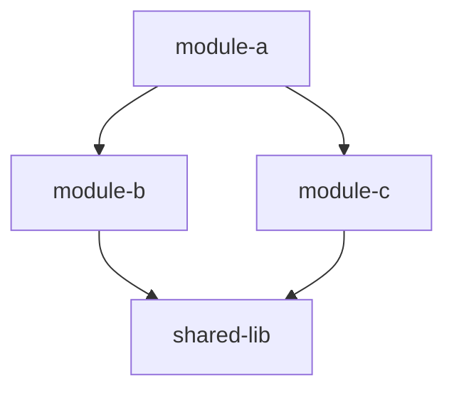
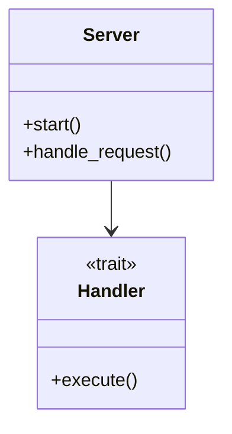
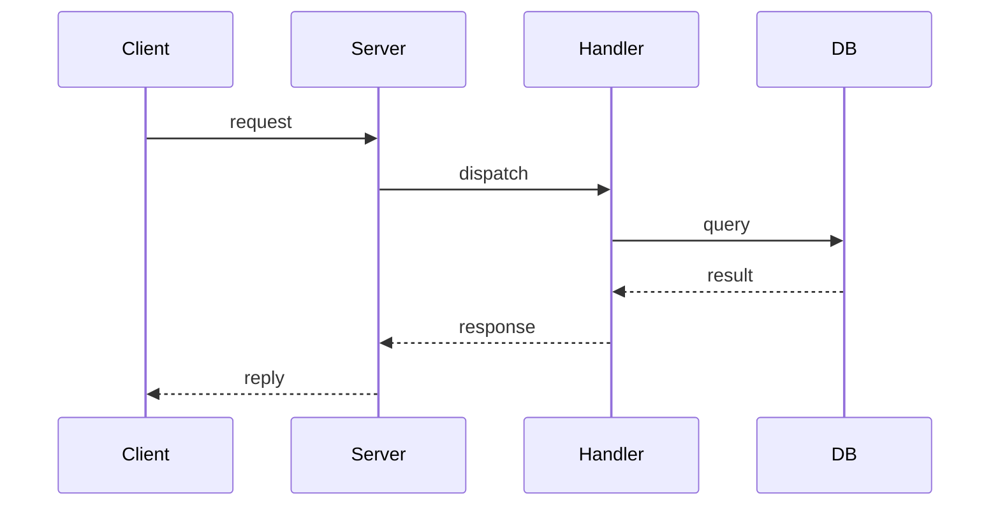
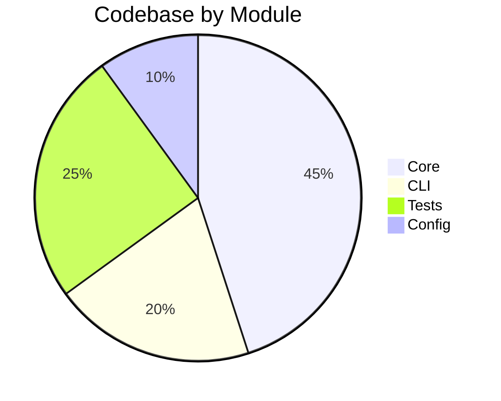

## Project Detection

To discover project types, build commands, and language-specific guidelines for this workspace, call the code_context tool:

```json
{"op": "detect projects"}
```

**Call this early in your session** to understand the project structure before making changes. The guidelines returned are authoritative — follow them for test commands, build commands, and formatting.

## Approach
- Think before acting. Read existing files before writing code.
- Be concise in output but thorough in reasoning.
- Prefer editing over rewriting whole files.
- Do not re-read files you have already read unless the file may have changed.
- Test your code before declaring done.
- No sycophantic openers or closing fluff.


# Map Codebase

Generate a rich, visual overview of the codebase and write it to `ARCHITECTURE.md` at the repository root.

## Process

### 1. Check code-context status

```json
{"op": "get status"}
```

If indexing is incomplete (TS or LSP indexed < 90%), wait and re-check. The quality of the map depends on having a fully indexed codebase.

### 2. Gather structural data

Run these queries to build a complete picture:

**File inventory** — understand what's in the repo:
```json
{"op": "grep code", "pattern": ".", "max_results": 1}
```

Use the file counts from `get status` to understand scale.

**Key symbols** — find the major types, traits, and entry points:
```json
{"op": "search symbol", "kind": "struct", "query": "", "max_results": 50}
```
```json
{"op": "search symbol", "kind": "function", "query": "main", "max_results": 10}
```
```json
{"op": "search symbol", "kind": "trait", "query": "", "max_results": 30}
```
```json
{"op": "search symbol", "kind": "class", "query": "", "max_results": 30}
```
```json
{"op": "search symbol", "kind": "interface", "query": "", "max_results": 30}
```

**Module structure** — list symbols in key files to understand organization:
```json
{"op": "list symbols", "file_path": "<entry-point-file>"}
```

**Call graph** — trace key flows from entry points:
```json
{"op": "get callgraph", "symbol": "<entry-point>", "direction": "outbound", "max_depth": 2}
```

**Dependencies** — understand module relationships:
```json
{"op": "get blastradius", "file_path": "<key-file>", "max_hops": 2}
```

### 3. Analyze project files

Read key configuration files to understand the project structure:
- `Cargo.toml` / `package.json` / `go.mod` / `pyproject.toml` — dependencies and workspace layout
- Entry point files (`main.rs`, `lib.rs`, `index.ts`, `main.go`, etc.)

### 4. Synthesize into ARCHITECTURE.md

Write `ARCHITECTURE.md` at the repository root with the following sections:

#### Header

```markdown
# Architecture

> Auto-generated by SwissArmyHammer `/map` — [timestamp]

## Overview

[2-3 sentence summary: what this project is, what it does, what language/framework]
```

#### Module/Package Dependency Diagram

Use `graph TD` to show how modules, crates, or packages depend on each other.

````markdown

````

Group by layer (e.g., CLI → core libraries → data layer) when the project has clear layers.

#### Key Types and Relationships

Use `classDiagram` for important types, traits/interfaces, and their relationships.

````markdown

````

Focus on the 10-20 most important types, not every struct in the codebase.

#### Key Flows

Use `sequenceDiagram` for 1-3 critical paths through the system (e.g., request handling, data pipeline, build process).

````markdown

````

#### Codebase Composition

Use `pie` to show the relative size of different areas.

````markdown

````

#### Directory Structure

A brief annotated tree of the top-level directories and what they contain.

```markdown
## Directory Structure

- `src/` — Main source code
  - `server/` — HTTP server and routing
  - `handlers/` — Request handlers
  - `models/` — Data models
- `tests/` — Integration tests
- `config/` — Configuration files
```

#### Symbol Index

A table of major public types and functions grouped by module.

```markdown
## Key Symbols

| Module | Symbol | Kind | Description |
|--------|--------|------|-------------|
| server | Server | struct | Main server instance |
| server | start | fn | Entry point |
| handler | Handler | trait | Request handler interface |
```

### 5. Print summary

After writing the file, print a brief summary to the terminal:

```
Wrote ARCHITECTURE.md

- [N] modules/packages mapped
- [N] key types documented
- [N] flows diagrammed
- [N] Mermaid diagrams generated

Diagrams render on GitHub, VS Code, and Obsidian.
```

## Rules

- Write `ARCHITECTURE.md` at the repo root, always. Overwrite if it exists.
- Every section must have at least one Mermaid diagram.
- Diagrams must use valid Mermaid syntax that renders on GitHub.
- Focus on architecture, not implementation details. Show the forest, not the trees.
- Use data from code-context, not guesses. Every claim should be backed by a query result.
- If the codebase is a monorepo or workspace, show the workspace-level view first, then drill into key packages.
- **Scoped mapping**: The user requested mapping of `{{ arguments }}`. Scope all queries and output to that subdirectory or module instead of the whole repo.
- If the user provides a path or module name as an argument, scope the map to that area instead of the whole repo.
- Keep the file under 500 lines. Be selective — map the important parts, not everything.
