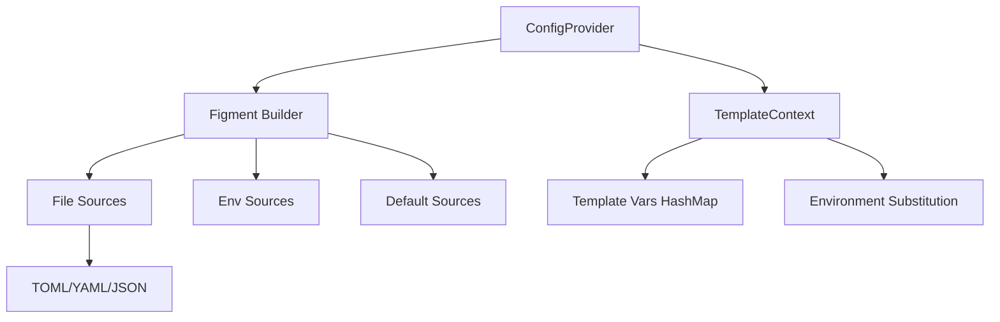

# Core Types and Figment Integration

Refer to /Users/wballard/github/swissarmyhammer/ideas/config.md

## Objective

Implement the core data structures and figment-based configuration loading system that will replace the existing `sah_config` and `toml_config` modules.

## Context

This step builds on the crate structure from step 1 and implements the foundational types and basic figment integration. The specification requires support for multiple file formats with a clear precedence order and no caching.

## Architecture



## Tasks

### 1. Core Data Structures

Define in `src/types.rs`:

```rust
/// Template context for rendering prompts, workflows, and actions
#[derive(Debug, Clone, Default)]
pub struct TemplateContext {
    vars: HashMap<String, serde_json::Value>,
}

/// Configuration provider using figment
pub struct ConfigProvider {
    // No caching - read fresh each time
}

/// Raw configuration values from files
#[derive(Debug, Clone, Deserialize)]
pub struct RawConfig {
    #[serde(flatten)]
    pub values: HashMap<String, serde_json::Value>,
}
```

### 2. TemplateContext Implementation

Implement core methods:
- `new()` - Create empty context
- `with_vars(HashMap)` - Create with initial variables
- `get(&str)` - Get template variable
- `set(String, Value)` - Set template variable  
- `merge(&self, other)` - Merge contexts with precedence
- `substitute_env_vars(&mut self)` - Process ${VAR} patterns
- `to_liquid_object()` - Convert to liquid template object

### 3. ConfigProvider Implementation

Implement in `src/provider.rs`:
- `new()` - Create provider
- `load_template_context()` - Main entry point that returns TemplateContext
- `build_figment()` - Internal method to construct figment with all sources
- Support for precedence order from specification

### 4. Figment Integration

Set up figment sources in precedence order:
1. Default values (hardcoded)
2. Global config file (`~/.swissarmyhammer/`)
3. Project config file (`./.swissarmyhammer/`)  
4. Environment variables (`SAH_` and `SWISSARMYHAMMER_` prefixes)
5. Command line arguments (placeholder for future)

### 5. Basic File Format Support

- TOML parsing via figment
- YAML parsing via figment  
- JSON parsing via figment
- Error handling for malformed files

### 6. Testing

Create `src/tests/` with:
- Unit tests for TemplateContext
- Unit tests for ConfigProvider  
- Integration tests with sample config files
- Tests for all supported file formats

## Acceptance Criteria

- [ ] TemplateContext struct with full implementation
- [ ] ConfigProvider with figment-based loading
- [ ] Support for TOML, YAML, JSON file formats
- [ ] Precedence order working correctly
- [ ] Environment variable loading via figment
- [ ] Comprehensive test coverage
- [ ] All tests passing with `cargo nextest run`
- [ ] Clean `cargo clippy` output

## Implementation Notes

- Do not implement file discovery yet - that's the next step
- Focus on the core loading mechanics using figment
- Preserve the environment variable substitution patterns (${VAR} and ${VAR:-default})
- TemplateContext should be the main interface, not raw HashMaps
- No caching - read config fresh each time as specified

## Files Changed

- `swissarmyhammer-config/src/lib.rs`
- `swissarmyhammer-config/src/types.rs` (new)
- `swissarmyhammer-config/src/provider.rs` (new)  
- `swissarmyhammer-config/src/tests/` (new directory)
- `swissarmyhammer-config/Cargo.toml` (dependencies)