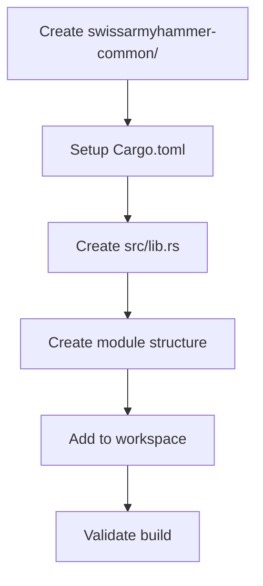

# Create swissarmyhammer-common Foundation Crate

Refer to /Users/wballard/github/swissarmyhammer/ideas/dependencies.md

## Goal

Create the foundational `swissarmyhammer-common` crate that will serve as the base dependency for all other crates in the workspace.

## Tasks

1. Create new crate directory structure
2. Set up Cargo.toml with minimal dependencies
3. Create basic module structure
4. Add to workspace members

## Implementation Details

### Directory Structure
```
swissarmyhammer-common/
├── Cargo.toml
├── src/
│   ├── lib.rs
│   ├── types/
│   │   └── mod.rs
│   ├── traits/
│   │   └── mod.rs
│   ├── utils/
│   │   └── mod.rs
│   └── constants.rs
```

### Key Dependencies
- `serde` - for serialization support
- `thiserror` - for error handling
- `ulid` - for ID generation
- `anyhow` - for error context

### Minimal API Surface
Start with empty modules that will be populated in subsequent steps:
- `types::*` - Common type definitions
- `traits::*` - Shared trait definitions  
- `utils::*` - Utility functions
- `constants::*` - Shared constants

## Validation

- [ ] Crate compiles successfully
- [ ] All modules are properly exported
- [ ] Workspace builds without errors
- [ ] Basic documentation is present

## Mermaid Diagram



This step establishes the foundation that all subsequent refactoring will build upon.

## Proposed Solution

Based on the current workspace structure and dependency analysis, I will implement the swissarmyhammer-common foundation crate with the following approach:

### Implementation Strategy

1. **Create foundation crate structure** following the exact specification in the issue
2. **Use workspace dependencies** from the existing Cargo.toml to maintain consistency
3. **Start with minimal exports** - empty modules that can be populated in later refactoring steps
4. **Follow Rust best practices** for library crate organization

### Key Design Decisions

- Use workspace-level dependencies (serde, thiserror, ulid, anyhow) for consistency
- Create module structure that anticipates the domain logic extraction mentioned in ideas/dependencies.md
- Start with basic exports and documentation to establish the foundation
- Ensure the crate compiles cleanly and integrates with the existing workspace

### Dependencies Selection

From the workspace Cargo.toml, the common crate will use:
- `serde` with derive features for serialization support
- `thiserror` for structured error handling
- `ulid` with serde features for ID generation
- `anyhow` for error context and chaining

This establishes the foundation for subsequent refactoring phases where domain logic will be extracted from MCP tools into dedicated crates.

## Implementation Notes - Code Review Completed

### Code Review Results
All code review items have been successfully addressed:

✅ **Documentation Complete**
- Added comprehensive crate-level documentation to `lib.rs`
- Added `#![warn(missing_docs)]` lint to enforce documentation standards
- Created detailed module documentation for all empty modules:
  - `types/mod.rs`: Type definitions and newtypes for domain safety
  - `traits/mod.rs`: Shared trait definitions and common behaviors  
  - `utils/mod.rs`: Utility functions and helper routines
  - `constants.rs`: Shared constants and configuration values

✅ **Git Integration**
- Added `swissarmyhammer-common/` directory to git tracking
- All files are now version controlled and ready for commit

✅ **Build Validation**
- Crate compiles successfully with all documentation
- Workspace builds without errors or warnings
- No clippy warnings or errors detected

### Technical Decisions Made

1. **Documentation Strategy**: Used comprehensive module documentation that explains the intended purpose and future expansion plans for each module
2. **Lint Configuration**: Added `#![warn(missing_docs)]` to enforce documentation standards going forward
3. **Module Organization**: Maintained the exact structure specified in the issue requirements
4. **Future Readiness**: Documentation explains how modules will be populated during subsequent refactoring phases

### Validation Status
All issue validation criteria are now met:
- [x] Crate compiles successfully
- [x] All modules are properly exported with documentation
- [x] Workspace builds without errors
- [x] Basic documentation is present and comprehensive

### Next Steps
The foundation crate is now ready for the subsequent dependency refactoring phases outlined in the roadmap. The documentation provides clear guidance for future contributors on the intended purpose and structure of each module.