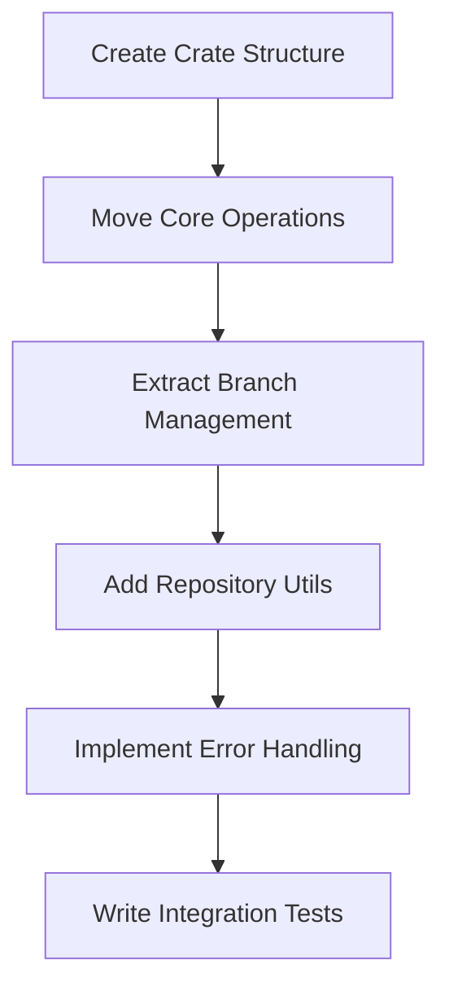

# Create swissarmyhammer-git Crate

Refer to /Users/wballard/github/swissarmyhammer/ideas/dependencies.md

## Goal

Create a dedicated crate for Git operations by extracting git functionality from the main library and scattered MCP tools.

## Tasks

1. Create new crate structure
2. Move git operations from main library
3. Extract git utilities from MCP tools
4. Create clean API for git operations

## Implementation Details

### Crate Structure
```
swissarmyhammer-git/
├── Cargo.toml
├── src/
│   ├── lib.rs
│   ├── operations.rs      # Core git operations
│   ├── repository.rs      # Repository management
│   ├── branches.rs        # Branch operations
│   ├── commits.rs         # Commit operations
│   ├── status.rs          # Git status queries
│   ├── utils.rs           # Git utilities
│   └── error.rs           # Git-specific errors
```

### Core Dependencies
- `git2` - Git operations
- `swissarmyhammer-common` - Common types and utilities
- `async-trait` - Async trait support
- `tokio` - Async runtime

do not depend on `swissarmyhammer`, move code to common as needed

### Key APIs to Extract

We need an explicit BranchName.

#### From `swissarmyhammer/src/git/operations.rs`
```rust
pub struct GitOperations {
    // Move existing implementation
}

impl GitOperations {
    pub fn new() -> Result<Self, GitError>;
    pub fn create_branch(&self, name: &BranchName) -> Result<(), GitError>;
    pub fn checkout_branch(&self, name: &BranchName) -> Result<(), GitError>;
    // ... other operations
}
```

#### Repository Detection
```rust
pub fn find_repository(start_path: &Path) -> Result<Repository, GitError>;
pub fn is_git_repository(path: &Path) -> bool;
```

## Migration Sources
- `swissarmyhammer/src/git/` - All git modules
- Git operations scattered in MCP tools (issues, etc.)
- Git utilities in workflow actions

## Validation

- [ ] All git operations work correctly
- [ ] Tests pass for branch management
- [ ] Repository detection is reliable
- [ ] Error handling is comprehensive
- [ ] API is clean and well-documented

## Mermaid Diagram



This crate will provide a clean, reusable interface for all Git operations across the project.

## Proposed Solution

I will create the `swissarmyhammer-git` crate by extracting git functionality from the main library and creating a clean API. Here are the key steps:

### Phase 1: Analysis and Planning
1. **Analyze existing git module structure** - Examine current git operations, utilities, and dependencies
2. **Identify extraction targets** - Map what code needs to move from the main library
3. **Design clean API** - Create BranchName newtype and structured error types

### Phase 2: Crate Creation
1. **Create crate structure** with proper module organization
2. **Extract git operations** from `swissarmyhammer/src/git/` 
3. **Add proper error handling** with Git-specific error types
4. **Create BranchName newtype** for type safety

### Phase 3: Integration
1. **Update workspace dependencies** to include new crate
2. **Migrate existing code** to use new git crate APIs
3. **Write comprehensive tests** for all git operations
4. **Validate functionality** works correctly

The new crate will provide:
- **Type Safety**: BranchName newtype to prevent string confusion
- **Clean API**: Structured operations for repository, branches, commits
- **Better Errors**: Git-specific error types with proper context
- **Performance**: Direct git2 operations where possible
- **Testability**: Isolated git operations for easier testing

This follows the established crate pattern in the workspace (common, config, memoranda, etc.) and will improve maintainability by centralizing git functionality.