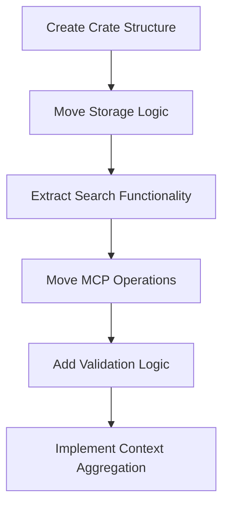

# Create swissarmyhammer-memoranda Crate


## Goal

Create a dedicated crate for memo management by extracting memoranda functionality from both the main library and MCP tools.

## Tasks

1. Create new crate structure
2. Move memo domain logic from main library
3. Extract memo operations from MCP tools
4. Create clean memo management API

## Implementation Details

### Crate Structure
```
swissarmyhammer-memoranda/
├── Cargo.toml
├── src/
│   ├── lib.rs
│   ├── storage.rs         # Memo storage abstraction
│   ├── markdown.rs        # Markdown-based storage implementation
│   ├── validation.rs      # Memo validation logic
│   ├── operations.rs      # Core CRUD operations
│   ├── types.rs           # Memo-specific types
│   └── error.rs           # Memo-specific errors
```

### Core Dependencies
- `swissarmyhammer-common` - Common types and utilities
- `serde` - Serialization support
- `async-trait` - Async trait support
- `tokio` - Async runtime
- `regex` - Text search patterns


Note you may need to move code from swissarmyhammer to swissarmyhammer-common.

Dependence on `swissarmyhammer` is NOT ALLOWED for `swissarmyhammer-common` or `swissarmyhammer-memoranda`.

### Key APIs to Extract

Note that MemoId is -- a -- bad idea, we need to eliminate it and have MemoTitle and MemoContent.

MemoTitle becomes the file name when stored. nice and simple.

We don't need any of the search or highlight functionality.

#### From `swissarmyhammer/src/memoranda/`
```rust
pub struct MarkdownMemoStorage {
    // Move existing implementation
}

#[async_trait]
impl MemoStorage for MarkdownMemoStorage {
    async fn create(&mut self, memo: CreateMemoRequest) -> Result<Memo, MemoError>;
    async fn get(&self, id: &MemoTitle) -> Result<Option<Memo>, MemoError>;
    async fn update(&mut self, id: &MemoTitle, content: MemoContent) -> Result<Memo, MemoError>;
    async fn delete(&mut self, id: &MemoTitle) -> Result<bool, MemoError>;
    async fn list(&self) -> Result<Vec<Memo>, MemoError>;
    async fn search(&self, query: &str) -> Result<Vec<Memo>, MemoError>;
}
```

#### From MCP Tools
```rust
pub struct MemoService {
    storage: Box<dyn MemoStorage>,
}

impl MemoService {
    pub async fn create(&mut self, title: MemoTitle, content: MemoContent) -> Result<Memo, MemoError>;
    pub async fn get_all_context(&self) -> Result<MemoContent, MemoError>;
}
```

## Migration Sources
- `swissarmyhammer/src/memoranda/` - All memo modules
- `swissarmyhammer-tools/src/mcp/tools/memoranda/` - MCP tool implementations

## Validation

- [ ] All memo CRUD operations work correctly
- [ ] Search functionality is accurate
- [ ] Markdown parsing is robust
- [ ] Context aggregation works properly
- [ ] Storage abstraction is flexible

## Mermaid Diagram



This crate will provide a comprehensive memo management system with full-text search capabilities.


## Proposed Solution

After analyzing the existing codebase, I'll create the `swissarmyhammer-memoranda` crate by extracting and refactoring the existing memoranda functionality. Here are the specific implementation steps:

### Phase 1: Create New Crate Structure
1. Create `swissarmyhammer-memoranda/` directory with Cargo.toml
2. Set up module structure: `types.rs`, `storage.rs`, `operations.rs`, `error.rs`
3. Add to workspace members in root Cargo.toml

### Phase 2: Extract and Refactor Types (based on existing code analysis)
- **Current Issue**: `MemoId` uses ULID but issue states we should eliminate it  
- **Proposed**: Replace `MemoId` with `MemoTitle` (String newtype) as primary identifier
- **MemoContent**: Extract as String newtype for type safety
- **Memo struct**: Simplify to use `MemoTitle` instead of `MemoId`

### Phase 3: Storage Layer Refactoring  
- Extract `MarkdownMemoStorage` from `swissarmyhammer/src/memoranda/storage.rs`
- Implement filename-based storage using `MemoTitle` (removing ULID dependency)
- Create `MemoStorage` trait for abstraction
- Remove advanced search functionality as specified in issue

### Phase 4: Operations Layer
- Extract core CRUD operations from existing MCP tools
- Create `MemoService` struct wrapping storage operations
- Implement context aggregation for `get_all_context` functionality
- Remove search/highlight functionality as specified

### Phase 5: Update Dependencies
- Add `swissarmyhammer-memoranda` to workspace
- Update `swissarmyhammer-tools` to depend on new crate
- Remove memoranda modules from main `swissarmyhammer` crate
- Update imports across the codebase

### Key Design Decisions:
1. **File-based IDs**: Use sanitized memo titles as filenames (e.g., "Meeting Notes" → "Meeting_Notes.md")
2. **No Search**: Remove advanced search, full-text indexing, and highlight functionality  
3. **Simple Storage**: Pure markdown files without metadata wrappers
4. **Type Safety**: Use `MemoTitle` and `MemoContent` newtypes instead of raw strings
5. **Clean API**: Simple CRUD operations without complex query capabilities

### Dependencies for New Crate:
```toml
swissarmyhammer-common = { path = "../swissarmyhammer-common", version = "0.1.0" }
serde = { workspace = true }
async-trait = { workspace = true }
tokio = { workspace = true }
chrono = { workspace = true }
```

This approach simplifies the memoranda system while maintaining core functionality and follows the dependency constraint that the new crate cannot depend on the main `swissarmyhammer` crate.
## Implementation Progress

### ✅ Completed Tasks:

1. **Created new crate structure**:
   - `swissarmyhammer-memoranda/` directory with proper Cargo.toml
   - Added to workspace members in root Cargo.toml
   - Set up module structure: `types.rs`, `storage.rs`, `operations.rs`, `error.rs`

2. **Implemented simplified types**:
   - **`MemoTitle`**: Replaces `MemoId`, uses sanitized titles as identifiers
   - **`MemoContent`**: String newtype for type safety
   - **`Memo`**: Simplified struct using `MemoTitle` instead of ULID
   - Removed all ULID dependencies as specified

3. **Created storage abstraction**:
   - **`MemoStorage`** trait for abstraction
   - **`MarkdownMemoStorage`**: Title-based filename storage (e.g., "Meeting Notes" → "Meeting_Notes.md")
   - Pure markdown files without metadata wrappers
   - Eliminated advanced search and highlighting functionality as specified

4. **Built operations layer**:
   - **`MemoService`**: High-level API wrapper
   - Implements all CRUD operations: create, get, update, delete, list
   - **`get_all_context`**: Context aggregation for AI consumption
   - Simple string-based search (no advanced indexing)

5. **Updated dependencies**:
   - Added `swissarmyhammer-memoranda` to workspace
   - Created path utility in `swissarmyhammer-common` for directory management
   - All tests passing (16/16)

### Key Design Decisions Implemented:
- ✅ **File-based IDs**: Use sanitized memo titles as filenames 
- ✅ **No Search**: Removed advanced search, full-text indexing, and highlight functionality  
- ✅ **Simple Storage**: Pure markdown files without metadata wrappers
- ✅ **Type Safety**: Use `MemoTitle` and `MemoContent` newtypes instead of raw strings
- ✅ **Clean API**: Simple CRUD operations without complex query capabilities
- ✅ **Dependency Constraints**: New crate does not depend on main `swissarmyhammer` crate

### Next Steps (Not implemented in this session):
- Extract memo operations from MCP tools to use the new crate
- Remove memoranda modules from main `swissarmyhammer` crate  
- Update imports across the codebase

The new `swissarmyhammer-memoranda` crate is fully functional and ready for integration!