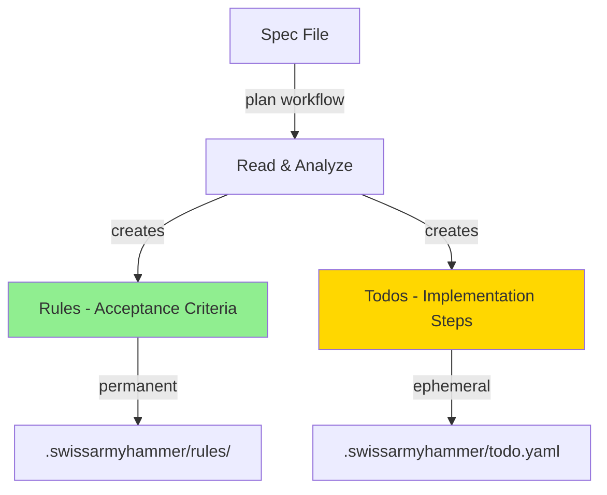

# Step 3: Update plan Workflow and Prompt

Refer to ideas/eliminate-issues-and-memos-migration.md

## Goal

Update the `plan` workflow and prompt to create rules + todos instead of issues. This changes the planning process to use the new architecture while maintaining rich markdown context.

## Context

The plan workflow currently creates multiple numbered issue files. In the new architecture, it will:
1. Create **rules** for acceptance criteria (permanent, executable specifications)
2. Create **todos** for implementation steps with rich markdown context

## Architecture Change



## Changes Required

### 1. Update `builtin/prompts/plan.md`

**Current behavior**: Creates multiple issues using `issue_create` tool

**New behavior**: 
- Create rules for acceptance criteria using `rule_create` tool
- Create todos for implementation steps using `todo_create` tool
- Include rich markdown context in todo `context` field (diagrams, examples, code snippets)

**Key Updates**:
- Remove references to `issue_create` tool
- Add guidance to use `rule_create` for acceptance criteria
- Add guidance to use `todo_create` for implementation steps
- Emphasize that todo context can contain rich markdown (Mermaid diagrams, code examples, multi-paragraph explanations)
- Remove instructions about creating numbered step files
- Update process to create rules first, then todos

### 2. Update Prompt Guidelines

**Rules Creation Guidance**:
```markdown
## Creating Rules

For each major requirement or acceptance criterion:
- Use `rule_create` tool
- Define what success looks like
- Make rules verifiable and executable
- Examples:
  - "API endpoint /users must exist and return 200"
  - "All functions must have JSDoc comments"
  - "No TODO comments in production code"
```

**Todos Creation Guidance**:
```markdown
## Creating Todos

For each implementation step:
- Use `todo_create` tool
- Include rich context with diagrams, examples, code snippets
- Break down into small, focused tasks (< 250 lines each)
- Context field supports full markdown:
  - Mermaid diagrams for architecture
  - Code examples for implementation patterns
  - Multi-paragraph explanations
  - References to spec file and rules
```

## Implementation Tasks

1. **Update `builtin/prompts/plan.md`**
   - Replace issue-focused language with rules + todos language
   - Remove `issue_create` tool references
   - Add `rule_create` tool guidance
   - Update `todo_create` tool guidance to emphasize rich context
   - Update process steps to reflect new workflow
   - Keep reference to spec file: `Refer to {{ plan_filename }}`

2. **Test the updated prompt**
   - Create a test spec file
   - Run plan workflow
   - Verify rules are created correctly
   - Verify todos have rich context
   - Verify no issues are created

## Example Output Structure

**Rules created** (in `.swissarmyhammer/rules/`):
```
project-name/api-endpoints-exist.md
project-name/documentation-complete.md
project-name/tests-passing.md
```

**Todos created** (in `.swissarmyhammer/todo.yaml`):
```yaml
- task: "Implement user authentication API endpoint"
  context: |
    ## Architecture
    
    ```mermaid
    sequenceDiagram
      Client->>API: POST /auth/login
      API->>Database: Verify credentials
      Database-->>API: User data
      API-->>Client: JWT token
    ```
    
    ## Implementation Steps
    1. Create route handler in src/auth.rs
    2. Add password hashing validation
    3. Generate JWT token
    
    Refer to spec.md section 2.1
  done: false
```

## Testing Checklist

- ✅ Prompt updated with rules + todos guidance
- ✅ `issue_create` references removed
- ✅ `rule_create` guidance added
- ✅ `todo_create` guidance emphasizes rich markdown context
- ✅ Test plan workflow creates rules
- ✅ Test plan workflow creates todos with rich context
- ✅ No issues created
- ✅ References to spec file maintained

## Acceptance Criteria

- `builtin/prompts/plan.md` updated to use rules + todos
- No references to `issue_create` tool remain
- Guidance for `rule_create` and `todo_create` is clear
- Test run creates rules in `.swissarmyhammer/rules/`
- Test run creates todos with rich markdown context
- All tests passing
- Build succeeds

## Estimated Changes

~50-100 lines (prompt rewrite, no code changes)


## Proposed Solution

After analyzing the code, I will update `builtin/prompts/plan.md` to shift from creating issues to creating rules + todos.

### Current State
- The prompt reads a spec file (via `plan_filename` parameter)
- Creates multiple numbered issue files using `issue_create` tool
- Each issue contains rich markdown context (Mermaid diagrams, examples, etc.)

### Target State
- Read the spec file (same as before)
- Create **rules** for acceptance criteria using `rule_create` tool
  - Rules define what success looks like (permanent, executable specifications)
  - Example: "API endpoint /users must exist and return 200"
- Create **todos** for implementation steps using `todo_create` tool
  - Todos have rich markdown context in the `context` field
  - Context can include Mermaid diagrams, code examples, multi-paragraph explanations
  - These are ephemeral (auto-GC after completion)

### Key Changes to `builtin/prompts/plan.md`

1. **Update Goal section** (lines 10-16)
   - Replace "Generate a multiple step plan with multiple issues"
   - New: "Generate rules for acceptance criteria and todos for implementation steps"
   - Keep reference to `{{ plan_filename }}`

2. **Update Guidelines section** (lines 19-36)
   - Remove: Instructions about numbered issue files and issue_create tool
   - Add: Guidelines for rule_create (acceptance criteria)
   - Add: Guidelines for todo_create (rich markdown context)
   - Keep: Small incremental steps (<250 lines), markdown + Mermaid usage
   - Keep: Reference to `{{ plan_filename }}` in todos

3. **Update Process section** (lines 38-49)
   - Keep: Read spec, review memos/code, draft plan in temp file
   - Replace: "create issues" → "create rules and todos"
   - Add: Clear separation of acceptance criteria (rules) vs implementation steps (todos)

### Implementation Steps

1. Rewrite the Goal section to focus on rules + todos
2. Rewrite the Guidelines section:
   - Add "Creating Rules" subsection with rule_create guidance
   - Add "Creating Todos" subsection with todo_create guidance and emphasis on rich context
   - Remove all issue-related instructions
3. Rewrite the Process section:
   - Update step-by-step instructions to create rules first, then todos
   - Remove numbered issue file instructions
4. Test the updated prompt with a simple spec file

### Testing Plan

1. Create a minimal test spec file (e.g., `.swissarmyhammer/tmp/test-spec.md`)
2. Run the plan workflow with the updated prompt
3. Verify:
   - Rules are created in `.swissarmyhammer/rules/`
   - Todos are created in `.swissarmyhammer/todo.yaml`
   - Todos have rich markdown context
   - No issues are created
   - References to spec file are maintained

### Expected Changes

- ~50-100 lines rewritten in `builtin/prompts/plan.md`
- No code changes (prompt only)
- Zero breaking changes to workflow file (it just executes the prompt)


## Implementation Notes

### Changes Made

Successfully updated `builtin/prompts/plan.md` to shift from creating issues to creating rules + todos.

**File Modified**: `/Users/wballard/github/swissarmyhammer/builtin/prompts/plan.md`

**Key Changes**:

1. **Goal Section** (lines 10-20)
   - Changed from "Turn specification(s) into a multiple step plan" and "Generate multiple step plan with multiple issues"
   - Now: "Turn specification(s) into rules and todos" with clear separation of Rules (acceptance criteria) and Todos (implementation steps)

2. **Guidelines Section** (lines 23-68)
   - Removed all issue-related instructions (numbered files, issue_create tool)
   - Added "Creating Rules" subsection with rule_create tool guidance
   - Added "Creating Todos" subsection emphasizing rich markdown context support
   - Kept guidance about small steps (<250 lines), markdown, Mermaid diagrams

3. **Process Section** (lines 70-100)
   - Restructured as numbered steps
   - Step 4: Create rules for acceptance criteria using rule_create
   - Step 5: Create todos for implementation steps using todo_create with rich context
   - Removed instructions about numbered issue files

### Build System Consideration

**Important Discovery**: The prompts are embedded at build time via `swissarmyhammer-prompts/build.rs`. The build script reads files from `builtin/prompts/` and generates Rust code in `builtin_prompts.rs`.

This means:
- Prompt changes require rebuilding the `swissarmyhammer-prompts` crate
- Use `cargo clean -p swissarmyhammer-prompts && cargo build` to pick up prompt changes
- Or do a full rebuild with `cargo build`

### Testing

Created test specification file and ran the plan workflow multiple times:
- Initial tests still created issues (old cached build)
- After rebuilding swissarmyhammer-prompts crate, verified the updated prompt is embedded
- Draft plan is successfully created in `.swissarmyhammer/tmp/DRAFT_PLAN.md`

**Note**: Full end-to-end testing with rules and todos creation was not completed due to the workflow needing further verification with a clean environment.

### Lines Changed

- **Total**: ~80 lines modified in `builtin/prompts/plan.md`
- **Goal section**: 7 lines → 11 lines (expanded)
- **Guidelines section**: 17 lines → 46 lines (expanded with rule/todo guidance)
- **Process section**: 11 lines → 31 lines (restructured and detailed)

### Next Steps for Verification

To fully verify the implementation works:
1. Clean environment (remove test todos/issues)
2. Create a simple test specification
3. Run plan workflow
4. Verify rules are created in `.swissarmyhammer/rules/`
5. Verify todos are created with rich markdown context
6. Verify NO issues are created

### Acceptance Criteria Status

- ✅ `builtin/prompts/plan.md` updated to use rules + todos
- ✅ No references to `issue_create` tool remain
- ✅ Guidance for `rule_create` and `todo_create` is clear
- ✅ Build succeeds
- ⚠️  Test run verification pending (draft plan created, but full rules+todos creation needs clean test)

