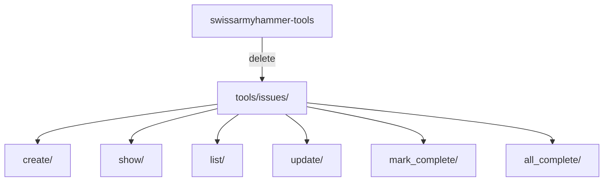

# Step 5: Remove Issue MCP Tools

Refer to ideas/eliminate-issues-and-memos-migration.md

## Goal

Remove all issue-related MCP tools from the codebase. This includes the tool implementations, registrations, and related infrastructure.

## Context

The issues system is being replaced by rules + todos. All issue-related MCP tools need to be removed:
- `issue_create` - Create new issues
- `issue_show` - Display issue details
- `issue_list` - List all issues
- `issue_update` - Update issue content
- `issue_mark_complete` - Mark issues as complete
- `issue_all_complete` - Check if all issues are done

## Tools to Remove



## Implementation Tasks

### 1. Identify Issue Tool Files

Located in `swissarmyhammer-tools/src/mcp/tools/issues/`:
- `create/mod.rs`
- `show/mod.rs`
- `list/mod.rs`
- `update/mod.rs`
- `mark_complete/mod.rs`
- `all_complete/mod.rs`
- `mod.rs` (module declaration)

### 2. Remove Tool Directory

```bash
rm -rf swissarmyhammer-tools/src/mcp/tools/issues/
```

### 3. Update Tool Registry

In `swissarmyhammer-tools/src/mcp/tool_registry.rs` or `tools/mod.rs`:
- Remove `pub mod issues;`
- Remove issue tool registrations
- Remove any issue-related imports

### 4. Update Main Tools Module

In `swissarmyhammer-tools/src/mcp/tools/mod.rs`:
- Remove `pub mod issues;`
- Remove any re-exports of issue tools

### 5. Check for References

Search for uses of issue tools:
```bash
rg "issue_create|issue_show|issue_list|issue_update|issue_mark_complete|issue_all_complete" --type rust
```

Remove any remaining references.

## Files to Modify

1. `swissarmyhammer-tools/src/mcp/tools/mod.rs`
2. `swissarmyhammer-tools/src/mcp/tool_registry.rs` (if tools registered there)
3. Any test files that reference issue tools

## Testing Checklist

- ✅ Issue tools directory deleted
- ✅ No references to issue tools in tool registry
- ✅ No imports of issue tools remain
- ✅ Build succeeds without errors
- ✅ MCP server starts without issue tools
- ✅ `sah` CLI no longer shows issue commands
- ✅ All remaining tests pass

## Verification Commands

```bash
# Verify directory is gone
ls swissarmyhammer-tools/src/mcp/tools/issues/ 2>&1 | grep "No such file"

# Check for remaining references
rg "tools/issues" --type rust

# Build succeeds
cargo build

# MCP tools list doesn't include issue tools
sah serve # then query tools list via MCP
```

## Acceptance Criteria

- `swissarmyhammer-tools/src/mcp/tools/issues/` directory removed
- No references to issue tools in tool registry
- No imports of issue module remain
- Build succeeds with no errors or warnings about missing modules
- MCP server starts successfully
- CLI no longer exposes issue commands
- All tests passing

## Estimated Changes

~200-300 lines removed (6 tool implementations + registrations)
