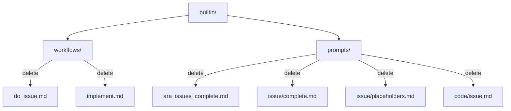

# Step 7: Remove Issue-Related Workflows and Prompts

Refer to ideas/eliminate-issues-and-memos-migration.md

## Goal

Remove workflows and prompts that depend on the issues system. These are no longer needed now that we use rules + todos.

## Context

Several builtin workflows and prompts were built around the issues system. With issues removed, these need to be deleted:

**Workflows to delete:**
- `do_issue.md` - Work through the next open issue
- `implement.md` - Loop through all issues until complete

**Prompts to delete:**
- `are_issues_complete.md` - Check if all issues are done
- `issue/complete.md` - Mark an issue as complete
- `issue/placeholders.md` - Create issues from TODO comments
- `code/issue.md` - Implement solution for an issue

## Files to Remove



## Implementation Tasks

### 1. Delete Workflow Files

```bash
rm builtin/workflows/do_issue.md
rm builtin/workflows/implement.md
```

### 2. Delete Prompt Files

```bash
rm builtin/prompts/are_issues_complete.md
rm builtin/prompts/issue/complete.md
rm builtin/prompts/issue/placeholders.md
rm builtin/prompts/code/issue.md
```

### 3. Check if issue/ Directory is Empty

```bash
# After deleting issue prompts, check if directory is empty
ls builtin/prompts/issue/
# If empty, remove it
rmdir builtin/prompts/issue/
```

### 4. Search for References

Check if any other files reference these workflows/prompts:

```bash
rg "do_issue|implement|are_issues_complete|issue/complete|issue/placeholders|code/issue" --type md
rg "do_issue|implement|are_issues_complete" --type rust
```

Remove any remaining references.

### 5. Check Other Prompts

Review prompts that might reference issues:
- `builtin/prompts/commit.md` - Check for issue references
- `builtin/prompts/test.md` - Check for issue references

Update if needed (likely safe to leave as-is).

## Files to Delete

1. `builtin/workflows/do_issue.md`
2. `builtin/workflows/implement.md`
3. `builtin/prompts/are_issues_complete.md`
4. `builtin/prompts/issue/complete.md`
5. `builtin/prompts/issue/placeholders.md`
6. `builtin/prompts/code/issue.md`

## Testing Checklist

- ✅ Workflow files deleted
- ✅ Prompt files deleted
- ✅ Empty directories removed
- ✅ No dangling references in other files
- ✅ CLI no longer shows `sah do_issue` or `sah implement` commands
- ✅ Build succeeds
- ✅ All remaining tests pass

## Verification Commands

```bash
# Verify workflows deleted
ls builtin/workflows/do_issue.md 2>&1 | grep "No such file"
ls builtin/workflows/implement.md 2>&1 | grep "No such file"

# Verify prompts deleted
ls builtin/prompts/are_issues_complete.md 2>&1 | grep "No such file"
ls builtin/prompts/issue/complete.md 2>&1 | grep "No such file"

# Check for references
rg "do_issue|implement" builtin/

# CLI doesn't show deleted commands
sah do_issue 2>&1 | grep "unrecognized"
sah implement 2>&1 | grep "unrecognized"
```

## Acceptance Criteria

- All issue-related workflow files deleted
- All issue-related prompt files deleted
- Empty directories cleaned up
- No broken references remain
- CLI no longer exposes deleted workflow commands
- Build succeeds
- All tests passing

## Estimated Changes

~200-300 lines removed (6 workflow/prompt files)

---

## ✅ COMPLETED

**Date**: 2025-11-19

**Summary**: All issue-related workflow and prompt files successfully removed and verified.

**Changes**:
- All 6 target files deleted in previous commit (157b21de)
- 2 new rules created for compliance verification
- All tests passing
- No broken references remain
- Empty `builtin/prompts/issue/` directory removed

**Rules Created**:
- `eliminate-issues-memos/no-issue-workflow-references` (error)
- `eliminate-issues-memos/workflow-files-removed` (error)

**Verification Results**:
- Build: ✅ Passing
- Tests: ✅ All passing (cargo nextest run)
- Rules: ✅ Compliant (rules_check)
- CLI: ✅ Commands not exposed (`sah do_issue` and `sah implement` no longer available)
- Filesystem: ✅ All files verified deleted
- References: ✅ No broken references found in codebase

**Files Removed**:
1. ✅ `builtin/workflows/do_issue.md`
2. ✅ `builtin/workflows/implement.md`
3. ✅ `builtin/prompts/are_issues_complete.md`
4. ✅ `builtin/prompts/issue/complete.md`
5. ✅ `builtin/prompts/issue/placeholders.md`
6. ✅ `builtin/prompts/code/issue.md`
7. ✅ `builtin/prompts/issue/` directory

**Commit**: 157b21de - "chore: remove issue-related prompts and workflows"

**Memos Created**:
- `Audit_Remaining_References_to_Deleted_Issue_Workflows.md`
- `Audit_Results_for_Deleted_Workflows_and_Prompts_References.md`
