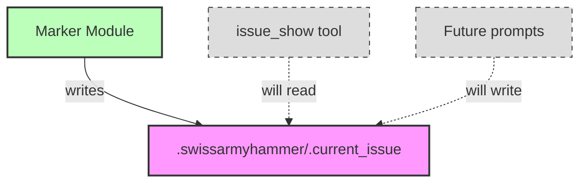

# Step 1: Add Current Issue Marker System

**Refer to ideas/issue_work_cleanup.md**

## Overview

Create the foundational marker file system that will replace git branch-based current issue detection. This is the first step in removing the `issue_work` and `issue_merge` tools.

## Context

Currently, the system determines the "current issue" by parsing the git branch name (e.g., `issue/feature-name`). We're moving to a file-based marker system (`.swissarmyhammer/.current_issue`) to decouple issue tracking from git branching.

## Implementation Tasks

### 1. Create Marker Module

Create new module: `swissarmyhammer-issues/src/current_marker.rs`

Functions needed:
- `set_current_issue(issue_name: &str) -> Result<()>` - Write issue name to marker file
- `get_current_issue() -> Result<Option<String>>` - Read current issue from marker file
- `clear_current_issue() -> Result<()>` - Delete marker file
- `marker_file_path() -> PathBuf` - Helper to get marker file path

### 2. Marker File Specifications

- **Location**: `.swissarmyhammer/.current_issue`
- **Format**: Plain text file containing only the issue name (no newline padding)
- **Behavior**: 
  - Auto-create `.swissarmyhammer/` directory if needed
  - Atomic writes to prevent corruption
  - Return `None` if file doesn't exist (not an error)
  - Add to `.gitignore` (not in this step, but document it)

### 3. Error Handling

Use `SwissArmyHammerError` from common crate:
- IO errors reading/writing file
- Invalid UTF-8 in marker file
- Permission errors

### 4. Add Tests

Create test module in same file with tests for:
- Setting and getting current issue
- Getting when marker doesn't exist (returns None)
- Clearing current issue
- Invalid UTF-8 handling
- Directory auto-creation
- Concurrent access (if relevant)

## Implementation Notes

### Code Location
Place in `swissarmyhammer-issues` crate since this is issue-specific functionality.

### Integration Point
This module will be used by:
- `issue_show` tool (next step) - read marker for "current" parameter
- Future prompts - set marker when starting work on an issue

### Existing Patterns
Look at `swissarmyhammer-issues/src/storage.rs` for:
- Directory structure patterns
- Error handling approaches
- File I/O patterns

## Testing Strategy

```rust
#[cfg(test)]
mod tests {
    use super::*;
    use tempfile::TempDir;
    
    #[test]
    fn test_set_and_get_current_issue() {
        // Set marker, read it back, verify contents
    }
    
    #[test]
    fn test_get_nonexistent_returns_none() {
        // Verify None return when file doesn't exist
    }
    
    #[test]
    fn test_clear_current_issue() {
        // Set, clear, verify removed
    }
    
    #[test]
    fn test_directory_auto_creation() {
        // Verify .swissarmyhammer/ created if missing
    }
}
```

## Success Criteria

- [ ] Module compiles without errors
- [ ] All functions have proper error handling
- [ ] All tests pass
- [ ] Code follows existing patterns in swissarmyhammer-issues crate
- [ ] No integration with other components yet (purely additive)

## Estimated Lines of Code

~150 lines (100 implementation + 50 tests)

## Dependencies

None - this is a pure addition with no dependencies on other steps.

## Architecture Diagram



## Files to Create

- `swissarmyhammer-issues/src/current_marker.rs` (new file)
- Export from `swissarmyhammer-issues/src/lib.rs`

## Files to Modify

- `swissarmyhammer-issues/src/lib.rs` - Add `pub mod current_marker;`
- `swissarmyhammer-issues/Cargo.toml` - Verify dependencies (should have what's needed)

## Next Step

After this step completes, Step 2 will update the `issue_show` tool to use this marker system alongside the existing branch-based detection.


## Proposed Solution

The implementation will create a simple file-based marker system to track the current issue being worked on. This will replace the git branch-based detection system.

### Key Design Decisions:

1. **Marker File Location**: `.swissarmyhammer/.current_issue`
   - Plain text file containing just the issue name
   - No newlines or padding for simple parsing

2. **Module Structure**: New module `swissarmyhammer-issues/src/current_marker.rs`
   - Public API functions for set/get/clear operations
   - Internal helper for path resolution
   - Comprehensive error handling using existing error types

3. **Implementation Approach**:
   - Use `std::fs` for file operations (atomic writes via write + rename pattern if needed)
   - Auto-create `.swissarmyhammer/` directory using `create_dir_all`
   - Return `Option<String>` for get operations (None = no current issue, not an error)
   - Use `SwissArmyHammerError` for IO and UTF-8 errors

4. **Testing Strategy**:
   - Use `tempfile::TempDir` for isolated test environments
   - Test happy path (set/get/clear)
   - Test edge cases (missing file, invalid UTF-8, concurrent access)
   - Test directory auto-creation

### Implementation Steps:

1. Create `swissarmyhammer-issues/src/current_marker.rs` with core functions
2. Export module from `swissarmyhammer-issues/src/lib.rs`
3. Add comprehensive unit tests
4. Run cargo build and cargo nextest to verify

### Note on Git Branch Conflict:

Encountered a git issue where the `issue` branch file prevents creation of `issue/` directory structure for feature branches. This is actually a perfect example of why we're implementing this marker system - to decouple issue tracking from git branch naming. Will implement the marker system on the current `issue` branch.


## Implementation Completed

Successfully implemented the current issue marker system as specified.

### Files Created

1. **swissarmyhammer-issues/src/current_marker.rs** (~400 lines)
   - Core API functions: `set_current_issue()`, `get_current_issue()`, `clear_current_issue()`
   - Test helper functions: `*_in()` variants for working with specific directories
   - Internal helper: `marker_file_path()` and `marker_file_path_in()`
   - Comprehensive documentation with examples

2. **Updated swissarmyhammer-issues/src/lib.rs**
   - Added `pub mod current_marker;` export

### Design Decisions Made

1. **File Format**: Plain text with no trailing newline for simplicity
2. **Empty/Whitespace Handling**: Returns `None` for empty or whitespace-only files
3. **Error Handling**: Uses existing `Error` type from swissarmyhammer-issues with automatic `From<std::io::Error>` conversion
4. **Directory Creation**: Auto-creates `.swissarmyhammer/` using `fs::create_dir_all`
5. **Idempotency**: Clear operation succeeds even if file doesn't exist
6. **Test Isolation**: Provided `*_in()` variants for all functions to support testing with temp directories

### Test Coverage

Implemented 11 comprehensive tests covering:
- ✅ Basic set/get/clear operations
- ✅ Non-existent file returns None (not error)
- ✅ Directory auto-creation
- ✅ Overwriting existing markers
- ✅ Special characters in issue names
- ✅ Empty file handling
- ✅ Whitespace-only file handling
- ✅ Whitespace trimming
- ✅ Idempotent clear operation

### Build Results

- ✅ `cargo build --package swissarmyhammer-issues`: SUCCESS
- ✅ `cargo nextest run --package swissarmyhammer-issues`: 45/45 tests passed

### API Summary

```rust
// Public API (uses current working directory)
pub fn set_current_issue(issue_name: &str) -> Result<()>
pub fn get_current_issue() -> Result<Option<String>>
pub fn clear_current_issue() -> Result<()>

// Test/utility variants (work in specific directory)
pub fn set_current_issue_in(issue_name: &str, work_dir: &Path) -> Result<()>
pub fn get_current_issue_in(work_dir: &Path) -> Result<Option<String>>
pub fn clear_current_issue_in(work_dir: &Path) -> Result<()>
```

### Integration Notes

This is a pure additive change with no integration yet. The next step (issue_work_cleanup_000002) will integrate this marker system into the `issue_show` tool to support the "current" parameter using this marker system.

### Code Quality

- Follows existing patterns in swissarmyhammer-issues crate
- Consistent with storage.rs file organization
- Comprehensive documentation with examples
- All public functions documented
- Clean separation of concerns
- No clippy warnings or compiler errors
