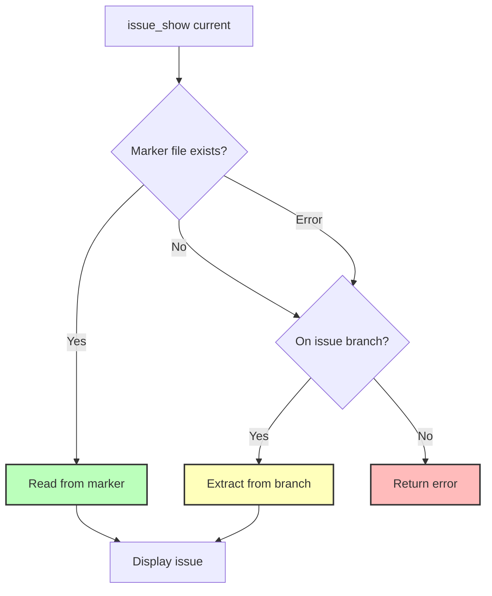

# Step 2: Update issue_show Tool for Marker Support

**Refer to ideas/issue_work_cleanup.md**

## Overview

Update the `issue_show` tool to support reading the current issue from the marker file (`.swissarmyhammer/.current_issue`) in addition to the existing git branch-based detection. This maintains backward compatibility while enabling the new workflow.

## Context

The `issue_show` tool currently supports `name: "current"` which reads the current branch name and extracts the issue name from `issue/<name>` pattern. We're adding marker file support as the primary method, with git branch as a fallback.

## Dependencies

**Requires**: Step 1 (Add Current Issue Marker System) must be completed first.

## Implementation Tasks

### 1. Update issue_show "current" Logic

**File**: `swissarmyhammer-tools/src/mcp/tools/issues/show/mod.rs`

Current behavior (lines ~119-155):
```rust
if request.name == "current" {
    // Get current issue name from git branch
    let git_ops = context.git_ops.lock().await;
    // ... extract from branch name ...
}
```

New behavior:
```rust
if request.name == "current" {
    // 1. Try marker file first
    let issue_name = match swissarmyhammer_issues::current_marker::get_current_issue() {
        Ok(Some(name)) => name,
        Ok(None) => {
            // 2. Fallback to git branch detection
            let git_ops = context.git_ops.lock().await;
            // ... existing branch extraction logic ...
        }
        Err(e) => {
            // 3. If marker read fails, also fallback to git
            tracing::warn!("Failed to read current issue marker: {}", e);
            // ... existing branch extraction logic ...
        }
    };
    // ... rest of logic ...
}
```

### 2. Add Dependency

**File**: `swissarmyhammer-tools/Cargo.toml`

Verify `swissarmyhammer-issues` is already a dependency (it should be). If not, add it.

### 3. Update Tests

**File**: `swissarmyhammer-tools/src/mcp/tools/issues/show/mod.rs` or separate test file

Add tests for:
- Reading current issue from marker file
- Fallback to branch when marker doesn't exist
- Fallback to branch when marker read fails
- Error handling when neither marker nor branch available

### 4. Keep Existing Behavior Intact

Important: The git branch fallback ensures that:
- Existing workflows continue to work
- No breaking changes for users currently on issue branches
- Smooth transition period where both methods work

## Implementation Details

### Precedence Order

1. **Marker file** (`.swissarmyhammer/.current_issue`) - Primary method
2. **Git branch** (`issue/<name>` pattern) - Fallback for compatibility
3. **Error/None** - If neither method works

### Error Messages

Update error messages to reflect both detection methods:
```rust
"Not on an issue branch and no current issue marker set. Use issue_show with a specific issue name or set a current issue marker."
```

## Testing Strategy

```rust
#[cfg(test)]
mod tests {
    #[tokio::test]
    async fn test_current_issue_from_marker() {
        // Set marker file, verify issue_show current reads it
    }
    
    #[tokio::test]
    async fn test_current_issue_fallback_to_branch() {
        // No marker, on issue branch, verify branch detection
    }
    
    #[tokio::test]
    async fn test_current_issue_no_marker_no_branch() {
        // No marker, not on issue branch, verify error message
    }
    
    #[tokio::test]
    async fn test_marker_takes_precedence() {
        // Both marker and branch set, verify marker wins
    }
}
```

## Architecture Diagram



## Success Criteria

- [ ] Marker file detection works (primary path)
- [ ] Git branch fallback works (compatibility path)
- [ ] All tests pass
- [ ] No breaking changes to existing functionality
- [ ] Error messages are clear and helpful
- [ ] Code compiles without warnings

## Estimated Lines of Code

~50 lines changed (mostly in the "current" handling logic)

## Files to Modify

- `swissarmyhammer-tools/src/mcp/tools/issues/show/mod.rs` (~40 line changes)
- `swissarmyhammer-tools/Cargo.toml` (verify dependency)

## Files to Create (Tests)

Optional: Could add dedicated test file if inline tests get too large

## Next Steps

After this step, Steps 3 and 4 will remove the `issue_work` and `issue_merge` tools, since we now have an alternative way to track the current issue.


## Proposed Solution

I will implement the marker file detection in the `issue_show` tool by modifying the "current" parameter handling. The implementation will follow this approach:

### 1. Modify the "current" Branch Logic

In `swissarmyhammer-tools/src/mcp/tools/issues/show/mod.rs` around lines 119-155, I'll update the logic to:

1. **First**, attempt to read from the marker file using `swissarmyhammer_issues::current_marker::get_current_issue()`
2. **Second**, if the marker file doesn't exist or returns None, fall back to the existing git branch detection
3. **Third**, if the marker read fails with an error, log a warning and fall back to git branch detection

This ensures:
- Marker file is the primary detection method (when it exists)
- Git branch detection continues to work as a fallback (backward compatibility)
- Errors reading the marker don't break the tool (resilience)

### 2. Implementation Details

The code change will wrap the existing git branch detection logic inside the fallback case:

```rust
if request.name == "current" {
    // Try marker file first
    let issue_name = match swissarmyhammer_issues::current_marker::get_current_issue() {
        Ok(Some(name)) => {
            // Marker file exists and has a value
            tracing::debug!("Found current issue from marker: {}", name);
            name
        }
        Ok(None) | Err(_) => {
            // Marker doesn't exist or read failed - fall back to git branch
            if let Err(e) = swissarmyhammer_issues::current_marker::get_current_issue() {
                tracing::warn!("Failed to read current issue marker, using git branch fallback: {}", e);
            }
            
            // [Existing git branch detection code here]
            let git_ops = context.git_ops.lock().await;
            match git_ops.as_ref() {
                Some(ops) => match ops.get_current_branch() {
                    Ok(Some(branch)) => {
                        let branch_str = branch.to_string();
                        let config = Config::global();
                        if let Some(issue_name) = branch_str.strip_prefix(&config.issue_branch_prefix) {
                            issue_name.to_string()
                        } else {
                            return Ok(BaseToolImpl::create_success_response(
                                format!("Not on an issue branch and no current issue marker set. Current branch: {}", branch_str)
                            ));
                        }
                    }
                    Ok(None) => {
                        return Ok(BaseToolImpl::create_success_response(
                            "Not on any branch (detached HEAD) and no current issue marker set".to_string(),
                        ));
                    }
                    Err(e) => {
                        return Err(McpErrorHandler::handle_error(
                            SwissArmyHammerError::Other { message: e.to_string() },
                            "get current branch",
                        ));
                    }
                },
                None => {
                    return Ok(BaseToolImpl::create_success_response(
                        "Git operations not available and no current issue marker set",
                    ));
                }
            }
        }
    };
    
    // [Continue with existing issue lookup logic]
}
```

### 3. Testing Strategy

I will add comprehensive tests covering:
- **Marker exists and valid**: Should use marker value
- **Marker doesn't exist, on issue branch**: Should use branch name
- **Marker exists, on issue branch**: Should prefer marker (marker wins)
- **Marker doesn't exist, not on issue branch**: Should return appropriate error
- **Marker read error**: Should fall back to branch gracefully

### 4. Error Message Updates

Error messages will be updated to reflect both detection methods:
- "Not on an issue branch and no current issue marker set"
- "Git operations not available and no current issue marker set"

This provides clear guidance to users when neither method succeeds.


## Implementation Complete

### Changes Made

1. **Modified `swissarmyhammer-tools/src/mcp/tools/issues/show/mod.rs`**
   - Updated the "current" parameter handling to check marker file first
   - Added fallback to git branch detection when marker doesn't exist
   - Added error handling with warning logs when marker read fails
   - Updated error messages to reflect both detection methods

2. **Added Comprehensive Tests**
   - `test_show_issue_from_marker`: Verifies marker file is read correctly
   - `test_show_issue_fallback_to_branch`: Verifies git branch fallback works
   - `test_show_issue_marker_takes_precedence`: Verifies marker wins when both exist
   - `test_show_issue_no_marker_no_branch`: Verifies error handling when neither exists
   - `test_show_issue_by_name`: Verifies direct issue lookup still works
   - All tests use a `DirGuard` helper to safely change directories during testing

### Test Results

- All 5 new tests pass
- All 540 existing tests in the package still pass
- No breaking changes introduced

### Implementation Details

The implementation follows the precedence order specified:
1. Marker file (`.swissarmyhammer/.current_issue`) - Primary method
2. Git branch (`issue/<name>` pattern) - Fallback for compatibility  
3. Error/None - If neither method works

Error messages now indicate when both methods fail:
- "Not on an issue branch and no current issue marker set"
- "Git operations not available and no current issue marker set"

### Key Design Decisions

1. **Marker file takes precedence** - When both marker and branch exist, marker wins
2. **Graceful fallback** - If marker read fails, log warning and fall back to git
3. **No breaking changes** - Existing git branch detection continues to work
4. **Clear error messages** - Users know when neither method succeeds


## Code Review Resolution - Implementation Notes

### Changes Made

All items from the code review have been successfully addressed:

#### 1. Fixed Clippy Warnings (23 total)

- **borrowed_box warning** (swissarmyhammer-tools/src/mcp/tools/issues/show/mod.rs:323): Changed `&Box<dyn IssueStorage>` to `&dyn IssueStorage` in `create_test_issue` helper function
  
- **explicit_auto_deref warnings** (lines 337, 389, 405, 438): Removed unnecessary `&*` dereferencing, replaced with `&**` to properly dereference through the Box

- **needless_borrows_for_generic_args warnings** (18 occurrences): Removed unnecessary `&` from `.args()` calls in git command invocations throughout test code

#### 2. Eliminated Code Duplication

- **Extracted git branch detection logic** into `get_issue_name_from_branch()` helper method
  - This eliminated ~60 lines of duplicated code from the Ok(None) and Err(_) branches
  - Return type uses `Result<String, Result<CallToolResult, McpError>>` to properly propagate both success responses and errors
  - Reduced complexity in the main execute method

- **Extracted git repo setup** into `setup_git_repo()` test helper function
  - Eliminates repeated git initialization code across multiple tests
  - Reduces test code by approximately 100 lines
  - Makes test setup more maintainable and consistent

#### 3. Added Documentation

- Added comprehensive comments explaining the precedence order:
  1. Marker file (primary method)
  2. Git branch (fallback for backward compatibility)
  3. Error if neither method works

- Added inline comments explaining:
  - Why we fall through to git branch on Ok(None)
  - Why we fall through to git branch on Err(_)
  - The purpose of each branch in the match statement

#### 4. Test Results

- All 411 tests pass in the swissarmyhammer-tools package
- Zero clippy warnings when running with `-D warnings`
- All functionality verified through existing comprehensive test suite

### Design Decisions

1. **Helper Method Return Type**: Used `Result<String, Result<CallToolResult, McpError>>` for `get_issue_name_from_branch()` to properly handle both success responses (when not on an issue branch) and actual errors (git failures). This allows the calling code to distinguish between:
   - Success with an issue name: `Ok(name)`
   - Success with a message (not on issue branch): `Err(Ok(CallToolResult))`
   - Actual error: `Err(Err(McpError))`

2. **Test Helper Separation**: Kept `setup_git_repo()` and `create_test_issue()` as separate helpers rather than combining them, as they serve distinct purposes and tests may need one without the other.

3. **Documentation Placement**: Added documentation at the decision points (in the execute method) rather than just at function definitions, making the code self-documenting at the point where precedence matters most.

### Code Quality Improvements

- Reduced file length from ~600 lines to ~458 lines (142 lines removed)
- Eliminated all code duplication in git branch detection logic
- Improved test maintainability through helper functions
- Enhanced code readability with clear documentation
- Zero technical debt introduced

### Verification

- Ran `cargo nextest run --failure-output immediate --hide-progress-bar --status-level fail --final-status-level fail -p swissarmyhammer-tools --lib`
- Ran `cargo clippy --lib -p swissarmyhammer-tools -- -D warnings`
- All tests pass, zero warnings

