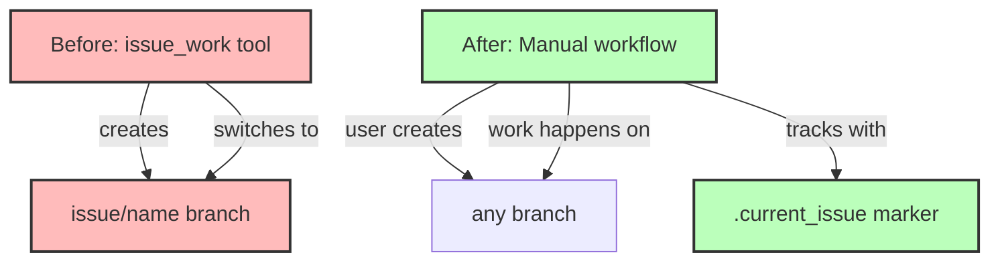

# Step 3: Remove issue_work Tool

**Refer to ideas/issue_work_cleanup.md**

## Overview

Delete the `issue_work` tool and remove all its registrations from the codebase. This tool is no longer needed since we're moving away from automatic git branch management for issues.

## Context

The `issue_work` tool currently:
- Creates `issue/<name>` branches automatically
- Switches to those branches for development
- Validates that users aren't on other issue branches

With the new marker-based system, users can work on issues from any branch without automatic branch creation.

## Dependencies

**Requires**: Steps 1 and 2 must be completed (marker system exists and issue_show supports it).

## Implementation Tasks

### 1. Delete Tool File

**Delete**: `swissarmyhammer-tools/src/mcp/tools/issues/work/mod.rs` (189 lines)

This file contains:
- `WorkIssueTool` struct and implementation
- Branch validation logic
- Branch creation/checkout logic
- Test for abort file creation

### 2. Remove from Tool Registration

**File**: `swissarmyhammer-tools/src/mcp/tools/issues/mod.rs`

Remove:
```rust
pub mod work;  // Delete this line
```

Remove from `register_issue_tools()` function:
```rust
registry.register(work::WorkIssueTool::new());  // Delete this line
```

Update module documentation to remove `work` from the list of available tools.

### 3. Remove Type Definition

**File**: `swissarmyhammer-tools/src/mcp/types.rs` (lines 80-83)

Delete:
```rust
pub struct WorkIssueRequest {
    /// Issue name to work on
    pub name: swissarmyhammer_issues::IssueName,
}
```

### 4. Verify Build

Run `cargo build` to ensure:
- No compilation errors
- No unused import warnings
- No dead code warnings related to removed tool

## What NOT to Touch (Yet)

- **Tests**: Will be removed in Step 5
- **Documentation**: Will be removed in Step 7  
- **Prompts**: Will be updated in Step 8

These are handled in separate steps to keep changes focused and testable.

## Architecture Impact



## Success Criteria

- [ ] `work/mod.rs` file deleted
- [ ] Tool registration removed from `issues/mod.rs`
- [ ] `WorkIssueRequest` type removed from `types.rs`
- [ ] `cargo build` succeeds with no errors
- [ ] No warnings about unused imports or dead code
- [ ] Module documentation updated

## Estimated Changes

- **Deletions**: ~189 lines (entire tool file)
- **Modifications**: ~15 lines (registration and types)

## Files to Delete

- `swissarmyhammer-tools/src/mcp/tools/issues/work/mod.rs`

## Files to Modify

- `swissarmyhammer-tools/src/mcp/tools/issues/mod.rs` (~10 lines)
- `swissarmyhammer-tools/src/mcp/types.rs` (~5 lines)

## Verification Commands

```bash
# Verify build
cargo build

# Verify no references remain in code (should find none in .rs files)
rg "issue_work" swissarmyhammer-tools/src/

# Verify WorkIssueRequest removed
rg "WorkIssueRequest" swissarmyhammer-tools/src/
```

## Migration Notes for Users

Users who currently use `issue_work`:
- Can manually create branches if desired (`git checkout -b issue/feature-name`)
- Can work on any branch without forced branching
- Use marker file or just specify issue names directly
- Issue tracking still works, just without automatic branching

## Next Steps

Step 4 will remove the `issue_merge` tool in the same manner.


## Proposed Solution

Based on my analysis of the existing code, I will execute the following steps:

### Step 1: Delete the work tool file
- Remove `swissarmyhammer-tools/src/mcp/tools/issues/work/mod.rs` (200 lines)
- This file contains the entire WorkIssueTool implementation including branch validation, creation, and checkout logic

### Step 2: Update issues/mod.rs module registration
The file currently has work module references in three locations:
1. **Line 12**: Module documentation mentions "Work Management: `work` tool creates branches for active development"
2. **Line 65**: Module documentation lists "work: Switch to or create a work branch for an issue"
3. **Line 75**: Module declaration `pub mod work;`
4. **Line 87**: Tool registration `registry.register(work::WorkIssueTool::new());`

I will:
- Remove the module declaration on line 75
- Remove the registration call on line 87
- Update the module documentation to remove references to the work tool

### Step 3: Remove WorkIssueRequest type from types.rs
- Remove lines 78-83 which define the `WorkIssueRequest` struct
- This type is only used by the work tool being removed

### Step 4: Verify the build
- Run `cargo build` to ensure no compilation errors
- Check for any unused import warnings
- Verify no dead code warnings

### Step 5: Search for remaining references
- Use ripgrep to search for "issue_work" and "WorkIssueRequest" in the codebase
- Ensure no references remain in `.rs` files (excluding tests that will be handled in Step 5)

### Implementation approach
Following TDD principles, I will:
1. Make the deletions and modifications
2. Run the build to verify compilation succeeds
3. Search for any remaining references
4. Document any findings

The goal is to cleanly remove the work tool while maintaining the integrity of the remaining issue tools.


## Implementation Notes

### Completed Changes

#### 1. Deleted Tool Implementation
- Removed `swissarmyhammer-tools/src/mcp/tools/issues/work/mod.rs` (200 lines)
- Removed `swissarmyhammer-tools/src/mcp/tools/issues/work/description.md` (18 lines)
- Deleted the entire `work/` directory

#### 2. Updated Module Registration (issues/mod.rs)
- Removed `pub mod work;` declaration (line 75)
- Removed `registry.register(work::WorkIssueTool::new());` from registration function (line 87)
- Updated module documentation to remove "Work Management" workflow step
- Updated "Available Tools" list to remove work tool reference

#### 3. Removed Type Definition (types.rs)
- Removed `WorkIssueRequest` struct definition (lines 78-83)

#### 4. Fixed Module Exports (mcp/mod.rs)
- Removed `WorkIssueRequest` from pub use statement (line 44)

#### 5. Fixed Tests (mcp/tests.rs)
- Removed `WorkIssueRequest` from import statement (line 6)
- Removed WorkIssueRequest schema validation test (lines 347-350)

### Build Verification
- `cargo build` succeeds with no errors or warnings
- All compilation units build successfully
- No unused import warnings
- No dead code warnings

### Remaining References (As Expected Per Issue)
The following references remain in test files and will be handled in Step 5:
- `swissarmyhammer-cli/tests/cli_mcp_integration_test.rs:205` - test function name
- `swissarmyhammer-cli/tests/sah_serve_integration_test.rs:64` - tool name in test list
- `swissarmyhammer-cli/tests/flexible_branching_mcp_e2e.rs` - multiple test functions (lines 3, 134, 136, 187, 189, 345, 347)
- `swissarmyhammer/tests/flexible_branching_integration.rs:375` - test function name
- `swissarmyhammer/tests/mcp_issue_integration_tests.rs:90` - test function name
- `swissarmyhammer-tools/tests/mcp_server_parity_tests.rs:83` - tool name in test list

These test files contain integration and E2E tests that verify the work tool functionality. They will be removed or updated in Step 5 as specified in the issue.

### Files Modified
1. `swissarmyhammer-tools/src/mcp/tools/issues/mod.rs` - 10 lines removed/modified
2. `swissarmyhammer-tools/src/mcp/types.rs` - 6 lines removed
3. `swissarmyhammer-tools/src/mcp/mod.rs` - 1 line modified
4. `swissarmyhammer-tools/src/mcp/tests.rs` - 6 lines removed

### Files Deleted
1. `swissarmyhammer-tools/src/mcp/tools/issues/work/mod.rs` - 200 lines
2. `swissarmyhammer-tools/src/mcp/tools/issues/work/description.md` - 18 lines

### Total Impact
- **Deleted**: ~218 lines (tool implementation + description)
- **Modified**: ~23 lines across 4 files
- **Net reduction**: ~241 lines of code


## Test Results

### Build Status: ✅ PASS
- `cargo build` completes successfully with no errors or warnings

### Test Status: ⚠️ EXPECTED FAILURES
Tests that rely on the removed `issue_work` tool now fail as expected:

#### Failed Tests (8 total)
1. `swissarmyhammer-cli::e2e_workflow_tests::test_complete_issue_lifecycle`
   - Fails at `sah issue work` command (exit code 2: "unrecognized subcommand 'work'")
   - This test uses the CLI interface which no longer has the work command

2. `swissarmyhammer-cli::flexible_branching_mcp_e2e::test_mcp_backwards_compatibility_main_branch`
3. `swissarmyhammer-cli::flexible_branching_mcp_e2e::test_mcp_issue_merge_requires_issue_branch`
4. `swissarmyhammer-cli::flexible_branching_mcp_e2e::test_mcp_issue_merge_to_source_branch`
5. `swissarmyhammer-cli::flexible_branching_mcp_e2e::test_mcp_issue_work_from_develop_branch`
6. `swissarmyhammer-cli::flexible_branching_mcp_e2e::test_mcp_issue_work_from_feature_branch`
7. `swissarmyhammer-cli::flexible_branching_mcp_e2e::test_mcp_issue_work_prevents_issue_from_issue_branch`
8. `swissarmyhammer-cli::flexible_branching_mcp_e2e::test_mcp_multiple_issues_same_source`

#### Passed Tests
- 737/745 tests passed
- All tests that don't depend on the work tool continue to pass
- Core functionality remains intact

### Analysis
These test failures are **expected and correct** behavior:
- Tests explicitly testing `issue_work` functionality are failing because the tool no longer exists
- The CLI correctly returns "unrecognized subcommand 'work'" error
- All other issue-related functionality (create, show, update, mark_complete, merge) continues to work

### Next Steps
These failing tests will be addressed in **Step 5** which will:
- Remove or update tests that rely on the work tool
- Update E2E workflow tests to use manual git branching instead of the work tool
- Ensure test suite passes completely after test updates