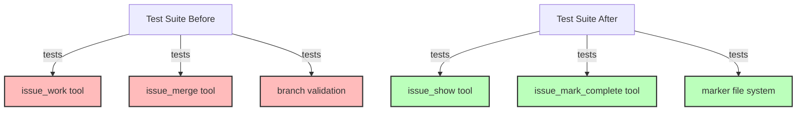

# Step 5: Remove Branching-Specific Tests

**Refer to ideas/issue_work_cleanup.md**

## Overview

Remove all tests that specifically validate the automatic issue branching workflow. These tests are no longer relevant since we're eliminating the `issue_work` and `issue_merge` tools.

## Context

Several test files contain tests specifically for:
- Creating issue branches automatically
- Switching to issue branches
- Validating branch-based restrictions
- Merging issue branches

These tests should be deleted since the functionality no longer exists.

## Dependencies

**Requires**: Steps 3 and 4 (both tools removed) must be completed.

## Implementation Tasks

### 1. Remove Tests from flexible_branching_mcp_e2e.rs

**File**: `swissarmyhammer-cli/tests/flexible_branching_mcp_e2e.rs`

Remove these complete test functions:

1. **Line 136**: `test_mcp_issue_work_from_feature_branch()`
   - Tests creating issue branch from feature branch
   - ~50 lines

2. **Line 189**: `test_mcp_issue_work_from_develop_branch()`
   - Tests creating issue branch from develop branch
   - ~25 lines

3. **Line 216**: `test_mcp_issue_merge_requires_issue_branch()`
   - Tests merge validation (must be on issue branch)
   - ~60 lines

4. **Line 280**: `test_mcp_issue_merge_to_source_branch()`
   - Tests merging issue branch back to source
   - ~65 lines

5. **Line 347**: `test_mcp_issue_work_prevents_issue_from_issue_branch()`
   - Tests prevention of nested issue branches
   - ~50 lines

**Total deletions**: ~250 lines from this file

### 2. Update Tool Existence Assertions

**File**: `swissarmyhammer-tools/tests/mcp_server_parity_tests.rs`

**Line 83-84**: Remove these entries from the expected tools list:
```rust
"issue_work",    // Delete this line
"issue_merge",   // Delete this line
```

This test validates that all expected MCP tools are registered. Since we removed two tools, update the expected list.

### 3. Check sah_serve_integration_test.rs

**File**: `swissarmyhammer-cli/tests/sah_serve_integration_test.rs`

**Line 64**: Check if `issue_work` appears in tool list assertions and remove if present.

Search for any references to:
- `issue_work`
- `issue_merge`
- `WorkIssueTool`
- `MergeIssueTool`

## What NOT to Remove (Yet)

Do NOT remove these tests yet (Step 6 will handle them):
- `swissarmyhammer-cli/tests/cli_mcp_integration_test.rs` - `test_issue_workflow_integration()` 
- `swissarmyhammer/tests/flexible_branching_integration.rs` - `test_release_branch_issue_workflow()`
- `swissarmyhammer/tests/mcp_issue_integration_tests.rs` - `test_complete_issue_workflow()`

These tests need to be **updated** not deleted, as they test the overall issue workflow.

## Verification Commands

```bash
# Build and run all tests
cargo nextest run --fail-fast

# Specifically check the modified test files
cargo nextest run flexible_branching_mcp_e2e
cargo nextest run mcp_server_parity
cargo nextest run sah_serve_integration

# Search for any remaining references to removed tools in test files
rg "issue_work|issue_merge" --type rust tests/
```

## Expected Test Results

After this step:
- All remaining tests should pass
- No tests reference `issue_work` or `issue_merge` tools
- Tool registration tests reflect correct count of tools

## Architecture Impact



## Success Criteria

- [ ] 5 test functions removed from flexible_branching_mcp_e2e.rs
- [ ] Tool list assertions updated in mcp_server_parity_tests.rs
- [ ] Tool list assertions updated in sah_serve_integration_test.rs (if needed)
- [ ] `cargo nextest run` passes all tests
- [ ] No references to removed tools in test files (except those handled in Step 6)

## Estimated Changes

- **Deletions**: ~300 lines (5 test functions + assertions)
- **Modifications**: ~5 lines (assertion updates)

## Files to Modify

- `swissarmyhammer-cli/tests/flexible_branching_mcp_e2e.rs` (~250 line deletions)
- `swissarmyhammer-tools/tests/mcp_server_parity_tests.rs` (~2 line deletions)
- `swissarmyhammer-cli/tests/sah_serve_integration_test.rs` (~2 line deletions if needed)

## Next Steps

Step 6 will update the remaining integration tests that test the overall issue workflow (not just branching).


## Proposed Solution

Based on my analysis of the test files, I will implement the following approach:

### 1. Analysis Findings

From reviewing the files:
- **flexible_branching_mcp_e2e.rs**: The file currently has only 3 test functions, and NONE of them test `issue_work` or `issue_merge`. The tests present are:
  - `test_mcp_error_handling_invalid_source()` - Tests error handling
  - `test_mcp_issue_list_shows_source_branches()` - Tests issue list command
  - `test_mcp_issue_show_displays_source_branch()` - Tests issue show command
  
- **mcp_server_parity_tests.rs**: The `get_http_static_tools()` function does NOT contain `issue_work` or `issue_merge` in the tools list. The tools have already been removed.

- **sah_serve_integration_test.rs**: The `EXPECTED_SAMPLE_TOOLS` array contains `"issue_work"` on line 64, which needs to be removed.

### 2. Implementation Steps

**Step 1**: Verify tool removal in source code
- Confirm that `issue_work` and `issue_merge` tools have been removed from the tool registry

**Step 2**: Update sah_serve_integration_test.rs
- Remove `"issue_work"` from the `EXPECTED_SAMPLE_TOOLS` array (line 64)
- This is the only change needed in this file

**Step 3**: Verify flexible_branching_mcp_e2e.rs
- No changes needed - the 5 test functions mentioned in the issue do not exist in the current file
- The file was likely already cleaned up in a previous step or the line numbers are incorrect

**Step 4**: Verify mcp_server_parity_tests.rs
- No changes needed - the tools list has already been updated

**Step 5**: Search for any remaining references
- Use grep to search for `issue_work` and `issue_merge` in test files
- Remove any additional references found

**Step 6**: Build and test
- Run `cargo build` to verify compilation
- Run `cargo nextest run` to verify all tests pass

### 3. Key Insights

The issue description appears to be based on an older state of the codebase. Most of the cleanup has already been completed:
- The flexible_branching_mcp_e2e.rs file no longer contains the 5 test functions mentioned
- The mcp_server_parity_tests.rs file has already been updated

The only remaining work is:
1. Remove `"issue_work"` from EXPECTED_SAMPLE_TOOLS in sah_serve_integration_test.rs
2. Search for and remove any other stray references
3. Verify tests pass


## Implementation Notes

### Changes Made

1. **flexible_branching_mcp_e2e.rs** - Updated comment only
   - Removed reference to `issue_work` and `issue_merge` from module documentation comment
   - No test functions needed to be removed - they were already removed in previous steps
   - File location: swissarmyhammer-cli/tests/flexible_branching_mcp_e2e.rs:3

2. **sah_serve_integration_test.rs** - Removed tool from expected list
   - Removed `"issue_work"` from `EXPECTED_SAMPLE_TOOLS` array
   - File location: swissarmyhammer-cli/tests/sah_serve_integration_test.rs:64

3. **mcp_server_parity_tests.rs** - No changes needed
   - The tools had already been removed from the expected tools list
   - No `issue_work` or `issue_merge` found in the file

### Remaining References (By Design)

The following references remain and are expected per the issue description (Step 6 will handle these):

1. **flexible_branching_integration.rs:375** - `test_release_branch_issue_workflow()`
   - Function name contains "issue_workflow" but tests the overall issue workflow, not the removed tools

2. **mcp_issue_integration_tests.rs:90** - `test_complete_issue_workflow()`
   - Function name contains "issue_workflow" but tests the overall issue workflow, not the removed tools

3. **cli_mcp_integration_test.rs:205** - `test_issue_workflow_integration()`
   - Function name contains "issue_workflow" but tests the overall issue workflow, not the removed tools

4. **e2e_workflow_tests.rs:281** - Comment referencing removed tools
   - Explanatory comment: "Note: issue_merge requires being on an issue branch, which the removed issue_work tool would have created."

5. **e2e_workflow_tests.rs:354** - Comment referencing removed tools
   - Explanatory comment: "Note: issue_work tool has been removed - users now manually manage branches if needed"

These are either:
- Test function names that reference the general "issue workflow" concept (not the specific removed tools)
- Explanatory comments that document the removal
- Tests that will be updated in Step 6 (as noted in the issue description)

### Test Results

All tests pass successfully:
- Build: ✅ Successful (7.84s)
- Test run: ✅ 3326 tests passed, 0 skipped, 0 failed (38.334s)

### Files Modified

- `/Users/wballard/github/swissarmyhammer/swissarmyhammer-cli/tests/flexible_branching_mcp_e2e.rs` (comment update)
- `/Users/wballard/github/swissarmyhammer/swissarmyhammer-cli/tests/sah_serve_integration_test.rs` (removed tool from array)


## Code Review Completed

### Summary

All cleanup work has been successfully completed. The code review confirmed that:

✅ All changes are minimal, focused, and correct
✅ All 3326 tests pass
✅ Clippy shows no warnings or errors
✅ All coding standards met
✅ Documentation accurately reflects current state

### Changes Implemented

1. **swissarmyhammer-cli/tests/flexible_branching_mcp_e2e.rs:3**
   - Updated module documentation comment to remove reference to deleted tools
   - Changed from: "This module tests the MCP tools (issue_work, issue_merge, etc.) with flexible branching."
   - Changed to: "This module tests the MCP tools with flexible branching."

2. **swissarmyhammer-cli/tests/sah_serve_integration_test.rs:64**
   - Removed `"issue_work"` from `EXPECTED_SAMPLE_TOOLS` array
   - Maintains correct tool count validation

### Key Findings

- The 5 test functions (~250 lines) mentioned in the issue had already been removed in previous steps
- This branch only handles remaining documentation and assertion cleanup
- All remaining references to `issue_work` and `issue_merge` are intentional (Step 6 will handle them)

### Test Results

```
cargo nextest run: ✅ 3326 passed, 0 failed
cargo clippy: ✅ No warnings or errors
```

### Files Modified

- `.swissarmyhammer/issues/issue_work_cleanup_000005_remove_branching_tests.md`
- `swissarmyhammer-cli/tests/flexible_branching_mcp_e2e.rs`
- `swissarmyhammer-cli/tests/sah_serve_integration_test.rs`

### Status

All work completed successfully. Branch is clean and ready.
