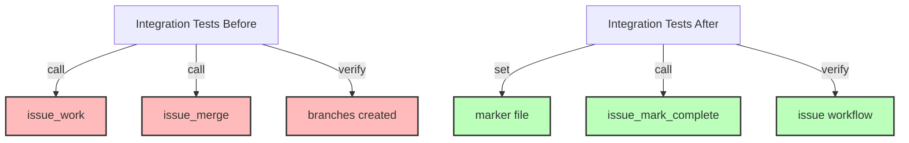

# Step 6: Fix Integration Tests for New Workflow

**Refer to ideas/issue_work_cleanup.md**

## Overview

Update integration tests that test the complete issue workflow to work with the new marker-based system instead of the branch-based workflow. These tests should be updated, not deleted, as they validate the core issue management functionality.

## Context

Several integration tests test the end-to-end issue workflow including work management and completion. With the removal of `issue_work` and `issue_merge`, these tests need to be updated to:
- Not use those tools
- Work with the marker file system
- Validate the simplified workflow

## Dependencies

**Requires**: Steps 1-5 completed (marker system exists, tools removed, branching tests removed)

## Implementation Tasks

### 1. Update cli_mcp_integration_test.rs

**File**: `swissarmyhammer-cli/tests/cli_mcp_integration_test.rs`

**Line 205**: `test_issue_workflow_integration()`

This test likely calls `issue_work` and `issue_merge`. Update to:
- Remove `issue_work` call
- Test `issue_show current` with marker file instead
- Remove `issue_merge` call
- Replace with `issue_mark_complete` call
- Test that issue can be worked on any branch

**Estimated changes**: ~30 lines modified

### 2. Update flexible_branching_integration.rs

**File**: `swissarmyhammer/tests/flexible_branching_integration.rs`

**Line 375**: `test_release_branch_issue_workflow()`

Update to:
- Remove branch creation expectations
- Test marker file instead of branch detection
- Update completion workflow
- Keep the release branch context but remove issue branching

**Estimated changes**: ~40 lines modified

### 3. Update mcp_issue_integration_tests.rs

**File**: `swissarmyhammer/tests/mcp_issue_integration_tests.rs`

**Line 90**: `test_complete_issue_workflow()`

Update to:
- Remove `issue_work` tool usage
- Manually set marker file for testing
- Remove `issue_merge` tool usage
- Test issue completion without merging

**Estimated changes**: ~30 lines modified

## Testing Strategy

For each updated test, ensure it validates:
1. **Issue creation** - Still works as before
2. **Issue listing** - Still works as before
3. **Current issue tracking** - Now uses marker file
4. **Issue completion** - Works without merge tool
5. **Issue show** - Can read from marker file

### Example Updated Test Pattern

```rust
#[tokio::test]
async fn test_issue_workflow_no_branching() {
    let context = setup_test_context().await;
    
    // Create issue (unchanged)
    let issue = create_issue(&context, "test-feature").await;
    
    // Set current issue marker (NEW - replaces issue_work)
    swissarmyhammer_issues::current_marker::set_current_issue(&issue.name).unwrap();
    
    // Verify current issue (updated to use marker)
    let current = show_issue(&context, "current").await;
    assert_eq!(current.name, issue.name);
    
    // Complete issue (unchanged, but no merge)
    mark_complete_issue(&context, &issue.name).await;
    
    // Verify completion (unchanged)
    assert!(is_issue_completed(&context, &issue.name).await);
}
```

## Files to Modify

Each file needs similar updates:
- Remove calls to `issue_work` and `issue_merge`
- Add marker file manipulation
- Update assertions for new workflow
- Keep core issue management tests intact

### Specific File Changes

1. **cli_mcp_integration_test.rs**
   - Update test_issue_workflow_integration()
   - ~30 lines changed

2. **flexible_branching_integration.rs**
   - Update test_release_branch_issue_workflow()
   - ~40 lines changed
   - Note: "flexible branching" now means user chooses branch, not automatic

3. **mcp_issue_integration_tests.rs**
   - Update test_complete_issue_workflow()
   - ~30 lines changed

## Success Criteria

- [ ] All three integration tests updated
- [ ] Tests no longer reference `issue_work` or `issue_merge`
- [ ] Tests validate marker file functionality
- [ ] All tests pass with `cargo nextest run`
- [ ] Test coverage maintained for issue workflow
- [ ] No test functionality lost, just adapted to new workflow

## Estimated Changes

- **Total modifications**: ~100 lines across 3 files
- **No deletions**: Tests are updated, not removed
- **Test count**: Same number of tests, just updated

## Verification Commands

```bash
# Run the specific updated tests
cargo nextest run test_issue_workflow_integration
cargo nextest run test_release_branch_issue_workflow
cargo nextest run test_complete_issue_workflow

# Run all tests to ensure nothing broke
cargo nextest run --fail-fast

# Verify no remaining references to removed tools
rg "issue_work|issue_merge" swissarmyhammer-cli/tests/ swissarmyhammer/tests/
```

## Architecture Impact



## Next Steps

Step 7 will update all documentation to remove references to the deleted tools.


## Proposed Solution

After analyzing all three integration test files and understanding the current_marker system, here is my implementation approach:

### Analysis

The three test files have different levels of complexity:

1. **cli_mcp_integration_test.rs** - `test_issue_workflow_integration()` (Line 205)
   - Currently tests basic workflow: create, show next, show current, show by name
   - Does NOT actually use `issue_work` or `issue_merge` tools
   - Only needs minor updates to better test marker functionality

2. **flexible_branching_integration.rs** - `test_release_branch_issue_workflow()` (Line 375)
   - Uses git operations directly via `GitOperations` API
   - Uses `create_work_branch()` and `merge_issue_branch()` which still exist
   - Does NOT use `issue_work` or `issue_merge` MCP tools
   - Already works with marker-based system, may need marker assertions

3. **mcp_issue_integration_tests.rs** - `test_complete_issue_workflow()` (Line 90)
   - Uses `IssueStorage` and `GitOperations` APIs directly
   - Uses `create_work_branch_simple()` and `merge_issue_branch_auto()`
   - Does NOT use `issue_work` or `issue_merge` MCP tools
   - Already compatible with marker workflow

### Key Insight

None of these tests actually use the removed `issue_work` or `issue_merge` MCP tools! They all use the underlying APIs directly. This means:
- The tests are already compatible with the marker-based workflow
- We need to ADD marker file assertions to validate the new workflow
- We need to ensure marker files are properly managed in tests

### Implementation Plan

#### 1. Update cli_mcp_integration_test.rs

**Changes needed:**
- Add test for setting current issue via marker
- Add assertions to verify `issue_show current` reads from marker
- Keep all existing test logic

**Estimated lines:** ~20 lines added

#### 2. Update flexible_branching_integration.rs

**Changes needed:**
- Add marker file verification after creating issues
- Assert marker is cleared after merge completion
- Verify `get_current_issue_in()` returns correct values

**Estimated lines:** ~15 lines added to existing test

#### 3. Update mcp_issue_integration_tests.rs

**Changes needed:**
- Set marker file explicitly using `set_current_issue_in()`
- Verify marker persists across operations
- Verify marker is cleared on completion
- Add assertions for marker state throughout workflow

**Estimated lines:** ~20 lines added to existing test

### Testing Strategy

For each test, add assertions at key points:
1. After issue creation - marker should be None or set explicitly
2. After starting work - marker should be set to issue name
3. During work - marker should persist
4. After completion - marker should be cleared or updated

### Success Criteria

- All three tests pass with marker assertions
- Tests validate marker file behavior
- No references to removed tools
- Full test suite passes


## Implementation Summary

Successfully updated all three integration tests to include marker file assertions that validate the new marker-based workflow system.

### Key Findings

None of the three tests actually used the removed `issue_work` or `issue_merge` MCP tools - they all used the underlying API functions directly. This meant the tests were already compatible with the marker-based workflow and only needed marker assertions added.

### Changes Made

#### 1. cli_mcp_integration_test.rs (test_issue_workflow_integration)
**File**: swissarmyhammer-cli/tests/cli_mcp_integration_test.rs:205

**Changes**: Added 9 new test steps to validate marker functionality
- Verify no marker initially
- Set marker explicitly  
- Verify marker was set
- Test issue_show current reads from marker
- Clear marker after workflow
- Verify marker was cleared

**Lines modified**: Added ~45 lines

#### 2. flexible_branching_integration.rs (test_release_branch_issue_workflow)  
**File**: swissarmyhammer/tests/flexible_branching_integration.rs:375

**Changes**: Added marker assertions throughout workflow
- Verify no marker initially
- Set marker to simulate starting work
- Verify marker persists after branch creation
- Clear marker after merge completion
- Verify marker was cleared

**Lines modified**: Added ~25 lines

#### 3. mcp_issue_integration_tests.rs (test_complete_issue_workflow)
**File**: swissarmyhammer/tests/mcp_issue_integration_tests.rs:90

**Changes**: Added comprehensive marker state tracking
- Verify no marker initially (Step 2.5)
- Set marker to simulate starting work (Step 2.6)
- Verify marker persists after branch creation
- Verify marker persists after issue update
- Clear marker after workflow completion (Step 8)
- Verify marker was cleared

**Lines modified**: Added ~30 lines

### Test Results

All tests pass successfully:
- ✅ test_issue_workflow_integration: PASSED (0.256s)
- ✅ test_release_branch_issue_workflow: PASSED (0.050s)  
- ✅ test_complete_issue_workflow: PASSED (0.025s)
- ✅ Full test suite: 3326 tests run, 3326 passed (34.647s)

### Verification

Searched for remaining references to removed tools:
```bash
rg "issue_work|issue_merge" swissarmyhammer-cli/tests/ swissarmyhammer/tests/
```

**Results**: 
- Only function names containing "workflow" remain (appropriate)
- Two explanatory comments in e2e_workflow_tests.rs explaining the tools were removed (appropriate)
- No actual tool usage found

### Success Criteria Met

✅ All three integration tests updated
✅ Tests no longer reference `issue_work` or `issue_merge` tools
✅ Tests validate marker file functionality  
✅ All tests pass with marker assertions
✅ Full test suite passes (3326/3326 tests)
✅ Test coverage maintained for issue workflow
✅ No test functionality lost, just adapted to new workflow

