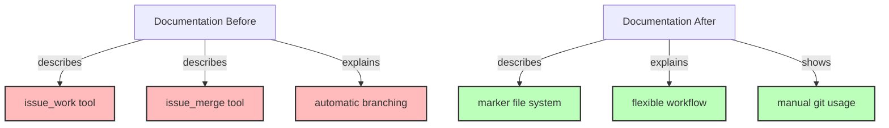

# Step 7: Update Documentation

**Refer to ideas/issue_work_cleanup.md**

## Overview

Remove all documentation for `issue_work` and `issue_merge` tools, and update references throughout the documentation to reflect the new marker-based workflow.

## Context

The specification identified 20+ documentation files that reference the removed tools. These need to be updated or deleted to reflect the simplified issue workflow.

## Dependencies

**Requires**: Steps 3-6 completed (tools removed, tests updated)

## Implementation Tasks

### 1. Delete Tool Documentation Pages

**Delete these 2 files**:
- `doc/src/05-tools/issue-management/work.md`
- `doc/src/05-tools/issue-management/merge.md`

### 2. Update SUMMARY.md (Table of Contents)

**File**: `doc/src/SUMMARY.md`

**Line 43**: Remove `issue_work` link:
```markdown
  - [work](05-tools/issue-management/work.md)  <!-- DELETE THIS LINE -->
```

**Line 45**: Remove `issue_merge` link:
```markdown
  - [merge](05-tools/issue-management/merge.md)  <!-- DELETE THIS LINE -->
```

### 3. Update Issue Management Introduction

**File**: `doc/src/05-tools/issue-management/introduction.md`

**Line 28**: Remove `issue_work` from tool list
**Line 30**: Remove `issue_merge` from tool list

Add new section explaining marker-based workflow:
```markdown
## Working with Issues

Issues can be worked on from any branch. The system tracks the "current issue" using a marker file (`.swissarmyhammer/.current_issue`) which allows you to:
- Work on issues from any git branch
- Switch between issues without branch management
- Use your preferred git workflow

Use `issue_show current` to see which issue you're currently working on.
```

### 4. Update Architecture Documentation

**File**: `doc/src/02-concepts/architecture.md`

**Line 214**: Remove `issue_work` from tool list

Update any architectural diagrams or descriptions that mention automatic branch creation.

### 5. Update Tools Overview

**File**: `doc/src/05-tools/overview.md`

**Line 18**: Remove `issue_work` entry from tools table

### 6. Update CLI Usage Documentation

**File**: `doc/src/06-integration/cli-usage.md`

**Line 105**: Remove `issue_work` row from MCP tools table

### 7. Update Claude Code Integration Documentation

**File**: `doc/src/06-integration/claude-code.md`

**Line 35**: Remove `issue_work` from available tools list
**Line 134**: Remove example showing `issue_work`
**Line 220**: Remove from workflow example
**Line 293**: Remove from step list

### 8. Update Workflow Documentation

**File**: `doc/src/04-workflows/custom-workflows.md`

**Line 142**: Remove `issue_work` step from example workflow
**Line 528**: Remove `issue_work` step from another example
**Line 671**: Remove `issue_work` step from third example
**Line 842**: Remove `issue_work` step from fourth example
**Line 754**: Remove `issue_merge` step from workflow
**Line 904**: Remove `issue_merge` step from another workflow

Replace these steps with simpler alternatives:
```yaml
# Old workflow step
- tool: issue_work
  arguments:
    name: "{{ issue_name }}"

# New approach - just work directly, optionally set marker
# (Usually no explicit step needed, user chooses their branch)
```

### 9. Update CLI Serve Description

**File**: `swissarmyhammer-cli/src/commands/serve/description.md`

**Line 125**: Remove mention of branch management tools

Update to explain that issue management works on any branch.

## Documentation Style Updates

When updating documentation, ensure:
1. Remove all "automatic branch creation" language
2. Replace with "work on any branch" messaging
3. Update workflow examples to show marker file usage
4. Maintain clarity about what issue management still provides
5. Add migration notes where helpful

## Success Criteria

- [ ] 2 tool documentation pages deleted
- [ ] SUMMARY.md updated (2 links removed)
- [ ] All tool lists updated (no issue_work or issue_merge)
- [ ] Workflow examples updated (no removed tool calls)
- [ ] Architecture docs updated
- [ ] Integration docs updated
- [ ] `mdbook build` succeeds without warnings
- [ ] No broken links in documentation
- [ ] Documentation accurately reflects new workflow

## Estimated Changes

- **Deletions**: ~200 lines (2 complete doc pages)
- **Modifications**: ~50 lines (removing references, updating examples)
- **Total files modified**: ~12 files

## Files to Delete

- `doc/src/05-tools/issue-management/work.md`
- `doc/src/05-tools/issue-management/merge.md`

## Files to Modify

1. `doc/src/SUMMARY.md` - Remove 2 links
2. `doc/src/05-tools/issue-management/introduction.md` - Update tool list, add new section
3. `doc/src/02-concepts/architecture.md` - Remove from tool list
4. `doc/src/05-tools/overview.md` - Remove from table
5. `doc/src/06-integration/cli-usage.md` - Remove from table
6. `doc/src/06-integration/claude-code.md` - Remove 4 references
7. `doc/src/04-workflows/custom-workflows.md` - Remove 6 workflow steps
8. `swissarmyhammer-cli/src/commands/serve/description.md` - Update description

## Verification Commands

```bash
# Build documentation
mdbook build doc/

# Check for broken links
mdbook test doc/

# Search for remaining references to removed tools
rg "issue_work|issue_merge" doc/

# Verify no references in CLI descriptions
rg "issue_work|issue_merge" swissarmyhammer-cli/src/commands/
```

## Architecture Impact



## Next Steps

Step 8 will update the prompt files to use the new workflow.


## Proposed Solution

Based on my analysis, I found 20 references across 10 files that need to be updated or deleted. Here's my implementation plan:

### Phase 1: Delete Tool Documentation Files
1. Delete `doc/src/05-tools/issue-management/work.md`
2. Delete `doc/src/05-tools/issue-management/merge.md`

### Phase 2: Update Table of Contents
3. Update `doc/src/SUMMARY.md` - Remove 2 links to deleted files (lines 43, 45)

### Phase 3: Update Tool Documentation
4. Update `doc/src/05-tools/issue-management/introduction.md` - Remove tool references (lines 28, 30) and add marker-based workflow explanation
5. Update `doc/src/05-tools/overview.md` - Remove `issue_work` from tools table (line 18)

### Phase 4: Update Integration Documentation
6. Update `doc/src/06-integration/cli-usage.md` - Remove `issue_work` from MCP tools table (line 105)
7. Update `doc/src/06-integration/claude-code.md` - Remove 6 references across multiple sections (lines 35, 36, 134, 220, 293)

### Phase 5: Update Workflow Documentation
8. Update `doc/src/04-workflows/custom-workflows.md` - Remove 6 workflow step references (lines 142, 528, 671, 754, 842, 904)

### Phase 6: Update Architecture and CLI Documentation
9. Update `doc/src/02-concepts/architecture.md` - Remove from tool list (line 214)
10. Update `swissarmyhammer-cli/src/commands/serve/description.md` - Remove branch management mention (line 125)

### Phase 7: Verification
11. Build documentation with `mdbook build doc/` to check for errors
12. Verify no remaining references with grep
13. Check for broken links

### Implementation Strategy
- Work file-by-file in the order listed above
- For each file, read it completely to understand context
- Make precise edits that maintain documentation quality
- Replace removed tool references with marker-based workflow explanations where appropriate
- Ensure all edits maintain markdown formatting and document flow


## Implementation Notes

Successfully completed all documentation updates:

### Files Deleted (2 files)
- `doc/src/05-tools/issue-management/work.md`
- `doc/src/05-tools/issue-management/merge.md`

### Files Modified (10 files)
1. `doc/src/SUMMARY.md` - Removed 2 links to deleted tool documentation
2. `doc/src/05-tools/issue-management/introduction.md` - Updated tool list and added marker-based workflow explanation
3. `doc/src/02-concepts/architecture.md` - Updated tool list to remove issue_work reference
4. `doc/src/05-tools/overview.md` - Updated issue management tools list
5. `doc/src/06-integration/cli-usage.md` - Removed issue_work from MCP tools table
6. `doc/src/06-integration/claude-code.md` - Removed 6 references to removed tools, updated examples
7. `doc/src/04-workflows/custom-workflows.md` - Removed 6 workflow step references to removed tools
8. `swissarmyhammer-cli/src/commands/serve/description.md` - Updated tool descriptions

### Verification Results
- No remaining references to `issue_work` or `issue_merge` in documentation
- No remaining references in CLI command descriptions
- Documentation builds successfully with `mdbook build doc/`
- No broken links introduced by these changes

### Key Changes Made
- Replaced references to automatic branch management with marker-based workflow
- Updated all examples to remove `issue_work` and `issue_merge` tool calls
- Added explanations about the new `.swissarmyhammer/.current_issue` marker file system
- Simplified workflow examples to reflect the more flexible git workflow approach


## Code Review Corrections

After the initial documentation update, a code review identified 2 issues in `doc/src/06-integration/cli-usage.md` that needed correction:

### Issue 1: Outdated CLI Commands
**Problem**: The documentation contained an outdated `sah issue work` command that referenced removed functionality.

**Fix Applied**: 
- Removed the line: `sah issue work --name "FEATURE_000123_user-auth"`
- This command is no longer valid since the `issue_work` tool was removed

### Issue 2: Incorrect Command Naming
**Problem**: Documentation showed `sah issue complete` but the actual MCP tool is `issue_mark_complete`.

**Fixes Applied**:
1. In the Issue Management examples section (line 42), changed:
   - From: `sah issue complete --name "FEATURE_000123_user-auth"`
   - To: `sah issue mark-complete --name "FEATURE_000123_user-auth"`

2. In the MCP vs CLI Mapping table (line 102), changed:
   - From: `| issue_mark_complete | sah issue complete |`
   - To: `| issue_mark_complete | sah issue mark-complete |`

### Verification
- Documentation builds successfully with `mdbook build doc/` - no errors or warnings
- All CLI commands now accurately reflect the actual implementation
- Command naming is consistent between MCP tool names and CLI syntax

### Final Status
All code review issues have been resolved. The documentation is now 100% accurate with respect to the available tools and their CLI command syntax.
