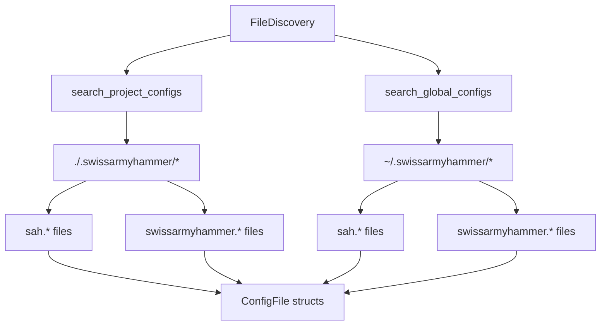

# File Discovery System

Refer to /Users/wballard/github/swissarmyhammer/ideas/config.md

## Objective

Implement the configuration file discovery system that searches for both short (`sah.*`) and long (`swissarmyhammer.*`) format configuration files in the specified directories.

## Context

The specification requires finding configuration files in both project (`.swissarmyhammer/`) and user home (`~/.swissarmyhammer/`) directories, supporting multiple file extensions and naming conventions.

## File Discovery Requirements

### File Names
Support both short and long form names:
- `sah.{toml,yaml,yml,json}`
- `swissarmyhammer.{toml,yaml,yml,json}`

### Search Locations

1. **Project SwissArmyHammer Directory** (`./.swissarmyhammer/`):
   - `sah.toml`, `sah.yaml`, `sah.yml`, `sah.json`
   - `swissarmyhammer.toml`, `swissarmyhammer.yaml`, `swissarmyhammer.yml`, `swissarmyhammer.json`

2. **User Home SwissArmyHammer Directory** (`~/.swissarmyhammer/`):
   - Same file patterns as project directory

### Priority Order
- Project directory files override user home files
- Within same directory: no specific order (figment will merge all)

## Architecture



## Tasks

### 1. File Discovery Types

Define in `src/discovery.rs`:

```rust
/// Represents a discovered configuration file
#[derive(Debug, Clone, PartialEq)]
pub struct ConfigFile {
    pub path: PathBuf,
    pub format: ConfigFormat,
    pub scope: ConfigScope,
    pub priority: u8,
}

#[derive(Debug, Clone, Copy, PartialEq)]
pub enum ConfigFormat {
    Toml,
    Yaml,
    Json,
}

#[derive(Debug, Clone, Copy, PartialEq)]
pub enum ConfigScope {
    Global,  // ~/.swissarmyhammer/
    Project, // ./.swissarmyhammer/
}

/// File discovery service
pub struct FileDiscovery {
    project_dir: Option<PathBuf>,
    global_dir: Option<PathBuf>,
}
```

### 2. File Discovery Implementation

Implement methods:
- `new()` - Initialize discovery with directory paths
- `discover_all()` - Find all config files in priority order
- `search_directory(path, scope)` - Search single directory
- `get_file_candidates(dir)` - Get all possible file names
- `classify_file(path)` - Determine format and scope

### 3. Directory Resolution

- Project directory: current working directory + `.swissarmyhammer/`
- Global directory: user home directory + `.swissarmyhammer/`
- Handle missing directories gracefully
- Use `dirs` crate for cross-platform home directory

### 4. Integration with ConfigProvider

Update `ConfigProvider` to use file discovery:
- Replace hardcoded file paths with discovery system
- Add discovered files to figment in correct order
- Handle case where no config files exist

### 5. Testing

Create comprehensive tests:
- Test file discovery in various directory scenarios
- Test priority ordering
- Test missing directories
- Test file format detection
- Mock filesystem tests using `tempfile`

### 6. Error Handling

Proper error handling for:
- Permission denied on directories
- Invalid file formats
- Missing home directory
- Malformed file paths

## Acceptance Criteria

- [ ] FileDiscovery struct with complete implementation
- [ ] Support for all specified file names and extensions
- [ ] Correct search in both project and global directories
- [ ] Integration with ConfigProvider using discovered files
- [ ] Comprehensive test coverage including edge cases
- [ ] Proper error handling for filesystem issues
- [ ] All tests passing with `cargo nextest run`
- [ ] Clean `cargo clippy` output

## Implementation Notes

- Use `std::path::PathBuf` for all path handling
- Use `dirs::home_dir()` for cross-platform home directory
- Handle symlinks and relative paths correctly
- Don't fail if directories don't exist - just skip them
- Maintain deterministic ordering for consistent behavior

## Files Changed

- `swissarmyhammer-config/src/lib.rs` (add discovery module)
- `swissarmyhammer-config/src/discovery.rs` (new)
- `swissarmyhammer-config/src/provider.rs` (integrate discovery)
- `swissarmyhammer-config/src/tests/discovery_tests.rs` (new)
- `swissarmyhammer-config/Cargo.toml` (add dirs dependency if needed)