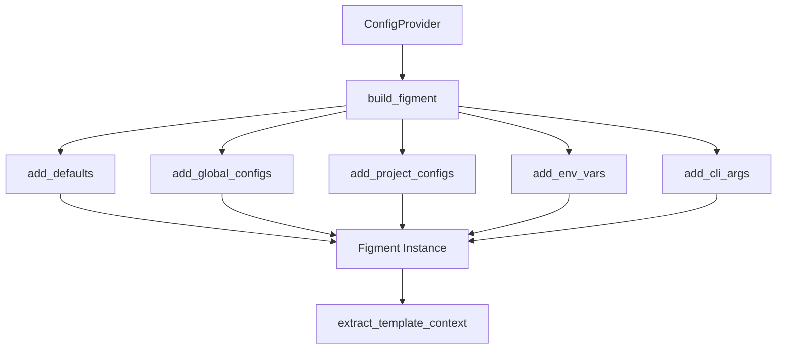

# Configuration Precedence and Environment Integration

Refer to /Users/wballard/github/swissarmyhammer/ideas/config.md

## Objective

Implement the complete configuration precedence order using figment, ensuring proper merging of default values, config files, environment variables, and future CLI arguments.

## Context

The specification requires a specific precedence order where later sources override earlier ones. This step focuses on getting the precedence mechanics working correctly with figment.

## Precedence Order (Later Overrides Earlier)

1. **Default values** (hardcoded in application)
2. **Global config file** (`~/.swissarmyhammer/` directory) 
3. **Project config file** (`./.swissarmyhammer/` directory)
4. **Environment variables** (`SAH_` or `SWISSARMYHAMMER_` prefix)
5. **Command line arguments** (placeholder for future implementation)

## Architecture



## Tasks

### 1. Default Values System

Define in `src/defaults.rs`:

```rust
/// Default configuration values
pub struct ConfigDefaults;

impl ConfigDefaults {
    /// Get all default configuration values
    pub fn values() -> HashMap<String, serde_json::Value> {
        // Add common defaults that users might want to override
        // Example: project_name, environment, debug flags, etc.
    }
    
    /// Add defaults to figment instance
    pub fn apply_to(figment: Figment) -> Figment {
        // Integration with figment's default source
    }
}
```

### 2. Environment Variable Integration

Implement environment variable support:
- Support both `SAH_` and `SWISSARMYHAMMER_` prefixes
- Use figment's built-in environment variable provider
- Handle nested configuration via `__` separators (e.g., `SAH_database__host`)
- Case insensitive environment variable matching

### 3. Figment Builder Enhancement

Update `ConfigProvider::build_figment()`:

```rust
impl ConfigProvider {
    fn build_figment(&self) -> Result<Figment, ConfigError> {
        let mut figment = Figment::new();
        
        // 1. Add defaults (lowest priority)
        figment = ConfigDefaults::apply_to(figment);
        
        // 2. Add global config files  
        for config_file in self.discovery.find_global_configs()? {
            figment = self.add_config_file(figment, config_file)?;
        }
        
        // 3. Add project config files (higher priority)
        for config_file in self.discovery.find_project_configs()? {
            figment = self.add_config_file(figment, config_file)?;
        }
        
        // 4. Add environment variables (even higher priority)
        figment = figment.merge(Env::prefixed("SAH_"));
        figment = figment.merge(Env::prefixed("SWISSARMYHAMMER_"));
        
        // 5. CLI args will be added here in future step
        
        Ok(figment)
    }
}
```

### 4. Configuration Extraction

Implement proper extraction from figment:
- Extract all configuration values into `TemplateContext`
- Handle figment extraction errors gracefully
- Preserve type information where possible
- Log configuration loading for debugging

### 5. Testing Precedence

Create comprehensive tests in `src/tests/precedence_tests.rs`:
- Test each precedence level individually
- Test override behavior between levels
- Test environment variable prefixes
- Test nested configuration values
- Test with real config files using `tempfile`

### 6. Integration Testing

End-to-end tests:
- Multiple config files with conflicting values
- Environment variables overriding config files
- Complex nested configuration structures
- Missing config files or invalid values

### 7. Error Handling

Proper error handling for:
- Figment extraction failures
- Invalid configuration values
- Missing required configuration
- Type conversion errors

## Acceptance Criteria

- [ ] Complete precedence order implementation using figment
- [ ] Default values system with sensible defaults
- [ ] Environment variable support for both prefixes
- [ ] Nested configuration support via `__` separators
- [ ] TemplateContext properly populated from figment
- [ ] Comprehensive precedence testing
- [ ] Integration tests with real config files
- [ ] Proper error handling and user feedback
- [ ] All tests passing with `cargo nextest run`
- [ ] Clean `cargo clippy` output

## Implementation Notes

- Use figment's built-in providers rather than custom parsing
- Keep the interface simple - `ConfigProvider::load_template_context()` as main entry point
- Log configuration loading at debug level for troubleshooting
- Ensure deterministic behavior for testing
- Handle case where no configuration exists gracefully

## Files Changed

- `swissarmyhammer-config/src/lib.rs` (add defaults module)
- `swissarmyhammer-config/src/defaults.rs` (new)
- `swissarmyhammer-config/src/provider.rs` (enhance build_figment)
- `swissarmyhammer-config/src/tests/precedence_tests.rs` (new)
- `swissarmyhammer-config/src/tests/integration_tests.rs` (new)