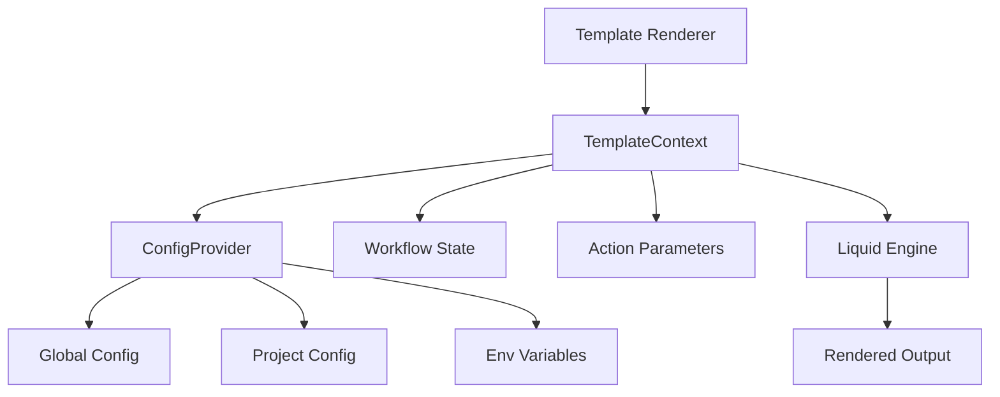

# Template Rendering Integration

Refer to /Users/wballard/github/swissarmyhammer/ideas/config.md

## Objective

Integrate the new TemplateContext with the existing template rendering system for prompts, workflows, and actions, ensuring seamless operation with the liquid template engine.

## Context

The current system uses `merge_config_into_context` function to combine configuration with workflow state. This step replaces that approach with the new TemplateContext-based system while maintaining compatibility with existing template rendering.

## Current Template Rendering Analysis

Key areas that need integration:
1. **Prompt rendering** - Uses liquid templates with configuration variables
2. **Workflow rendering** - Combines workflow state with configuration  
3. **Action rendering** - Template-based action parameter substitution
4. **Template variable precedence** - Workflow vars override config vars

## Architecture



## Tasks

### 1. Template Renderer Integration

Create or enhance template rendering in `src/renderer.rs`:

```rust
/// Template renderer with TemplateContext integration
pub struct TemplateRenderer {
    engine: liquid::ParserBuilder,
}

impl TemplateRenderer {
    /// Create new renderer with default liquid configuration
    pub fn new() -> Result<Self, ConfigError> { ... }
    
    /// Render template with TemplateContext
    pub fn render(&self, template: &str, context: &TemplateContext) -> Result<String, ConfigError> { ... }
    
    /// Render template with combined config and workflow context
    pub fn render_with_config(
        &self, 
        template: &str,
        workflow_vars: Option<HashMap<String, serde_json::Value>>
    ) -> Result<String, ConfigError> {
        // Load config, create context, merge with workflow vars, render
    }
}
```

### 2. ConfigProvider-TemplateContext Integration

Update `ConfigProvider` to work with template rendering:

```rust
impl ConfigProvider {
    /// Load template context for rendering operations
    pub fn load_template_context(&self) -> Result<TemplateContext, ConfigError> { ... }
    
    /// Create template context with additional workflow variables
    pub fn create_context_with_vars(
        &self,
        workflow_vars: HashMap<String, serde_json::Value>
    ) -> Result<TemplateContext, ConfigError> {
        let mut context = self.load_template_context()?;
        context.merge_workflow(workflow_vars);
        Ok(context)
    }
    
    /// Quick rendering utility
    pub fn render_template(
        &self,
        template: &str,
        workflow_vars: Option<HashMap<String, serde_json::Value>>
    ) -> Result<String, ConfigError> { ... }
}
```

### 3. Prompt Rendering Integration

Update prompt rendering to use new system:
- Replace `merge_config_into_context` calls with TemplateContext
- Ensure prompt variables work with new configuration precedence
- Maintain backward compatibility for existing prompts

### 4. Workflow Rendering Integration  

Update workflow rendering:
- Replace HashMap-based context with TemplateContext
- Ensure workflow state variables properly override config
- Update workflow template variable handling
- Handle `_template_vars` compatibility

### 5. Action Rendering Integration

Update action parameter rendering:
- Use TemplateContext for action parameter substitution
- Ensure action variables work with configuration system
- Handle complex nested action parameters

### 6. Legacy Compatibility Layer

Make it work eith the new functionality directly.

Create compatibility functions in `src/compat.rs`:

```rust
/// Legacy function compatibility for existing code
pub fn merge_config_into_context(
    context: &mut HashMap<String, serde_json::Value>
) -> Result<(), ConfigError> {
    // Load config, create TemplateContext, merge back to HashMap
    // Maintains exact behavior of old function
}

/// Load and merge repository config (legacy interface)  
pub fn load_and_merge_repo_config(
    context: &mut HashMap<String, serde_json::Value>
) -> Result<bool, ConfigError> {
    // Compatibility wrapper that uses new system internally
}
```

### 7. Error Handling Integration

Ensure proper error handling:
- Template parsing errors
- Configuration loading errors  
- Variable substitution errors
- Liquid rendering errors

### 8. Testing Integration

Create integration tests in `src/tests/renderer_tests.rs`:
- End-to-end template rendering tests
- Prompt rendering with configuration
- Workflow rendering with variable precedence
- Action parameter substitution
- Legacy compatibility testing

## Acceptance Criteria

- [ ] TemplateRenderer with TemplateContext integration
- [ ] ConfigProvider methods for template context creation
- [ ] Prompt rendering updated to use new system
- [ ] Workflow rendering updated with proper precedence
- [ ] Action rendering updated for parameter substitution  
- [ ] Legacy compatibility layer for existing code
- [ ] Error handling for all rendering scenarios
- [ ] Comprehensive integration tests
- [ ] All existing template rendering tests still pass
- [ ] All tests passing with `cargo nextest run`
- [ ] Clean `cargo clippy` output

## Implementation Notes

- Maintain exact behavior compatibility with existing rendering
- Use the same liquid configuration and filters as current system
- Ensure performance is equivalent or better than current approach
- Keep the API simple and intuitive for common use cases
- Add proper tracing for debugging template rendering issues

## Migration Strategy

1. **Phase 1**: Add new renderer alongside existing system
2. **Phase 2**: Update one rendering area at a time (prompts → workflows → actions)
3. **Phase 3**: Remove old code after all tests pass
4. **Phase 4**: Clean up compatibility layer

## Files Changed

- `swissarmyhammer-config/src/lib.rs` (add renderer module)
- `swissarmyhammer-config/src/renderer.rs` (new)
- `swissarmyhammer-config/src/compat.rs` (new) 
- `swissarmyhammer-config/src/provider.rs` (add template methods)
- `swissarmyhammer-config/src/tests/renderer_tests.rs` (new)
- `swissarmyhammer/src/prompt_resolver.rs` (update to use new system)
- `swissarmyhammer/src/workflow/` (update relevant files)