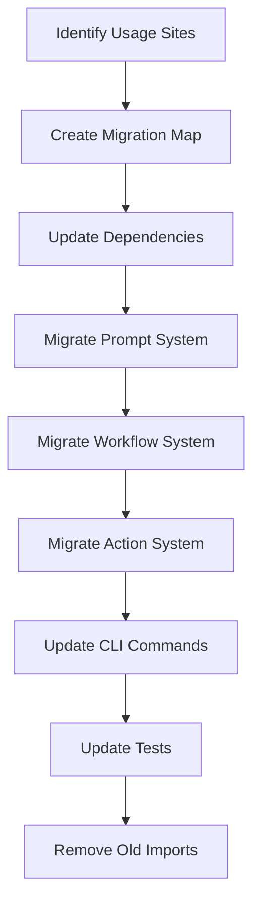

# Migration and Usage Updates

Refer to /Users/wballard/github/swissarmyhammer/ideas/config.md

## Objective

Migrate all existing usage of the old `sah_config` and `toml_config` systems to the new figment-based configuration system throughout the codebase.

## Context

The specification calls for complete replacement of the existing configuration systems. This step identifies all usage sites and migrates them to use the new `swissarmyhammer-config` crate.

## Current Usage Analysis

Based on code review, key areas that need migration:

### sah_config Usage
- `merge_config_into_context` function calls
- `load_and_merge_repo_config` function calls  
- `substitute_env_vars` function calls
- Direct Configuration type usage

### toml_config Usage  
- Any TOML parsing utilities
- Configuration validation code
- Legacy configuration file handling

## Migration Strategy



## Tasks

### 1. Usage Site Discovery

Search and catalog all usage sites:

```bash
# Find all sah_config usage
rg "sah_config::" --type rust
rg "use.*sah_config" --type rust
rg "merge_config_into_context" --type rust
rg "load_and_merge_repo_config" --type rust

# Find all toml_config usage  
rg "toml_config::" --type rust
rg "use.*toml_config" --type rust
```

Document findings in migration checklist.

### 2. Dependency Updates

Update `Cargo.toml` files to use new config crate:

```toml
# In swissarmyhammer/Cargo.toml
[dependencies]
swissarmyhammer-config = { path = "../swissarmyhammer-config" }
# Remove old toml dependency if no longer needed

# In swissarmyhammer-cli/Cargo.toml  
[dependencies]
swissarmyhammer-config = { path = "../swissarmyhammer-config" }
```

### 3. Import Updates

Replace old imports with new ones:

```rust
// OLD
use crate::sah_config::{merge_config_into_context, load_and_merge_repo_config};
use crate::toml_config::Configuration;

// NEW  
use swissarmyhammer_config::{ConfigProvider, TemplateContext};
```

### 4. Prompt System Migration

Update prompt rendering in `src/prompt_resolver.rs`:

```rust
// OLD approach
let mut context = HashMap::new();
load_and_merge_repo_config(&mut context)?;
// render with context

// NEW approach
let config_provider = ConfigProvider::new()?;
let template_context = config_provider.load_template_context()?;
// render with template_context
```

### 5. Workflow System Migration  

Update workflow execution:
- Replace HashMap context with TemplateContext
- Update workflow variable merging logic
- Ensure proper precedence (workflow vars override config)

### 6. Action System Migration

Update action parameter substitution:
- Use TemplateContext for action parameters
- Maintain existing parameter substitution behavior
- Handle complex nested parameters

### 7. CLI Commands Migration

Update CLI commands that use configuration:
- Replace old config loading with ConfigProvider
- Update any config-related command implementations  
- Ensure CLI arg precedence works (future enhancement)

### 8. Test Updates

Update all tests that use configuration:
- Replace old config mocking with new system
- Update integration tests  
- Ensure test isolation still works
- Add tests for new configuration features

### 9. Documentation Updates

Update documentation:
- Configuration usage examples
- API documentation
- Migration guide for external users

### 10. Compatibility Verification

Verify compatibility:
- All existing config files still work
- Template rendering produces same output
- Performance is equivalent or better

## Acceptance Criteria

- [ ] All `sah_config` usage replaced with new system
- [ ] All `toml_config` usage replaced with new system  
- [ ] Prompt rendering uses TemplateContext
- [ ] Workflow rendering uses TemplateContext with proper precedence
- [ ] Action parameter substitution uses new system
- [ ] CLI commands updated to use ConfigProvider
- [ ] All tests updated and passing
- [ ] Dependencies updated in all Cargo.toml files
- [ ] Performance benchmarks show no regression
- [ ] Integration tests verify end-to-end functionality
- [ ] All tests passing with `cargo nextest run`
- [ ] Clean `cargo clippy` output

## Implementation Notes

- Migrate one subsystem at a time to minimize risk
- Keep old system alongside new initially for comparison  
- Use compatibility layer temporarily if needed
- Verify behavior matches exactly before removing old code
- Add logging to help debug any migration issues

## Migration Checklist

Create detailed checklist of files to update:
- [ ] `swissarmyhammer/src/prompt_resolver.rs`
- [ ] `swissarmyhammer/src/workflow/executor/core.rs`  
- [ ] `swissarmyhammer/src/workflow/actions.rs`
- [ ] `swissarmyhammer-cli/src/...` (relevant files)
- [ ] All test files using old config system
- [ ] Documentation files

## Files Changed

This step will touch many files across the codebase. Key areas:
- `swissarmyhammer/Cargo.toml` (dependencies)
- `swissarmyhammer-cli/Cargo.toml` (dependencies)  
- `swissarmyhammer/src/prompt_resolver.rs`
- `swissarmyhammer/src/workflow/` (multiple files)
- `swissarmyhammer-cli/src/` (multiple files)
- Test files throughout the codebase
- Documentation files