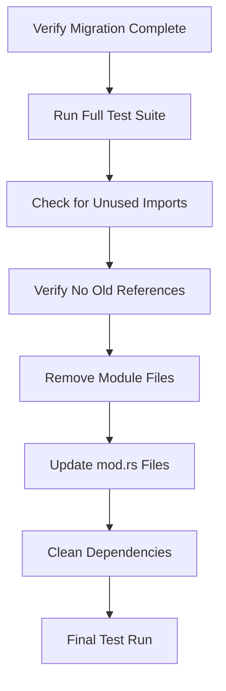

# Remove Old Configuration Modules

Refer to /Users/wballard/github/swissarmyhammer/ideas/config.md

## Objective

Remove the old `sah_config` and `toml_config` modules completely from the codebase after migration to the new figment-based system is complete and verified.

## Context

The specification explicitly states that the `sah_config` and `toml_config` modules should be eliminated. This step performs the final cleanup after all usage has been migrated to the new system.

## Modules to Remove

### sah_config Module Structure
```
swissarmyhammer/src/sah_config/
├── mod.rs
├── loader.rs  
├── env_vars.rs
├── validation.rs
├── types.rs
└── template_integration.rs
```

### toml_config Module Structure  
```
swissarmyhammer/src/toml_config/
├── mod.rs
├── parser.rs
├── configuration.rs
└── (other files)
```

## Safety Verification



## Tasks

### 1. Pre-Removal Verification

Before removing any code, verify:
- [ ] All tests pass with new system
- [ ] No remaining references to old modules
- [ ] Integration tests verify same behavior
- [ ] Performance benchmarks show acceptable results

### 2. Reference Audit

Search for any remaining references:

```bash
# Search for sah_config references
rg "sah_config" --type rust --exclude-dir target
rg "use.*sah_config" --type rust
rg "crate::sah_config" --type rust

# Search for toml_config references  
rg "toml_config" --type rust --exclude-dir target
rg "use.*toml_config" --type rust
rg "crate::toml_config" --type rust

# Check for any remaining function usage
rg "merge_config_into_context" --type rust
rg "load_and_merge_repo_config" --type rust
rg "substitute_env_vars" --type rust
```

Document any remaining usage and ensure it's been properly migrated.

### 3. Module File Removal

Remove the module directories and files:
- `rm -rf swissarmyhammer/src/sah_config/`
- `rm -rf swissarmyhammer/src/toml_config/`

### 4. Update Module Declarations

Update `swissarmyhammer/src/lib.rs`:

```rust
// REMOVE these lines:
pub mod sah_config;
pub mod toml_config;

// Keep other modules as-is
```

### 5. Cleanup Dependencies  

Review and clean up `Cargo.toml` dependencies:
- Remove `toml = "0.9.5"` if no longer needed elsewhere
- Remove any other dependencies only used by old modules
- Keep dependencies still used by other parts of the system

### 6. Remove Related Tests

Remove test files associated with old modules:
- Tests in `sah_config` subdirectories
- Tests in `toml_config` subdirectories  
- Integration tests that only tested old system

### 7. Update Documentation

Remove references to old modules from:
- README files
- API documentation
- Code comments mentioning old system
- Examples using old configuration

### 8. Clean Build Verification

After removal:
```bash
# Clean build to ensure no stale artifacts
cargo clean

# Full build should succeed
cargo build

# All tests should pass
cargo nextest run --fail-fast

# Clippy should be clean
cargo clippy --all-targets --all-features
```

### 9. Git Cleanup

Proper git handling:
- Commit removal as single atomic change
- Include descriptive commit message
- Consider using `git rm` for proper file removal tracking

## Acceptance Criteria

- [ ] All `sah_config` module files removed
- [ ] All `toml_config` module files removed
- [ ] Module declarations updated in lib.rs
- [ ] No remaining references to old modules in codebase
- [ ] Unused dependencies removed from Cargo.toml
- [ ] All tests still pass after removal
- [ ] Clean `cargo build` with no warnings about missing modules
- [ ] Clean `cargo clippy` output
- [ ] Documentation updated to remove old references

## Safety Measures

### Pre-Removal Backup
- Create git branch for safe rollback: `git checkout -b backup-old-config`
- Tag current state: `git tag pre-config-cleanup`

### Staged Removal Process
1. **Phase 1**: Comment out module declarations, verify build  
2. **Phase 2**: Move modules to temporary location, verify tests
3. **Phase 3**: Actually delete files after verification
4. **Phase 4**: Clean up dependencies and documentation

### Verification Points
- After each phase, run full test suite
- Check that integration tests still pass
- Verify no performance regression
- Ensure all configuration files still work

## Rollback Plan

If issues are discovered after removal:
1. `git checkout backup-old-config`
2. Cherry-pick any necessary fixes from main
3. Re-approach removal more cautiously

## Files Changed

### Files Removed
- `swissarmyhammer/src/sah_config/` (entire directory)
- `swissarmyhammer/src/toml_config/` (entire directory)
- Associated test files

### Files Modified
- `swissarmyhammer/src/lib.rs` (remove module declarations)
- `swissarmyhammer/Cargo.toml` (clean up dependencies)
- Documentation files (remove old references)