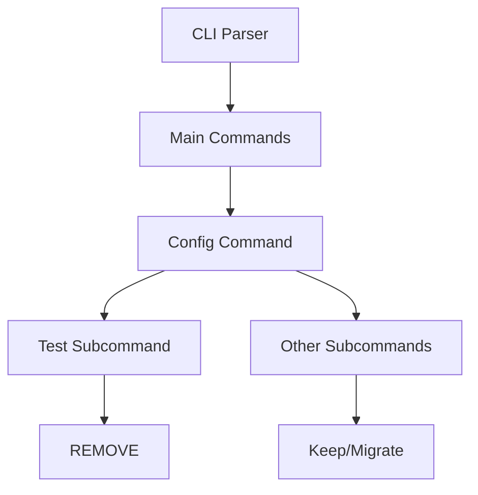

# Remove CLI Config Test Command

Refer to /Users/wballard/github/swissarmyhammer/ideas/config.md

## Objective

Remove the `sah config test` CLI subcommand as specified in the requirements, since the new configuration system eliminates the need for a separate test command.

## Context

The specification states: "Remove the `sah config test` sub command". This command was likely used to validate the old configuration system, but with the new figment-based system providing built-in validation, a separate test command is no longer needed.

## Current CLI Analysis

Need to locate and understand the current CLI structure:

```bash
# Find config-related CLI commands
rg "config.*test" --type rust
rg "ConfigTest" --type rust  
rg "config.*subcommand" --type rust

# Look for CLI structure
rg "clap.*Command" --type rust
rg "enum.*Command" --type rust
```

## Architecture



## Tasks

### 1. Locate CLI Command Structure

Find the current CLI command definitions:
- Main CLI command enum
- Config subcommand enum  
- Command handlers/implementations
- Help text and documentation

### 2. Identify Config Test Command

Locate the specific `config test` implementation:
- Command definition in CLI enum
- Handler/implementation function
- Related helper functions
- Tests for the command

### 3. Assess Other Config Commands

Review other config-related CLI commands:
- Are there other config subcommands to keep?
- Do they need migration to new system?
- Should the entire `config` command be removed?

### 4. Remove Command Definition

Update CLI command definitions:

```rust
// Example - remove from enum
#[derive(Debug, Parser)]
pub enum Command {
    // ... other commands ...
    
    #[command(subcommand)]
    Config(ConfigCommand),  // Keep if other subcommands exist
    
    // ... other commands ...
}

#[derive(Debug, Parser)]
pub enum ConfigCommand {
    // REMOVE THIS:
    // Test(ConfigTestArgs),
    
    // Keep other subcommands if they exist
}
```

### 5. Remove Command Handler

Remove the command implementation:

```rust  
// Remove handler function
pub fn handle_config_test(args: ConfigTestArgs) -> Result<(), Error> {
    // DELETE this entire function
}

// Remove from main command dispatcher
match command {
    // ... other commands ...
    // Command::Config(config_cmd) => match config_cmd {
    //     ConfigCommand::Test(args) => handle_config_test(args)?, // REMOVE
    // }
}
```

### 6. Remove Related Types

Remove supporting types and structs:

```rust
// Remove argument struct
#[derive(Debug, Parser)]
pub struct ConfigTestArgs {
    // DELETE this struct
}

// Remove any related error types
pub enum ConfigTestError {
    // DELETE if only used by test command
}
```

### 7. Update Help and Documentation

Update CLI help text:
- Remove `config test` from command help
- Update main help if config command is removed entirely
- Update any documentation mentioning the test command

### 8. Remove Tests

Remove tests for the config test command:
- Unit tests for command parsing
- Integration tests for command execution
- CLI integration tests using the command

### 9. Clean Up Dependencies

Check if command removal allows dependency cleanup:
- Remove unused imports
- Remove unused dependencies from Cargo.toml
- Clean up error handling that was only for test command

### 10. Alternative Validation

Since config test is removed, ensure alternative validation:
- Configuration validation happens automatically during loading
- Error messages are clear when config is invalid  
- Users can validate config by running any command that uses config

## Acceptance Criteria

- [ ] `sah config test` command removed from CLI
- [ ] Command definition removed from CLI enums
- [ ] Handler function and related code removed
- [ ] Supporting types and structs removed
- [ ] Help text updated to not mention test command
- [ ] Tests for removed command deleted
- [ ] CLI still builds and works correctly
- [ ] `sah --help` and `sah config --help` show correct options
- [ ] All remaining tests pass
- [ ] Clean `cargo clippy` output

## Implementation Notes

### Determine Scope
First determine if:
- Only `config test` should be removed
- The entire `config` command group should be removed
- Other config commands need to be migrated

### Graceful Migration
If users are currently using `sah config test`:
- Consider showing a deprecation message initially
- Provide guidance on how to validate config without the command
- Document the change in migration notes

### Testing Strategy
- Ensure removal doesn't break other CLI functionality
- Test that invalid config still produces good error messages
- Verify help text is accurate after removal

## Files Changed

Expected files to modify:
- `swissarmyhammer-cli/src/main.rs` (or similar CLI entry point)
- `swissarmyhammer-cli/src/cli.rs` (if CLI definitions are separate) 
- `swissarmyhammer-cli/src/commands/` (command handler files)
- Test files for CLI commands
- Documentation files mentioning the command

## Verification Steps

After removal:
1. `cargo build` - Should build successfully
2. `sah --help` - Should not show config test
3. `sah config --help` - Should show remaining subcommands or error if config removed
4. `sah config test` - Should show "command not found" or similar error
5. All tests pass with `cargo nextest run`