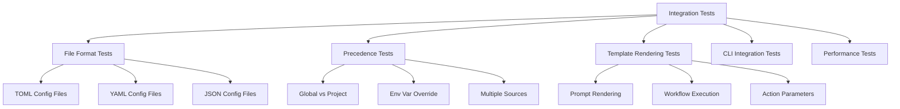

# Integration Testing

Refer to /Users/wballard/github/swissarmyhammer/ideas/config.md

## Objective

Create comprehensive integration tests to verify that the new figment-based configuration system works correctly end-to-end with template rendering, workflow execution, and CLI operations.

## Context

After implementing the new configuration system and migrating all usage, we need thorough integration testing to ensure:
- Configuration loading works in real-world scenarios  
- Template rendering produces identical results to the old system
- All file formats and precedence rules work correctly
- Performance meets or exceeds the old system

## Test Architecture



## Tasks

### 1. Test Infrastructure Setup

Create test infrastructure in `swissarmyhammer-config/tests/`:

```rust
// tests/integration_tests.rs
mod common;
mod file_format_tests;
mod precedence_tests; 
mod template_tests;
mod performance_tests;
mod cli_tests;

// tests/common/mod.rs
pub struct TestEnvironment {
    temp_dir: TempDir,
    global_config_dir: PathBuf,
    project_config_dir: PathBuf,
}

impl TestEnvironment {
    pub fn new() -> Result<Self, Error> { ... }
    pub fn write_global_config(&self, content: &str, format: ConfigFormat) { ... }
    pub fn write_project_config(&self, content: &str, format: ConfigFormat) { ... }
    pub fn set_env_var(&self, key: &str, value: &str) { ... }
    pub fn create_provider(&self) -> ConfigProvider { ... }
}
```

### 2. File Format Integration Tests

Test all supported file formats in `tests/file_format_tests.rs`:

```rust
#[test]
fn test_toml_config_loading() {
    let env = TestEnvironment::new().unwrap();
    env.write_project_config(r#"
        project_name = "test-project"
        debug = true
        database = { host = "localhost", port = 5432 }
    "#, ConfigFormat::Toml);
    
    let provider = env.create_provider();
    let context = provider.load_template_context().unwrap();
    
    assert_eq!(context.get_string("project_name").unwrap(), "test-project");
    assert_eq!(context.get_bool("debug").unwrap(), true);
    // ... more assertions
}

#[test] 
fn test_yaml_config_loading() { ... }

#[test]
fn test_json_config_loading() { ... }

#[test]
fn test_mixed_format_precedence() {
    // Global TOML, project YAML - verify project wins
}
```

### 3. Precedence Integration Tests

Test precedence rules in `tests/precedence_tests.rs`:

```rust
#[test]
fn test_global_vs_project_precedence() {
    let env = TestEnvironment::new().unwrap();
    
    // Global config with lower priority
    env.write_global_config(r#"
        environment = "global"
        timeout = 30
    "#, ConfigFormat::Toml);
    
    // Project config with higher priority  
    env.write_project_config(r#"
        environment = "project"
        debug = true
    "#, ConfigFormat::Toml);
    
    let context = env.create_provider().load_template_context().unwrap();
    
    assert_eq!(context.get_string("environment").unwrap(), "project");
    assert_eq!(context.get_number("timeout").unwrap(), 30.0);
    assert_eq!(context.get_bool("debug").unwrap(), true);
}

#[test]
fn test_env_var_precedence() {
    let env = TestEnvironment::new().unwrap();
    
    env.write_project_config(r#"environment = "config""#, ConfigFormat::Toml);
    env.set_env_var("SAH_ENVIRONMENT", "env_override");
    
    let context = env.create_provider().load_template_context().unwrap();
    assert_eq!(context.get_string("environment").unwrap(), "env_override");
}

#[test] 
fn test_full_precedence_chain() {
    // Test defaults < global < project < env vars
}
```

### 4. Template Rendering Integration Tests

Test end-to-end template rendering in `tests/template_tests.rs`:

```rust
#[test]
fn test_prompt_rendering_with_config() {
    let env = TestEnvironment::new().unwrap();
    env.write_project_config(r#"
        project_name = "MyProject"
        author = "Test Author"
    "#, ConfigFormat::Toml);
    
    let template = "Welcome to {{project_name}} by {{author}}!";
    let provider = env.create_provider();
    let result = provider.render_template(template, None).unwrap();
    
    assert_eq!(result, "Welcome to MyProject by Test Author!");
}

#[test]
fn test_workflow_variable_precedence() {
    let env = TestEnvironment::new().unwrap();
    env.write_project_config(r#"step = "config_step""#, ConfigFormat::Toml);
    
    let template = "Current step: {{step}}";
    let mut workflow_vars = HashMap::new();
    workflow_vars.insert("step".to_string(), json!("workflow_step"));
    
    let provider = env.create_provider();
    let result = provider.render_template(template, Some(workflow_vars)).unwrap();
    
    // Workflow variables should override config
    assert_eq!(result, "Current step: workflow_step");
}

#[test]
fn test_env_var_substitution() {
    let env = TestEnvironment::new().unwrap();
    env.set_env_var("PROJECT_VERSION", "1.2.3");
    env.write_project_config(r#"
        title = "Project v${PROJECT_VERSION}"
        fallback = "${MISSING_VAR:-default_value}"
    "#, ConfigFormat::Toml);
    
    let provider = env.create_provider();
    let context = provider.load_template_context().unwrap();
    
    assert_eq!(context.get_string("title").unwrap(), "Project v1.2.3");
    assert_eq!(context.get_string("fallback").unwrap(), "default_value");
}
```

### 5. CLI Integration Tests

Test CLI integration in `tests/cli_tests.rs`:

```rust
#[test]  
fn test_cli_with_config_files() {
    let env = TestEnvironment::new().unwrap();
    env.write_project_config(r#"output_format = "json""#, ConfigFormat::Toml);
    
    // Test that CLI commands can load and use configuration
    // This may require mocking or using a test CLI harness
}

#[test]
fn test_cli_env_var_precedence() {
    // Test that CLI respects environment variable overrides
}
```

### 6. Performance Integration Tests

Test performance in `tests/performance_tests.rs`:

```rust
#[test]
fn test_config_loading_performance() {
    let env = TestEnvironment::new().unwrap();
    env.write_project_config(&create_large_config(), ConfigFormat::Toml);
    
    let start = Instant::now();
    for _ in 0..100 {
        let provider = env.create_provider();
        let _context = provider.load_template_context().unwrap();
    }
    let duration = start.elapsed();
    
    // Should be reasonably fast (adjust threshold as needed)
    assert!(duration < Duration::from_millis(1000));
}

#[test]
fn test_template_rendering_performance() {
    // Test that template rendering performance is acceptable
}

#[test] 
fn benchmark_vs_old_system() {
    // If possible, benchmark against old system for comparison
}
```

### 7. Error Handling Integration Tests

Test error scenarios:

```rust
#[test]
fn test_invalid_config_file() {
    let env = TestEnvironment::new().unwrap();
    env.write_project_config("invalid toml content [", ConfigFormat::Toml);
    
    let provider = env.create_provider();
    let result = provider.load_template_context();
    
    assert!(result.is_err());
    // Verify error message is helpful
}

#[test]
fn test_missing_config_files() {
    let env = TestEnvironment::new().unwrap();
    // Don't write any config files
    
    let provider = env.create_provider();
    let context = provider.load_template_context().unwrap();
    
    // Should work with empty context (defaults only)
    assert!(context.keys().count() >= 0);
}
```

### 8. Cross-Platform Testing

Ensure tests work across platforms:
- Windows path handling
- Unix path handling  
- Home directory resolution
- File permissions

### 9. Real-World Scenario Tests

Test realistic usage patterns:
- Complex nested configuration
- Multiple config files with conflicts
- Large configuration files
- Configuration with special characters
- Unicode content in config files

## Acceptance Criteria

- [ ] Comprehensive test coverage for all configuration features
- [ ] File format tests (TOML, YAML, JSON) with real files  
- [ ] Precedence tests covering all override scenarios
- [ ] Template rendering tests with configuration integration
- [ ] CLI integration tests (if applicable)
- [ ] Performance tests showing acceptable performance
- [ ] Error handling tests for invalid configurations
- [ ] Cross-platform compatibility verification
- [ ] All tests passing with `cargo nextest run`
- [ ] Test coverage >90% for new configuration code
- [ ] Integration tests run in CI/CD pipeline

## Implementation Notes

- Use `tempfile` for isolated test environments
- Mock environment variables properly in tests
- Use property-based testing where appropriate (with `proptest`)
- Ensure tests are deterministic and don't interfere with each other
- Test both positive and negative cases
- Include edge cases and boundary conditions

## Files Created

- `swissarmyhammer-config/tests/integration_tests.rs`
- `swissarmyhammer-config/tests/common/mod.rs`
- `swissarmyhammer-config/tests/file_format_tests.rs`
- `swissarmyhammer-config/tests/precedence_tests.rs`
- `swissarmyhammer-config/tests/template_tests.rs`
- `swissarmyhammer-config/tests/performance_tests.rs`
- `swissarmyhammer-config/tests/cli_tests.rs`
- Test fixture files (sample configs in various formats)