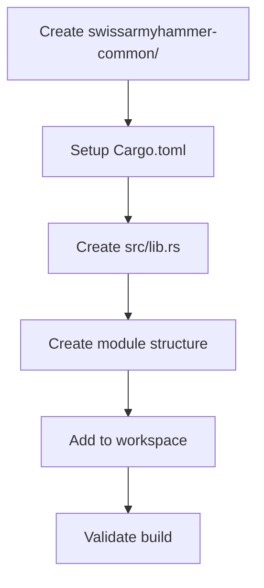

# Create swissarmyhammer-common Foundation Crate

Refer to /Users/wballard/github/swissarmyhammer/ideas/dependencies.md

## Goal

Create the foundational `swissarmyhammer-common` crate that will serve as the base dependency for all other crates in the workspace.

## Tasks

1. Create new crate directory structure
2. Set up Cargo.toml with minimal dependencies
3. Create basic module structure
4. Add to workspace members

## Implementation Details

### Directory Structure
```
swissarmyhammer-common/
├── Cargo.toml
├── src/
│   ├── lib.rs
│   ├── types/
│   │   └── mod.rs
│   ├── traits/
│   │   └── mod.rs
│   ├── utils/
│   │   └── mod.rs
│   └── constants.rs
```

### Key Dependencies
- `serde` - for serialization support
- `thiserror` - for error handling
- `ulid` - for ID generation
- `anyhow` - for error context

### Minimal API Surface
Start with empty modules that will be populated in subsequent steps:
- `types::*` - Common type definitions
- `traits::*` - Shared trait definitions  
- `utils::*` - Utility functions
- `constants::*` - Shared constants

## Validation

- [ ] Crate compiles successfully
- [ ] All modules are properly exported
- [ ] Workspace builds without errors
- [ ] Basic documentation is present

## Mermaid Diagram



This step establishes the foundation that all subsequent refactoring will build upon.