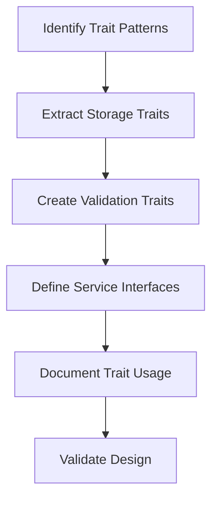

# Extract Common Traits to swissarmyhammer-common

Refer to /Users/wballard/github/swissarmyhammer/ideas/dependencies.md

## Goal

Extract shared trait definitions from existing crates into `swissarmyhammer-common/src/traits/` to enable consistent interfaces across domain crates.

## Tasks

1. Identify common trait patterns
2. Extract storage traits
3. Create validation traits
4. Define service interfaces

## Implementation Details

### Storage Traits (`src/traits/storage.rs`)
```rust
#[async_trait]
pub trait Storage<T, K> {
    type Error;
    
    async fn get(&self, key: &K) -> Result<Option<T>, Self::Error>;
    async fn store(&mut self, item: T) -> Result<K, Self::Error>;
    async fn delete(&mut self, key: &K) -> Result<bool, Self::Error>;
    async fn list(&self) -> Result<Vec<(K, T)>, Self::Error>;
}
```

### Validation Traits (`src/traits/validation.rs`)
```rust
pub trait Validate {
    type Error;
    
    fn validate(&self) -> Result<(), Self::Error>;
}

pub trait ValidatedFrom<T>: Sized {
    type Error;
    
    fn validated_from(value: T) -> Result<Self, Self::Error>;
}
```

### Service Traits (`src/traits/service.rs`)
```rust
#[async_trait]
pub trait SearchService {
    type Query;
    type Result;
    type Error;
    
    async fn search(&self, query: Self::Query) -> Result<Vec<Self::Result>, Self::Error>;
    async fn index(&mut self, items: Vec<Self::Result>) -> Result<(), Self::Error>;
}
```

## Migration Sources
- Storage patterns from `swissarmyhammer/src/storage.rs`
- Validation patterns scattered across domain modules
- Service interfaces from MCP tool implementations

## Validation

- [ ] All traits are properly documented
- [ ] Traits use appropriate async patterns where needed
- [ ] Default implementations provided where sensible
- [ ] Traits are generic enough for all use cases

## Mermaid Diagram



These traits will enable consistent interfaces and make it easier to swap implementations.