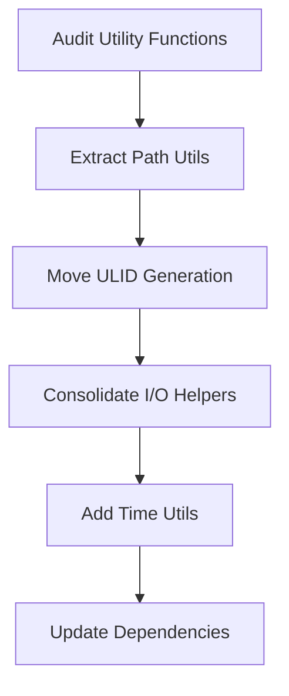

# Move Common Utilities to swissarmyhammer-common

Refer to /Users/wballard/github/swissarmyhammer/ideas/dependencies.md

## Goal

Consolidate shared utility functions from across the codebase into `swissarmyhammer-common/src/utils/` to eliminate duplication.

## Tasks

1. Extract path utilities and security functions
2. Move ULID generation utilities
3. Consolidate I/O helper functions
4. Extract time/date utilities

## Implementation Details

### Path Utilities (`src/utils/path.rs`)
```rust
pub fn sanitize_path(path: &str) -> Result<PathBuf, ValidationError> {
    // Path sanitization and validation logic
}

pub fn ensure_safe_path(path: &Path, base: &Path) -> Result<(), SecurityError> {
    // Directory traversal protection
}
```

### ULID Utilities (`src/utils/ulid.rs`)
```rust
pub fn generate_ulid() -> ulid::Ulid {
    ulid::Ulid::new()
}

pub fn generate_memo_id() -> MemoId {
    MemoId(generate_ulid())
}
```

### I/O Utilities (`src/utils/io.rs`)
```rust
pub async fn read_file_safely(path: &Path, max_size: usize) -> Result<String, IoError> {
    // Safe file reading with size limits
}

pub async fn write_file_atomically(path: &Path, content: &str) -> Result<(), IoError> {
    // Atomic file writing
}
```

### Time Utilities (`src/utils/time.rs`)
```rust
pub fn current_timestamp() -> chrono::DateTime<chrono::Utc> {
    chrono::Utc::now()
}

pub fn format_duration(duration: std::time::Duration) -> String {
    // Human-readable duration formatting
}
```

## Migration Sources
- Path utilities from `swissarmyhammer/src/fs_utils.rs`
- Security functions from `swissarmyhammer/src/security.rs`
- ULID generation from `swissarmyhammer/src/common/ulid_generator.rs`
- I/O helpers scattered across domain modules

## Validation

- [ ] All utility functions are well-tested
- [ ] Security-sensitive functions maintain their safety guarantees
- [ ] Performance characteristics are preserved
- [ ] Documentation includes usage examples

## Mermaid Diagram



This consolidation will reduce code duplication and ensure consistent behavior across the codebase.