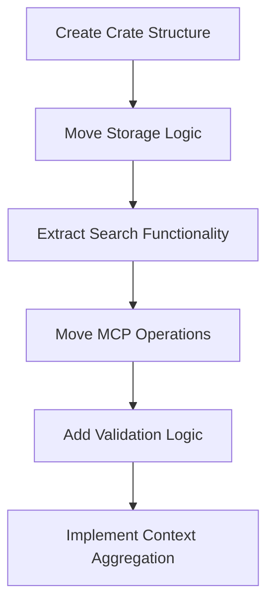

# Create swissarmyhammer-memoranda Crate


## Goal

Create a dedicated crate for memo management by extracting memoranda functionality from both the main library and MCP tools.

## Tasks

1. Create new crate structure
2. Move memo domain logic from main library
3. Extract memo operations from MCP tools
4. Create clean memo management API

## Implementation Details

### Crate Structure
```
swissarmyhammer-memoranda/
├── Cargo.toml
├── src/
│   ├── lib.rs
│   ├── storage.rs         # Memo storage abstraction
│   ├── markdown.rs        # Markdown-based storage implementation
│   ├── validation.rs      # Memo validation logic
│   ├── operations.rs      # Core CRUD operations
│   ├── types.rs           # Memo-specific types
│   └── error.rs           # Memo-specific errors
```

### Core Dependencies
- `swissarmyhammer-common` - Common types and utilities
- `serde` - Serialization support
- `async-trait` - Async trait support
- `tokio` - Async runtime
- `regex` - Text search patterns


Note you may need to move code from swissarmyhammer to swissarmyhammer-common.

Dependence on `swissarmyhammer` is NOT ALLOWED for `swissarmyhammer-common` or `swissarmyhammer-memoranda`.

### Key APIs to Extract

Note that MemoId is -- a -- bad idea, we need to eliminate it and have MemoTitle and MemoContent.

MemoTitle becomes the file name when stored. nice and simple.

We don't need any of the search or highlight functionality.

#### From `swissarmyhammer/src/memoranda/`
```rust
pub struct MarkdownMemoStorage {
    // Move existing implementation
}

#[async_trait]
impl MemoStorage for MarkdownMemoStorage {
    async fn create(&mut self, memo: CreateMemoRequest) -> Result<Memo, MemoError>;
    async fn get(&self, id: &MemoTitle) -> Result<Option<Memo>, MemoError>;
    async fn update(&mut self, id: &MemoTitle, content: MemoContent) -> Result<Memo, MemoError>;
    async fn delete(&mut self, id: &MemoTitle) -> Result<bool, MemoError>;
    async fn list(&self) -> Result<Vec<Memo>, MemoError>;
    async fn search(&self, query: &str) -> Result<Vec<Memo>, MemoError>;
}
```

#### From MCP Tools
```rust
pub struct MemoService {
    storage: Box<dyn MemoStorage>,
}

impl MemoService {
    pub async fn create(&mut self, title: MemoTitle, content: MemoContent) -> Result<Memo, MemoError>;
    pub async fn get_all_context(&self) -> Result<MemoContent, MemoError>;
}
```

## Migration Sources
- `swissarmyhammer/src/memoranda/` - All memo modules
- `swissarmyhammer-tools/src/mcp/tools/memoranda/` - MCP tool implementations

## Validation

- [ ] All memo CRUD operations work correctly
- [ ] Search functionality is accurate
- [ ] Markdown parsing is robust
- [ ] Context aggregation works properly
- [ ] Storage abstraction is flexible

## Mermaid Diagram



This crate will provide a comprehensive memo management system with full-text search capabilities.
