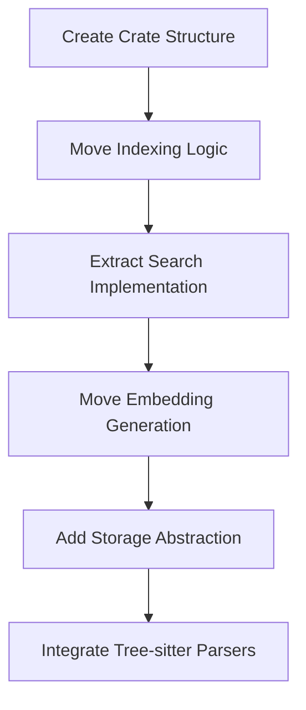

# Create swissarmyhammer-search Crate

Refer to /Users/wballard/github/swissarmyhammer/ideas/dependencies.md

## Goal

Create a dedicated crate for semantic search functionality by extracting search and indexing logic from both the main library and MCP tools.

## Tasks

1. Create new crate structure
2. Move semantic search implementation from main library
3. Extract search operations from MCP tools
4. Create clean search and indexing API

## Implementation Details

### Crate Structure
```
swissarmyhammer-search/
├── Cargo.toml
├── src/
│   ├── lib.rs
│   ├── indexer.rs         # File indexing with Tree-sitter
│   ├── searcher.rs        # Semantic search implementation
│   ├── embedding.rs       # Vector embedding generation
│   ├── storage.rs         # Vector storage abstraction
│   ├── parser.rs          # Code parsing utilities
│   ├── types.rs           # Search-specific types
│   ├── config.rs          # Search configuration
│   └── error.rs           # Search-specific errors
```

### Core Dependencies
- `swissarmyhammer-common` - Common types and utilities
- `tree-sitter` and language parsers - Code parsing
- `ort` - ONNX runtime for embeddings
- `duckdb` - Vector storage
- `tokio` - Async runtime
- `ndarray` - Array operations

### Key APIs to Extract

#### From `swissarmyhammer/src/search/`
```rust
pub struct FileIndexer {
    // Move existing implementation
}

impl FileIndexer {
    pub async fn index_files(&mut self, patterns: Vec<String>) -> Result<IndexStats, SearchError>;
}

pub struct SemanticSearcher {
    // Move existing implementation
}

impl SemanticSearcher {
    pub async fn search(&self, query: &str, limit: usize) -> Result<Vec<SearchResult>, SearchError>;
}
```

#### From MCP Tools
```rust
pub struct SearchService {
    indexer: FileIndexer,
    searcher: SemanticSearcher,
}

impl SearchService {
    pub async fn index(&mut self, request: IndexRequest) -> Result<IndexResponse, SearchError>;
    pub async fn query(&self, request: QueryRequest) -> Result<QueryResponse, SearchError>;
}
```

## Migration Sources
- `swissarmyhammer/src/search/` - All search modules
- `swissarmyhammer-tools/src/mcp/tools/search/` - MCP tool implementations
- Search configuration and utilities

## Validation

- [ ] File indexing works correctly with Tree-sitter
- [ ] Vector embeddings are generated properly
- [ ] Search queries return relevant results
- [ ] Storage operations are efficient
- [ ] Multiple language parsers function correctly

## Mermaid Diagram



This crate will provide a powerful semantic search system that can index and search code across multiple languages.