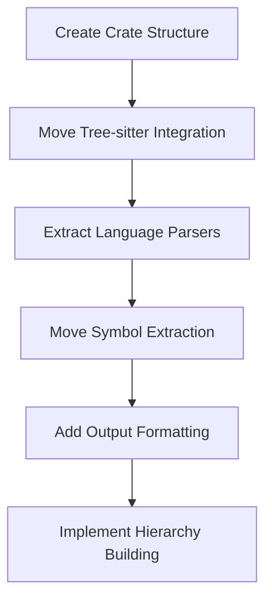

# Create swissarmyhammer-outline Crate

Refer to /Users/wballard/github/swissarmyhammer/ideas/dependencies.md

## Goal

Create a dedicated crate for code outline generation by extracting Tree-sitter parsing functionality from both the main library and MCP tools.

## Tasks

1. Create new crate structure
2. Move outline generation from main library
3. Extract outline operations from MCP tools
4. Create clean code analysis API

## Implementation Details

### Crate Structure
```
swissarmyhammer-outline/
├── Cargo.toml
├── src/
│   ├── lib.rs
│   ├── parser.rs          # Tree-sitter parser coordination
│   ├── extractors/        # Language-specific extractors
│   │   ├── mod.rs
│   │   ├── rust.rs
│   │   ├── python.rs
│   │   ├── typescript.rs
│   │   ├── javascript.rs
│   │   └── dart.rs
│   ├── hierarchy.rs       # Symbol hierarchy building
│   ├── formatter.rs       # Output formatting (YAML/JSON)
│   ├── types.rs          # Outline-specific types
│   └── error.rs          # Outline-specific errors
```

### Core Dependencies
- `swissarmyhammer-common` - Common types and utilities
- `tree-sitter` - Parser infrastructure
- `tree-sitter-*` - Language-specific parsers
- `serde` - Serialization for output formats
- `tokio` - Async file processing

### Key APIs to Extract

#### From `swissarmyhammer/src/outline/`
```rust
pub struct OutlineGenerator {
    // Move existing implementation
}

impl OutlineGenerator {
    pub async fn generate_outline(&self, patterns: Vec<String>) -> Result<Outline, OutlineError>;
    pub fn extract_symbols(&self, source: &str, language: Language) -> Result<Vec<Symbol>, OutlineError>;
}
```

#### From MCP Tools
```rust
pub struct OutlineService {
    generator: OutlineGenerator,
}

impl OutlineService {
    pub async fn generate(&self, request: OutlineRequest) -> Result<OutlineResponse, OutlineError>;
}
```

#### Language Support
```rust
pub enum SupportedLanguage {
    Rust,
    Python,
    TypeScript,
    JavaScript,
    Dart,
}

pub trait SymbolExtractor {
    fn extract_symbols(&self, node: tree_sitter::Node, source: &str) -> Vec<Symbol>;
}
```

## Migration Sources
- `swissarmyhammer/src/outline/` - All outline modules including extractors
- `swissarmyhammer-tools/src/mcp/tools/outline/` - MCP tool implementation
- Tree-sitter integration and language parsers

## Validation

- [ ] All supported languages parse correctly
- [ ] Symbol extraction is accurate and complete
- [ ] Hierarchy building preserves relationships
- [ ] Output formatting supports multiple formats
- [ ] Performance is acceptable for large codebases

## Mermaid Diagram



This crate will provide comprehensive code analysis and outline generation for multiple programming languages.