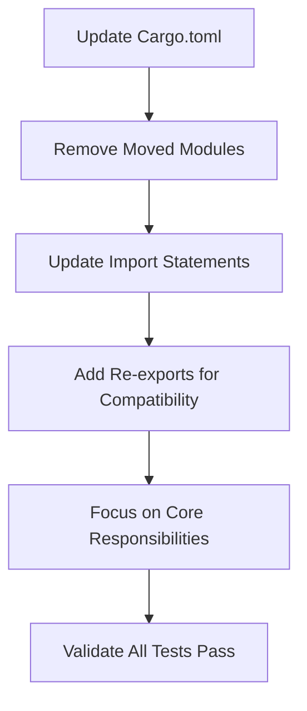

# Update swissarmyhammer Main Library Dependencies

Refer to /Users/wballard/github/swissarmyhammer/ideas/dependencies.md

## Goal

Update the main `swissarmyhammer` library to depend on the new domain-specific crates instead of containing the domain logic directly.

## Tasks

1. Update Cargo.toml dependencies
2. Remove moved modules from main library
3. Update imports to use new domain crates
4. Maintain public API compatibility where possible

## Implementation Details

### Updated Dependencies in Cargo.toml
```toml
[dependencies]
swissarmyhammer-common = { path = "../swissarmyhammer-common" }
swissarmyhammer-git = { path = "../swissarmyhammer-git" }
swissarmyhammer-issues = { path = "../swissarmyhammer-issues" }
swissarmyhammer-memoranda = { path = "../swissarmyhammer-memoranda" }
swissarmyhammer-search = { path = "../swissarmyhammer-search" }
swissarmyhammer-files = { path = "../swissarmyhammer-files" }
swissarmyhammer-outline = { path = "../swissarmyhammer-outline" }
```

### Modules to Remove/Update
- Remove `src/git/` - replace with `swissarmyhammer-git`
- Remove `src/issues/` - replace with `swissarmyhammer-issues`  
- Remove `src/memoranda/` - replace with `swissarmyhammer-memoranda`
- Remove `src/search/` - replace with `swissarmyhammer-search`
- Remove `src/outline/` - replace with `swissarmyhammer-outline`
- Update `src/common/` - use `swissarmyhammer-common`

### Public API Re-exports
```rust
// Maintain backwards compatibility with re-exports
pub use swissarmyhammer_issues as issues;
pub use swissarmyhammer_memoranda as memoranda;
pub use swissarmyhammer_search as search;
pub use swissarmyhammer_git as git;
pub use swissarmyhammer_files as files;
pub use swissarmyhammer_outline as outline;
```

### Focus Areas
The main library should now focus on:
- Workflow orchestration and execution
- Template processing and rendering
- Plugin management
- High-level coordination between domain crates

## Validation

- [ ] All existing public APIs continue to work
- [ ] Compilation succeeds without errors
- [ ] All tests pass
- [ ] No circular dependencies exist
- [ ] Performance characteristics are maintained

## Mermaid Diagram



This transformation makes the main library a thin orchestration layer that coordinates between specialized domain crates.