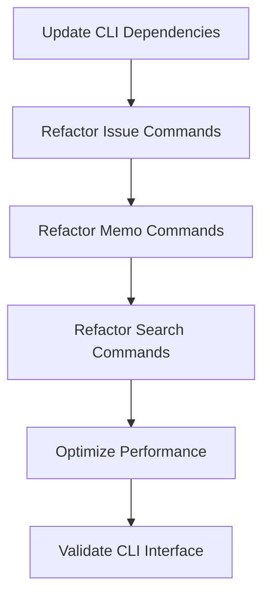

# Update CLI to Use Domain Crates

Refer to /Users/wballard/github/swissarmyhammer/ideas/dependencies.md

## Goal

Update the CLI to use domain crates directly instead of going through the main library, enabling more efficient and focused command implementations.

## Tasks

1. Update CLI Cargo.toml dependencies
2. Update command implementations to use domain crates
3. Maintain CLI interface compatibility
4. Optimize for performance and directness

## Implementation Details

### Updated Dependencies in Cargo.toml
```toml
[dependencies]
swissarmyhammer-common = { path = "../swissarmyhammer-common" }
swissarmyhammer-git = { path = "../swissarmyhammer-git" }
swissarmyhammer-issues = { path = "../swissarmyhammer-issues" }
swissarmyhammer-memoranda = { path = "../swissarmyhammer-memoranda" }
swissarmyhammer-search = { path = "../swissarmyhammer-search" }
swissarmyhammer-files = { path = "../swissarmyhammer-files" }
swissarmyhammer-outline = { path = "../swissarmyhammer-outline" }
swissarmyhammer = { path = "../swissarmyhammer" } # Still needed for workflows
```

### Command Implementation Updates

#### Issue Commands
```rust
// Before: CLI → MCP Tools → Domain Logic
async fn handle_issue_create(args: CreateIssueArgs) -> Result<()> {
    let context = CliToolContext::new().await?;
    // MCP tool call...
}

// After: CLI → Domain Crate directly
async fn handle_issue_create(args: CreateIssueArgs) -> Result<()> {
    let service = IssueService::new().await?;
    let issue = service.create(args.into()).await?;
    println!("Created issue: {}", issue.name);
}
```

#### Memo Commands
```rust
async fn handle_memo_list() -> Result<()> {
    let service = MemoService::new().await?;
    let memos = service.list().await?;
    print_memo_table(&memos);
}
```

### Benefits of Direct Usage
- **Performance**: Eliminate MCP protocol overhead
- **Type Safety**: Direct use of typed APIs instead of JSON
- **Error Handling**: Richer error information
- **Debugging**: Clearer stack traces

### MCP vs Direct Usage
- MCP tools remain for external integrations (LLMs, etc.)
- CLI uses domain crates directly for better performance
- Both paths use the same underlying domain logic

## Validation

- [ ] All CLI commands work identically
- [ ] Performance is improved or unchanged
- [ ] Error messages are clear and helpful
- [ ] Help text and documentation are accurate
- [ ] Integration tests pass

## Mermaid Diagram



This change makes the CLI more efficient while maintaining the same user interface.