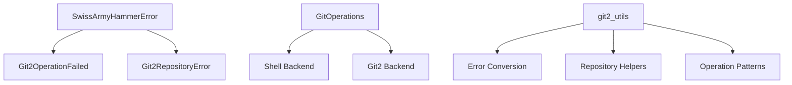

# Git2-rs Foundation and Error Types

Refer to /Users/wballard/github/sah-skipped/ideas/git.md

## Objective

Establish the foundation for git2-rs integration by creating custom error types, utility functions, and basic integration patterns that will be used throughout the migration.

## Context

This is the first step in migrating from shell-based git commands to native Rust git operations using git2-rs. We need to establish proper error handling and integration patterns before migrating individual operations.

## Tasks

### 1. Create Git2 Error Wrapper Types

Create new error variants in `SwissArmyHammerError` to wrap git2 errors:

```rust
#[derive(Debug, Error)]  
#[non_exhaustive]
pub enum SwissArmyHammerError {
    // ... existing variants ...
    
    #[error("Git2 operation failed: {operation}")]
    Git2OperationFailed { 
        operation: String, 
        source: git2::Error 
    },
    
    #[error("Git2 repository error: {message}")]
    Git2RepositoryError { 
        message: String,
        source: git2::Error  
    },
}
```

### 2. Create Git2 Utility Module

Create `src/git/git2_utils.rs` module with:
- Error conversion functions from `git2::Error` to `SwissArmyHammerError`
- Common git2 operation patterns
- Repository opening and validation helpers
- Logging integration for git2 operations

### 3. Update GitOperations Structure

Modify `GitOperations` struct to support both shell and git2 backends:
- Add optional `Repository` field for git2 operations
- Add methods to initialize git2 repository handle
- Maintain existing shell-based methods during transition

### 4. Integration Testing Framework

Create test utilities for git2 integration:
- Helper functions for creating test repositories with git2
- Comparison functions between shell and git2 operations
- Performance testing framework setup

## Implementation Details



## Acceptance Criteria

- [ ] Git2 error types integrated into existing error hierarchy
- [ ] Git2 utility functions available for use by subsequent steps
- [ ] GitOperations struct can hold both shell and git2 repository handles
- [ ] Test utilities ready for git2 operation validation
- [ ] All existing tests continue to pass
- [ ] No breaking changes to public APIs

## Testing Requirements

- Unit tests for error conversion functions
- Integration tests for git2 repository operations
- Compatibility tests ensuring shell operations still work
- Performance baseline tests for comparison

## Dependencies

- git2 crate already available in Cargo.toml
- No external dependencies required

## Notes

This step focuses entirely on infrastructure and does not migrate any actual git operations. All existing functionality must continue working exactly as before.