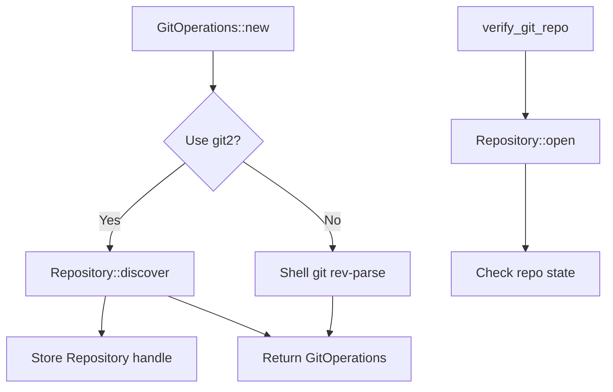

# Git2-rs Repository Operations Migration

Refer to /Users/wballard/github/sah-skipped/ideas/git.md

## Objective

Migrate basic repository operations from shell commands to git2-rs, including repository verification, initialization, and path resolution.

## Context

Building on the foundation established in step 1, this step migrates the core repository operations that are used throughout the GitOperations class. These are fundamental operations that other git commands depend on.

## Current Shell Commands to Migrate

```bash
# Repository verification
git rev-parse --git-dir

# Repository initialization (mainly in tests)  
git init

# Working directory path resolution
pwd (implicit in Command::current_dir)
```

## Tasks

### 1. Migrate Repository Verification

Replace `Command::new("git").args(["rev-parse", "--git-dir"])` with git2:

```rust
// Before (shell)
let output = Command::new("git")
    .current_dir(path)
    .args(["rev-parse", "--git-dir"])
    .output()?;

// After (git2)
match Repository::discover(path) {
    Ok(_) => Ok(()),
    Err(e) => Err(SwissArmyHammerError::git2_repository_error("Repository discovery failed", e))
}
```

### 2. Migrate Repository Opening

Add git2-based repository opening to `GitOperations`:

```rust
impl GitOperations {
    /// Open repository using git2
    fn open_git2_repository(&mut self) -> Result<&Repository> {
        if self.git2_repo.is_none() {
            let repo = Repository::open(&self.work_dir)
                .map_err(|e| SwissArmyHammerError::git2_repository_error(
                    "Failed to open repository", e))?;
            self.git2_repo = Some(repo);
        }
        Ok(self.git2_repo.as_ref().unwrap())
    }
}
```

### 3. Add Repository State Queries

Implement git2-based repository state checking:
- Check if repository is bare
- Get repository work directory and git directory paths
- Validate repository consistency

### 4. Update Constructor Methods

Update `GitOperations::new()` and `GitOperations::with_work_dir()`:
- Use git2 for repository verification instead of shell commands
- Maintain identical error messages and behavior
- Add git2 repository initialization

## Implementation Details



## Acceptance Criteria

- [ ] `GitOperations::new()` uses git2 for repository verification
- [ ] `GitOperations::with_work_dir()` uses git2 for repository verification  
- [ ] `verify_git_repo()` method uses git2 instead of shell commands
- [ ] Repository handle cached for reuse in GitOperations
- [ ] All existing error messages preserved exactly
- [ ] Performance improvement measurable (no subprocess overhead)
- [ ] All existing tests pass without modification

## Testing Requirements

- Update existing repository verification tests to work with git2
- Add performance tests comparing shell vs git2 repository operations
- Test repository discovery in various directory structures
- Test error conditions (non-git directories, permissions, etc.)

## Backward Compatibility

- Public API remains unchanged
- Error messages remain identical
- Behavior remains identical for edge cases
- Shell command fallback available if needed

## Performance Expectations

- Eliminate subprocess creation overhead for repository verification
- Faster repository opening and validation
- Reduced memory allocation from string parsing

## Dependencies

- git2 error types from step 1
- git2_utils module from step 1

## Notes

This step focuses on the most fundamental git operations. Success here validates the migration approach for more complex operations in subsequent steps.