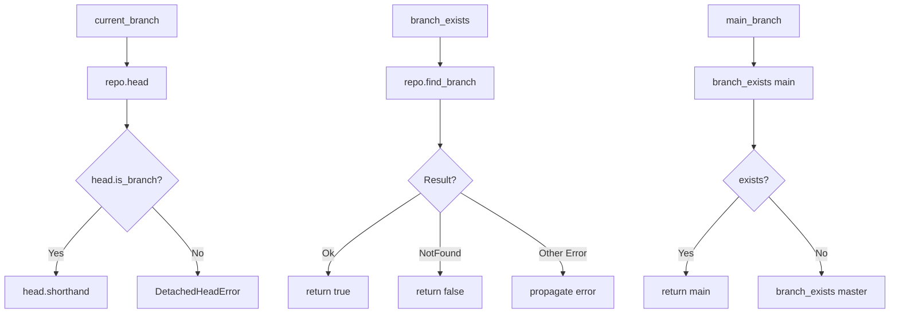

# Git2-rs Branch Detection Operations Migration

Refer to /Users/wballard/github/sah-skipped/ideas/git.md

## Objective

Migrate branch detection operations from shell commands to git2-rs, including current branch detection, branch existence checking, and basic branch listing.

## Context

Branch operations are core to the SwissArmyHammer issue management system. This step migrates the fundamental branch detection operations that are used throughout the GitOperations class.

## Current Shell Commands to Migrate

```bash
# Current branch detection
git rev-parse --abbrev-ref HEAD

# Branch existence checking
git show-ref --verify --quiet refs/heads/{branch}

# Branch listing (used in some areas)
git branch -a
```

## Tasks

### 1. Migrate Current Branch Detection

Replace `current_branch()` method to use git2:

```rust
// Before (shell)
let output = Command::new("git")
    .args(["rev-parse", "--abbrev-ref", "HEAD"])
    .output()?;

// After (git2)
pub fn current_branch(&self) -> Result<String> {
    let repo = self.open_git2_repository()?;
    let head_ref = repo.head()
        .map_err(|e| SwissArmyHammerError::git2_operation_failed("get HEAD reference", e))?;
    
    if head_ref.is_branch() {
        let branch_name = head_ref.shorthand()
            .ok_or_else(|| SwissArmyHammerError::git2_operation_failed(
                "get branch name", 
                git2::Error::from_str("Invalid branch name encoding")))?;
        Ok(branch_name.to_string())
    } else {
        // Handle detached HEAD
        Err(SwissArmyHammerError::git2_operation_failed(
            "get current branch", 
            git2::Error::from_str("HEAD is detached")))
    }
}
```

### 2. Migrate Branch Existence Checking

Replace `branch_exists()` method to use git2:

```rust
// Before (shell)
let output = Command::new("git")
    .args(["show-ref", "--verify", "--quiet", &format!("refs/heads/{branch}")])
    .output()?;

// After (git2)  
pub fn branch_exists(&self, branch: &str) -> Result<bool> {
    let repo = self.open_git2_repository()?;
    match repo.find_branch(branch, git2::BranchType::Local) {
        Ok(_) => Ok(true),
        Err(e) if e.code() == git2::ErrorCode::NotFound => Ok(false),
        Err(e) => Err(SwissArmyHammerError::git2_operation_failed("check branch existence", e))
    }
}
```

### 3. Implement Main Branch Detection

Enhance `main_branch()` method to use git2:

```rust
pub fn main_branch(&self) -> Result<String> {
    // Try 'main' first
    if self.branch_exists("main")? {
        return Ok("main".to_string());
    }
    
    // Fall back to 'master'
    if self.branch_exists("master")? {
        return Ok("master".to_string());
    }
    
    Err(SwissArmyHammerError::Other("No main or master branch found".to_string()))
}
```

### 4. Add Branch Listing Support

Add git2-based branch listing for future use:

```rust
pub fn list_branches(&self) -> Result<Vec<String>> {
    let repo = self.open_git2_repository()?;
    let mut branch_names = Vec::new();
    
    let branches = repo.branches(Some(git2::BranchType::Local))
        .map_err(|e| SwissArmyHammerError::git2_operation_failed("list branches", e))?;
        
    for branch_result in branches {
        let (branch, _) = branch_result
            .map_err(|e| SwissArmyHammerError::git2_operation_failed("iterate branch", e))?;
        
        if let Some(name) = branch.name()? {
            branch_names.push(name.to_string());
        }
    }
    
    Ok(branch_names)
}
```

## Implementation Details



## Acceptance Criteria

- [ ] `current_branch()` method uses git2 instead of shell commands
- [ ] `branch_exists()` method uses git2 instead of shell commands
- [ ] `main_branch()` method uses git2 for branch checking
- [ ] Detached HEAD scenario handled correctly  
- [ ] Branch name encoding handled correctly (UTF-8)
- [ ] All existing error messages and behavior preserved
- [ ] Performance improvement measurable
- [ ] All existing tests pass without modification

## Testing Requirements

- Test current branch detection in various states (normal branch, detached HEAD)
- Test branch existence checking with existing and non-existing branches
- Test main/master branch detection in repositories with different setups
- Test branch name handling with special characters
- Performance comparison tests between shell and git2 implementations
- Edge case testing (empty repository, permissions issues)

## Error Handling

- Map git2 error codes to appropriate SwissArmyHammer errors
- Preserve existing error message formats for compatibility
- Handle edge cases like detached HEAD states
- Graceful handling of repository corruption or access issues

## Performance Expectations

- Eliminate subprocess overhead for branch operations
- Faster branch existence checking
- Reduced string parsing and UTF-8 conversion overhead
- Better memory efficiency

## Dependencies

- Repository operations from step 2
- Git2 utility functions from step 1
- Error types from step 1

## Notes

Branch detection is fundamental to issue management workflows. This step validates the git2 integration approach with commonly-used operations before moving to more complex branch manipulation.