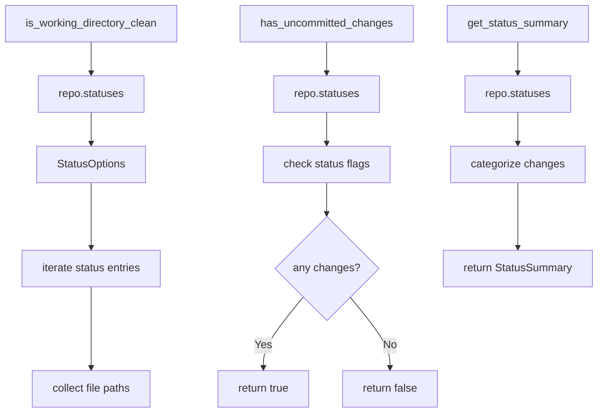

# Git2-rs Working Directory Status Operations

Refer to /Users/wballard/github/sah-skipped/ideas/git.md

## Objective

Migrate working directory status operations from shell commands to git2-rs, including status checking, uncommitted changes detection, and working tree state validation.

## Context

Working directory status checking is critical for ensuring repository safety before branch operations and merges. This step migrates status operations that are used throughout the GitOperations class.

## Current Shell Commands to Migrate

```bash
# Working directory status
git status --porcelain

# Status checking for merge safety
git status --porcelain | wc -l  # (implied in has_uncommitted_changes logic)
```

## Tasks

### 1. Migrate Working Directory Status Checking

Replace `is_working_directory_clean()` method to use git2:

```rust
// Before (shell)
let output = Command::new("git")
    .args(["status", "--porcelain"])
    .output()?;

// After (git2)
pub fn is_working_directory_clean(&self) -> Result<Vec<String>> {
    let repo = self.open_git2_repository()?;
    let statuses = repo.statuses(Some(git2::StatusOptions::new()
        .include_untracked(true)
        .include_ignored(false)))
        .map_err(|e| SwissArmyHammerError::git2_operation_failed("get repository status", e))?;
    
    let mut changes = Vec::new();
    
    for status_entry in statuses.iter() {
        if let Some(path) = status_entry.path() {
            changes.push(path.to_string());
        }
    }
    
    Ok(changes)
}
```

### 2. Enhance Uncommitted Changes Detection

Improve `has_uncommitted_changes()` method with git2:

```rust
pub fn has_uncommitted_changes(&self) -> Result<bool> {
    let repo = self.open_git2_repository()?;
    let statuses = repo.statuses(Some(git2::StatusOptions::new()
        .include_untracked(false)  // Only track changes to tracked files
        .include_ignored(false)))
        .map_err(|e| SwissArmyHammerError::git2_operation_failed("check uncommitted changes", e))?;
    
    // Check for any modified, staged, or deleted files
    for status_entry in statuses.iter() {
        let flags = status_entry.status();
        if flags.intersects(
            git2::Status::INDEX_MODIFIED 
            | git2::Status::INDEX_NEW 
            | git2::Status::INDEX_DELETED
            | git2::Status::WT_MODIFIED 
            | git2::Status::WT_NEW 
            | git2::Status::WT_DELETED
        ) {
            return Ok(true);
        }
    }
    
    Ok(false)
}
```

### 3. Add Detailed Status Information

Create new methods for detailed status information:

```rust
pub fn get_status_summary(&self) -> Result<StatusSummary> {
    let repo = self.open_git2_repository()?;
    let statuses = repo.statuses(Some(git2::StatusOptions::new()
        .include_untracked(true)
        .include_ignored(false)))
        .map_err(|e| SwissArmyHammerError::git2_operation_failed("get status summary", e))?;
    
    let mut summary = StatusSummary::new();
    
    for status_entry in statuses.iter() {
        let flags = status_entry.status();
        let path = status_entry.path().unwrap_or("<unknown>");
        
        if flags.contains(git2::Status::INDEX_MODIFIED) {
            summary.staged_modified.push(path.to_string());
        }
        if flags.contains(git2::Status::WT_MODIFIED) {
            summary.unstaged_modified.push(path.to_string());  
        }
        if flags.contains(git2::Status::WT_NEW) {
            summary.untracked.push(path.to_string());
        }
        // ... handle other status types
    }
    
    Ok(summary)
}

#[derive(Debug, Default)]
pub struct StatusSummary {
    pub staged_modified: Vec<String>,
    pub unstaged_modified: Vec<String>, 
    pub untracked: Vec<String>,
    pub deleted: Vec<String>,
    pub renamed: Vec<String>,
}
```

### 4. Add Index Operations Support

Add support for index operations that will be needed later:

```rust
pub fn refresh_index(&self) -> Result<()> {
    let repo = self.open_git2_repository()?;
    let mut index = repo.index()
        .map_err(|e| SwissArmyHammerError::git2_operation_failed("get repository index", e))?;
    
    index.read(true)
        .map_err(|e| SwissArmyHammerError::git2_operation_failed("refresh index", e))?;
    
    Ok(())
}
```

## Implementation Details



## Acceptance Criteria

- [ ] `is_working_directory_clean()` uses git2 instead of shell commands
- [ ] `has_uncommitted_changes()` uses git2 instead of shell commands  
- [ ] Status checking handles all git status types correctly
- [ ] Untracked files handled appropriately based on context
- [ ] Performance significantly improved over shell commands
- [ ] All existing behavior preserved exactly
- [ ] Status information more detailed than shell equivalent

## Testing Requirements

- Test status checking in clean repositories
- Test with various file modifications (staged, unstaged, untracked)
- Test with file deletions, renames, and moves
- Test with large repositories (performance)
- Test edge cases (symlinks, submodules, permissions)
- Performance benchmarks vs shell commands
- Compatibility tests ensuring identical behavior

## Performance Expectations

- Eliminate subprocess overhead for status operations
- Faster status checking, especially for large repositories
- Reduced memory allocation from string parsing
- Direct access to git index without text parsing

## Error Handling

- Handle repository lock conditions gracefully
- Map git2 status errors to appropriate application errors
- Handle filesystem permission issues
- Graceful degradation for corrupted index

## Dependencies

- Repository operations from step 2
- Branch detection from step 3  
- Git2 utility functions from step 1

## Notes

Status operations are frequently called and performance-critical. This step should show significant performance improvements while maintaining exact compatibility with existing behavior.