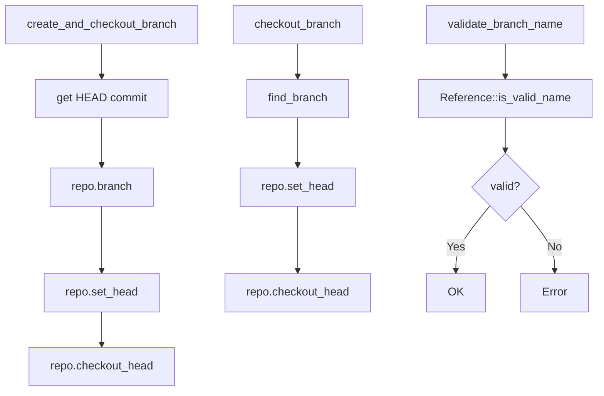

# Git2-rs Branch Creation Operations Migration

Refer to /Users/wballard/github/sah-skipped/ideas/git.md

## Objective

Migrate branch creation and checkout operations from shell commands to git2-rs, including creating new branches, switching to existing branches, and branch validation.

## Context

Branch creation is core to the issue management workflow. This step migrates the branch manipulation operations that are used when creating and switching to issue branches.

## Current Shell Commands to Migrate

```bash
# Create and checkout new branch
git checkout -b {branch_name}

# Switch to existing branch  
git checkout {branch}

# Branch validation (implicit in current logic)
```

## Tasks

### 1. Migrate Branch Creation and Checkout

Replace `create_and_checkout_branch()` method to use git2:

```rust
// Before (shell)
let output = Command::new("git")
    .args(["checkout", "-b", branch_name])
    .output()?;

// After (git2)
fn create_and_checkout_branch(&self, branch_name: &str) -> Result<()> {
    let repo = self.open_git2_repository()?;
    
    // Get current HEAD commit
    let head_commit = repo.head()
        .map_err(|e| SwissArmyHammerError::git2_operation_failed("get HEAD", e))?
        .peel_to_commit()
        .map_err(|e| SwissArmyHammerError::git2_operation_failed("get HEAD commit", e))?;
    
    // Create new branch pointing to HEAD commit
    let branch = repo.branch(branch_name, &head_commit, false)
        .map_err(|e| SwissArmyHammerError::git2_operation_failed(
            &format!("create branch '{}'", branch_name), e))?;
    
    // Set HEAD to point to new branch
    let branch_ref = branch.get().name()
        .ok_or_else(|| SwissArmyHammerError::git2_operation_failed(
            "get branch reference name", 
            git2::Error::from_str("Invalid branch reference")))?;
    
    repo.set_head(branch_ref)
        .map_err(|e| SwissArmyHammerError::git2_operation_failed(
            &format!("checkout branch '{}'", branch_name), e))?;
    
    // Update working directory to match new HEAD
    repo.checkout_head(Some(git2::build::CheckoutBuilder::new()
        .force()))
        .map_err(|e| SwissArmyHammerError::git2_operation_failed(
            &format!("update working directory for '{}'", branch_name), e))?;
    
    Ok(())
}
```

### 2. Migrate Branch Checkout

Replace `checkout_branch()` method to use git2:

```rust
// Before (shell)  
let output = Command::new("git")
    .args(["checkout", branch])
    .output()?;

// After (git2)
pub fn checkout_branch(&self, branch: &str) -> Result<()> {
    let repo = self.open_git2_repository()?;
    
    // Find the branch reference
    let branch_ref = repo.find_branch(branch, git2::BranchType::Local)
        .map_err(|e| SwissArmyHammerError::git2_operation_failed(
            &format!("find branch '{}'", branch), e))?;
    
    let reference = branch_ref.get();
    let branch_ref_name = reference.name()
        .ok_or_else(|| SwissArmyHammerError::git2_operation_failed(
            "get branch reference name",
            git2::Error::from_str("Invalid branch reference")))?;
    
    // Set HEAD to point to the branch
    repo.set_head(branch_ref_name)
        .map_err(|e| SwissArmyHammerError::git2_operation_failed(
            &format!("set HEAD to '{}'", branch), e))?;
    
    // Update working directory to match branch
    repo.checkout_head(Some(git2::build::CheckoutBuilder::new()
        .force()))
        .map_err(|e| SwissArmyHammerError::git2_operation_failed(
            &format!("checkout working directory for '{}'", branch), e))?;
    
    Ok(())
}
```

### 3. Add Branch Validation

Implement comprehensive branch validation:

```rust
pub fn validate_branch_name(&self, branch_name: &str) -> Result<()> {
    // Check branch name validity using git2 reference validation
    if git2::Reference::is_valid_name(&format!("refs/heads/{}", branch_name)) {
        Ok(())
    } else {
        Err(SwissArmyHammerError::git2_operation_failed(
            "validate branch name",
            git2::Error::from_str(&format!("Invalid branch name: '{}'", branch_name))))
    }
}

pub fn can_create_branch(&self, branch_name: &str) -> Result<bool> {
    // Validate branch name
    self.validate_branch_name(branch_name)?;
    
    // Check if branch already exists
    if self.branch_exists(branch_name)? {
        return Ok(false);
    }
    
    // Check if we have a valid HEAD to branch from
    let repo = self.open_git2_repository()?;
    match repo.head() {
        Ok(_) => Ok(true),
        Err(e) if e.code() == git2::ErrorCode::UnbornBranch => Ok(false),
        Err(e) => Err(SwissArmyHammerError::git2_operation_failed("check HEAD for branching", e))
    }
}
```

### 4. Enhance Branch Creation with Safety Checks

Add safety checks to branch creation:

```rust
pub fn create_work_branch_safe(&self, issue_name: &str) -> Result<String> {
    let branch_name = format!("issue/{}", issue_name);
    
    // Validate branch creation prerequisites
    self.validate_branch_creation(issue_name, None)?;
    
    // Check if we can create the branch
    if !self.can_create_branch(&branch_name)? {
        return Err(SwissArmyHammerError::git2_operation_failed(
            "create work branch",
            git2::Error::from_str(&format!("Cannot create branch '{}'", branch_name))));
    }
    
    // Store current branch as source before creating new branch
    let current_branch = self.current_branch()?;
    
    // Create and checkout the branch
    self.create_and_checkout_branch(&branch_name)?;
    
    // Store source branch information
    self.store_issue_source_branch(issue_name, &current_branch)?;
    
    Ok(branch_name)
}
```

## Implementation Details



## Acceptance Criteria

- [ ] `create_and_checkout_branch()` uses git2 instead of shell commands
- [ ] `checkout_branch()` uses git2 instead of shell commands
- [ ] Branch name validation implemented with git2
- [ ] Working directory updated correctly during branch operations
- [ ] Branch creation safety checks implemented
- [ ] All existing behavior preserved exactly
- [ ] Performance significantly improved
- [ ] Error handling comprehensive and informative

## Testing Requirements

- Test branch creation from various starting points (main, feature branches)
- Test checkout of existing branches
- Test branch name validation (valid/invalid names)
- Test branch creation in empty repositories
- Test checkout with uncommitted changes (should fail appropriately)
- Test concurrent branch operations
- Performance benchmarks vs shell commands
- Test working directory updates during branch operations

## Error Handling

- Handle cases where branch already exists
- Handle invalid branch names gracefully
- Handle checkout conflicts (uncommitted changes)
- Handle repository lock conditions
- Handle filesystem permission issues
- Provide informative error messages matching shell equivalents

## Performance Expectations

- Eliminate subprocess overhead for branch operations
- Faster branch creation and checkout
- Direct git object manipulation without text parsing
- Better memory efficiency

## Safety Considerations

- Ensure working directory is properly updated after branch operations
- Handle uncommitted changes appropriately
- Maintain git repository consistency
- Atomic operations where possible

## Dependencies

- Configuration management from step 5
- Working directory status from step 4
- Branch detection from step 3
- Repository operations from step 2

## Notes

Branch creation and checkout are fundamental operations that must be rock-solid. This step should demonstrate significant performance improvements while maintaining exact compatibility with existing workflows.