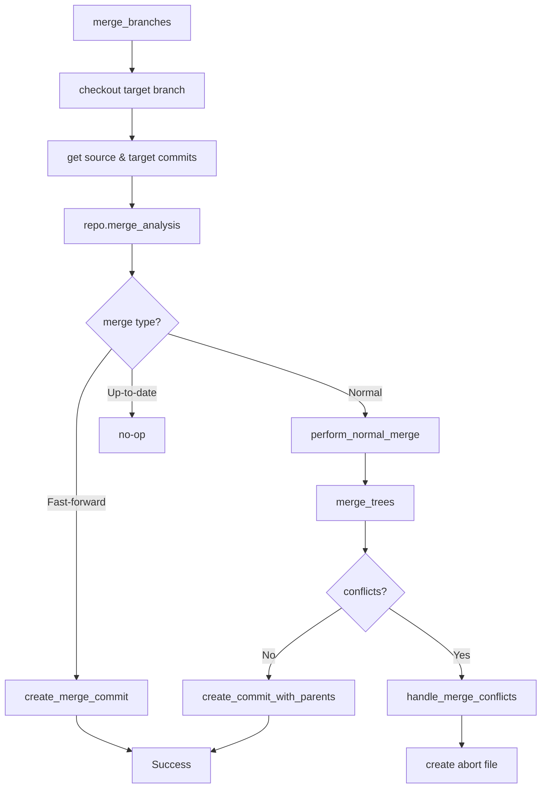

# Git2-rs Merge Operations Migration

Refer to /Users/wballard/github/sah-skipped/ideas/git.md

## Objective

Migrate merge operations from shell commands to git2-rs, including branch merging, conflict detection, and merge validation with comprehensive error handling.

## Context

Merge operations are the most complex git operations in the system. They require careful handling of conflicts, working directory state, and proper error reporting with abort file creation.

## Current Shell Commands to Migrate

```bash
# Branch merging with no-fast-forward
git merge --no-ff {branch_name} -m "Merge message"

# Merge conflict detection (implicit in error handling)
# Working directory validation before merge (status checking)
```

## Tasks

### 1. Migrate Basic Merge Operations

Replace shell-based merge with git2 merge operations:

```rust
// Before (shell)
let output = Command::new("git")
    .args(["merge", "--no-ff", &branch_name, "-m", &message])
    .output()?;

// After (git2) 
pub fn merge_branches(&self, source_branch: &str, target_branch: &str, message: &str) -> Result<()> {
    let repo = self.open_git2_repository()?;
    
    // Ensure we're on the target branch
    self.checkout_branch(target_branch)?;
    
    // Get the source branch commit
    let source_ref = repo.find_branch(source_branch, git2::BranchType::Local)
        .map_err(|e| SwissArmyHammerError::git2_operation_failed(
            &format!("find source branch '{}'", source_branch), e))?;
    
    let source_commit = source_ref.get().peel_to_commit()
        .map_err(|e| SwissArmyHammerError::git2_operation_failed(
            &format!("get source commit for '{}'", source_branch), e))?;
    
    // Get current HEAD commit (target branch)
    let target_commit = repo.head()
        .map_err(|e| SwissArmyHammerError::git2_operation_failed("get target HEAD", e))?
        .peel_to_commit()
        .map_err(|e| SwissArmyHammerError::git2_operation_failed("get target commit", e))?;
    
    // Perform merge analysis
    let merge_analysis = repo.merge_analysis(&[&source_commit])
        .map_err(|e| SwissArmyHammerError::git2_operation_failed("analyze merge", e))?;
    
    self.handle_merge_analysis(merge_analysis, &source_commit, &target_commit, source_branch, target_branch, message)
}
```

### 2. Implement Merge Analysis and Execution

Handle different merge scenarios based on analysis:

```rust
fn handle_merge_analysis(
    &self,
    analysis: (git2::MergeAnalysis, git2::MergePreference),
    source_commit: &git2::Commit,
    target_commit: &git2::Commit, 
    source_branch: &str,
    target_branch: &str,
    message: &str
) -> Result<()> {
    let repo = self.open_git2_repository()?;
    let (merge_analysis, _merge_pref) = analysis;
    
    if merge_analysis.is_fast_forward() {
        // Force non-fast-forward merge as per original shell behavior
        self.create_merge_commit(source_commit, target_commit, source_branch, target_branch, message)
    } else if merge_analysis.is_normal() {
        // Normal merge - may have conflicts
        self.perform_normal_merge(source_commit, target_commit, source_branch, target_branch, message)
    } else if merge_analysis.is_up_to_date() {
        // Nothing to merge
        tracing::info!("Branch '{}' is already up to date with '{}'", target_branch, source_branch);
        Ok(())
    } else {
        // Unmerged state or other issues
        create_abort_file(&self.work_dir, &format!(
            "Cannot merge '{}' into '{}': repository is in an unmerged state or has conflicts",
            source_branch, target_branch
        ))?;
        
        Err(SwissArmyHammerError::git2_operation_failed(
            "merge analysis",
            git2::Error::from_str("Repository in unmerged state")
        ))
    }
}
```

### 3. Implement Conflict Detection and Handling

Add comprehensive conflict detection:

```rust
fn perform_normal_merge(
    &self,
    source_commit: &git2::Commit,
    target_commit: &git2::Commit,
    source_branch: &str, 
    target_branch: &str,
    message: &str
) -> Result<()> {
    let repo = self.open_git2_repository()?;
    
    // Get merge base for 3-way merge
    let merge_base = repo.merge_base(source_commit.id(), target_commit.id())
        .map_err(|e| SwissArmyHammerError::git2_operation_failed("find merge base", e))?;
    
    let merge_base_commit = repo.find_commit(merge_base)
        .map_err(|e| SwissArmyHammerError::git2_operation_failed("get merge base commit", e))?;
    
    // Create trees for 3-way merge
    let ancestor_tree = merge_base_commit.tree()
        .map_err(|e| SwissArmyHammerError::git2_operation_failed("get ancestor tree", e))?;
    let our_tree = target_commit.tree()
        .map_err(|e| SwissArmyHammerError::git2_operation_failed("get target tree", e))?;
    let their_tree = source_commit.tree()
        .map_err(|e| SwissArmyHammerError::git2_operation_failed("get source tree", e))?;
    
    // Perform merge
    let mut index = repo.merge_trees(&ancestor_tree, &our_tree, &their_tree, None)
        .map_err(|e| SwissArmyHammerError::git2_operation_failed("merge trees", e))?;
    
    // Check for conflicts
    if index.has_conflicts() {
        self.handle_merge_conflicts(&index, source_branch, target_branch)?;
        return Err(SwissArmyHammerError::git2_operation_failed(
            "merge",
            git2::Error::from_str("Merge conflicts detected")
        ));
    }
    
    // Create merge commit
    let tree_oid = index.write_tree_to(&repo)
        .map_err(|e| SwissArmyHammerError::git2_operation_failed("write merge tree", e))?;
    let tree = repo.find_tree(tree_oid)
        .map_err(|e| SwissArmyHammerError::git2_operation_failed("find merge tree", e))?;
    
    self.create_commit_with_parents(&tree, &[target_commit, source_commit], message)
}
```

### 4. Add Merge Conflict Analysis

Implement detailed conflict analysis and reporting:

```rust
fn handle_merge_conflicts(
    &self,
    index: &git2::Index,
    source_branch: &str,
    target_branch: &str
) -> Result<()> {
    let mut conflicts = Vec::new();
    
    // Collect conflict information
    let conflicts_iter = index.conflicts()
        .map_err(|e| SwissArmyHammerError::git2_operation_failed("get conflicts iterator", e))?;
    
    for conflict in conflicts_iter {
        let conflict = conflict
            .map_err(|e| SwissArmyHammerError::git2_operation_failed("read conflict entry", e))?;
            
        if let Some(ours) = conflict.our {
            if let Some(path) = std::str::from_utf8(&ours.path).ok() {
                conflicts.push(path.to_string());
            }
        }
    }
    
    // Create detailed abort message
    let conflict_details = if conflicts.is_empty() {
        "Unknown conflicts detected".to_string()
    } else {
        format!("Conflicts in files: {}", conflicts.join(", "))
    };
    
    create_abort_file(&self.work_dir, &format!(
        "Merge conflicts detected while merging '{}' into '{}'. {}. Manual conflict resolution required.",
        source_branch, target_branch, conflict_details
    ))?;
    
    Ok(())
}
```

### 5. Implement Commit Creation

Add support for creating merge commits:

```rust
fn create_merge_commit(
    &self,
    source_commit: &git2::Commit,
    target_commit: &git2::Commit,
    source_branch: &str,
    target_branch: &str,
    message: &str
) -> Result<()> {
    // Use source tree for fast-forward case, but create explicit merge commit
    let tree = source_commit.tree()
        .map_err(|e| SwissArmyHammerError::git2_operation_failed("get source tree", e))?;
    
    let full_message = format!("Merge {} into {}\n\n{}", source_branch, target_branch, message);
    self.create_commit_with_parents(&tree, &[target_commit, source_commit], &full_message)
}

fn create_commit_with_parents(
    &self,
    tree: &git2::Tree,
    parents: &[&git2::Commit],
    message: &str
) -> Result<()> {
    let repo = self.open_git2_repository()?;
    
    // Get signature for commit
    let signature = repo.signature()
        .map_err(|e| SwissArmyHammerError::git2_operation_failed("get signature", e))?;
    
    // Create commit
    let commit_oid = repo.commit(
        Some("HEAD"),
        &signature,
        &signature,
        message,
        tree,
        parents
    ).map_err(|e| SwissArmyHammerError::git2_operation_failed("create merge commit", e))?;
    
    tracing::info!("Created merge commit: {}", commit_oid);
    Ok(())
}
```

## Implementation Details



## Acceptance Criteria

- [ ] Branch merge operations use git2 instead of shell commands
- [ ] Non-fast-forward merges enforced (matching original shell behavior)
- [ ] Merge conflict detection comprehensive and accurate
- [ ] Abort files created with detailed conflict information
- [ ] Merge commits created with proper parent relationships
- [ ] Working directory state properly managed during merges
- [ ] All existing merge behavior preserved exactly
- [ ] Performance significantly improved

## Testing Requirements

- Test successful merges (fast-forward and normal)
- Test merge conflict detection and reporting
- Test merge with various branch configurations
- Test merge commit creation and metadata
- Test merge failure scenarios and abort file creation
- Test working directory state after merge operations
- Performance benchmarks vs shell commands
- Integration tests with issue workflow

## Error Handling

- Comprehensive merge conflict detection and reporting
- Proper abort file creation with actionable information
- Handle repository state inconsistencies
- Handle filesystem permission issues during merges
- Preserve original error message formats

## Performance Expectations

- Eliminate subprocess overhead for merge operations
- Faster merge analysis and execution
- Direct git object manipulation for merge commits
- Better memory efficiency for large merges

## Safety Considerations

- Validate repository state before merging
- Ensure working directory is clean before merge
- Atomic merge operations where possible
- Proper cleanup on merge failures

## Dependencies

- Reflog analysis from step 7
- Branch creation operations from step 6
- Working directory status from step 4
- Configuration management from step 5

## Notes

Merge operations are the most complex part of the git workflow. This step requires extensive testing to ensure reliability and must maintain exact compatibility with shell-based merge behavior including error conditions and conflict handling.