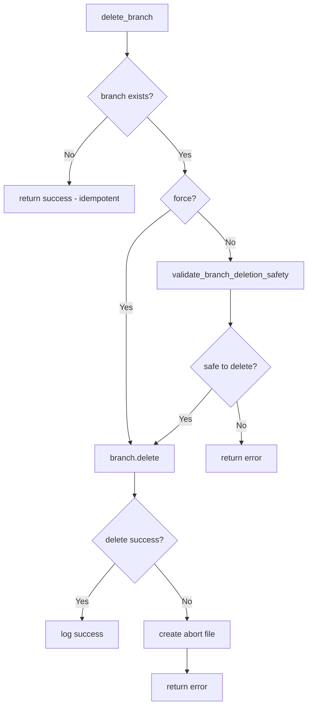

# Git2-rs Branch Deletion Operations Migration

Refer to /Users/wballard/github/sah-skipped/ideas/git.md

## Objective

Migrate branch deletion operations from shell commands to git2-rs, including safe branch deletion, forced deletion, and validation of deletion safety.

## Context

Branch deletion is used after successful merges to clean up issue branches. The current implementation has idempotent behavior (succeeds if branch doesn't exist) that must be preserved.

## Current Shell Commands to Migrate

```bash
# Normal branch deletion
git branch --delete {branch_name}

# Forced branch deletion  
git branch --delete --force {branch_name}

# Branch deletion validation (implicit in error handling)
```

## Tasks

### 1. Migrate Basic Branch Deletion

Replace `delete_branch()` method to use git2:

```rust
// Before (shell)
let mut args = vec!["branch", "--delete"];
if force {
    args.push("--force");
}
args.push(branch_name);
let output = Command::new("git").args(args).output()?;

// After (git2)
pub fn delete_branch(&self, branch_name: &str, force: bool) -> Result<()> {
    let repo = self.open_git2_repository()?;
    
    // Check if branch exists first - idempotent behavior
    let branch = match repo.find_branch(branch_name, git2::BranchType::Local) {
        Ok(branch) => branch,
        Err(e) if e.code() == git2::ErrorCode::NotFound => {
            // Branch doesn't exist - already achieved desired outcome
            tracing::info!("Branch '{}' does not exist - deletion already achieved", branch_name);
            return Ok(());
        },
        Err(e) => return Err(SwissArmyHammerError::git2_operation_failed(
            &format!("find branch '{}'", branch_name), e))
    };
    
    // Validate deletion safety unless forced
    if !force {
        self.validate_branch_deletion_safety(&branch, branch_name)?;
    }
    
    // Delete the branch
    branch.delete()
        .map_err(|e| {
            // Create abort file for deletion failures
            let _ = create_abort_file(&self.work_dir, 
                &format!("Failed to delete branch '{}': {}", branch_name, e));
            SwissArmyHammerError::git2_operation_failed(
                &format!("delete branch '{}'", branch_name), e)
        })?;
    
    tracing::info!("Successfully deleted branch '{}'", branch_name);
    Ok(())
}
```

### 2. Implement Branch Deletion Safety Validation

Add safety checks for branch deletion:

```rust
fn validate_branch_deletion_safety(
    &self,
    branch: &git2::Branch,
    branch_name: &str
) -> Result<()> {
    let repo = self.open_git2_repository()?;
    
    // Check if we're currently on the branch we're trying to delete
    let current_branch = self.current_branch()?;
    if current_branch == branch_name {
        return Err(SwissArmyHammerError::git2_operation_failed(
            "delete current branch",
            git2::Error::from_str(&format!(
                "Cannot delete branch '{}' - currently checked out. Switch to another branch first.",
                branch_name
            ))
        ));
    }
    
    // Check if branch is merged (git2 equivalent of --delete behavior)
    if !self.is_branch_merged(branch, branch_name)? {
        return Err(SwissArmyHammerError::git2_operation_failed(
            "delete unmerged branch",
            git2::Error::from_str(&format!(
                "Branch '{}' is not fully merged. Use force deletion if you're sure.",
                branch_name
            ))
        ));
    }
    
    Ok(())
}

fn is_branch_merged(&self, branch: &git2::Branch, branch_name: &str) -> Result<bool> {
    let repo = self.open_git2_repository()?;
    
    // Get branch commit
    let branch_commit = branch.get().peel_to_commit()
        .map_err(|e| SwissArmyHammerError::git2_operation_failed(
            &format!("get commit for branch '{}'", branch_name), e))?;
    
    // Get HEAD commit
    let head_commit = repo.head()
        .map_err(|e| SwissArmyHammerError::git2_operation_failed("get HEAD", e))?
        .peel_to_commit()
        .map_err(|e| SwissArmyHammerError::git2_operation_failed("get HEAD commit", e))?;
    
    // Check if branch commit is reachable from HEAD
    match repo.graph_descendant_of(head_commit.id(), branch_commit.id()) {
        Ok(is_descendant) => Ok(is_descendant),
        Err(e) => {
            // If we can't determine merge status, be conservative
            tracing::warn!("Could not determine merge status for branch '{}': {}", branch_name, e);
            Ok(false)
        }
    }
}
```

### 3. Add Batch Branch Deletion

Implement efficient batch deletion for cleanup operations:

```rust
pub fn delete_branches(&self, branch_names: &[&str], force: bool) -> Result<Vec<(String, bool)>> {
    let mut results = Vec::new();
    
    for &branch_name in branch_names {
        match self.delete_branch(branch_name, force) {
            Ok(()) => results.push((branch_name.to_string(), true)),
            Err(e) => {
                tracing::warn!("Failed to delete branch '{}': {}", branch_name, e);
                results.push((branch_name.to_string(), false));
                
                // Continue with other branches unless it's a critical failure
                if !force {
                    return Err(e);
                }
            }
        }
    }
    
    Ok(results)
}
```

### 4. Add Branch Cleanup Utilities

Implement utilities for branch maintenance:

```rust
pub fn cleanup_merged_issue_branches(&self) -> Result<Vec<String>> {
    let repo = self.open_git2_repository()?;
    let mut cleaned_branches = Vec::new();
    
    // List all issue branches
    let branches = repo.branches(Some(git2::BranchType::Local))
        .map_err(|e| SwissArmyHammerError::git2_operation_failed("list branches", e))?;
    
    for branch_result in branches {
        let (branch, _) = branch_result
            .map_err(|e| SwissArmyHammerError::git2_operation_failed("iterate branch", e))?;
        
        if let Some(branch_name) = branch.name()? {
            // Only process issue branches
            if self.is_issue_branch(branch_name) {
                // Check if branch is merged
                if self.is_branch_merged(&branch, branch_name)? {
                    match self.delete_branch(branch_name, false) {
                        Ok(()) => {
                            tracing::info!("Cleaned up merged issue branch: {}", branch_name);
                            cleaned_branches.push(branch_name.to_string());
                        },
                        Err(e) => {
                            tracing::warn!("Failed to cleanup branch '{}': {}", branch_name, e);
                        }
                    }
                }
            }
        }
    }
    
    Ok(cleaned_branches)
}

pub fn list_unmerged_issue_branches(&self) -> Result<Vec<String>> {
    let repo = self.open_git2_repository()?;
    let mut unmerged_branches = Vec::new();
    
    let branches = repo.branches(Some(git2::BranchType::Local))
        .map_err(|e| SwissArmyHammerError::git2_operation_failed("list branches", e))?;
    
    for branch_result in branches {
        let (branch, _) = branch_result
            .map_err(|e| SwissArmyHammerError::git2_operation_failed("iterate branch", e))?;
        
        if let Some(branch_name) = branch.name()? {
            if self.is_issue_branch(branch_name) {
                if !self.is_branch_merged(&branch, branch_name)? {
                    unmerged_branches.push(branch_name.to_string());
                }
            }
        }
    }
    
    Ok(unmerged_branches)
}
```

## Implementation Details



## Acceptance Criteria

- [ ] `delete_branch()` method uses git2 instead of shell commands
- [ ] Idempotent behavior preserved (success if branch doesn't exist)
- [ ] Branch deletion safety validation implemented
- [ ] Force deletion option works correctly
- [ ] Batch branch deletion operations available
- [ ] Branch cleanup utilities implemented
- [ ] All existing behavior preserved exactly
- [ ] Performance improved over shell commands

## Testing Requirements

- Test deletion of existing branches (normal and force modes)
- Test deletion of non-existent branches (idempotent behavior)
- Test safety validation (current branch, unmerged branches)
- Test batch deletion operations
- Test branch cleanup utilities
- Test deletion with repository locks
- Test error conditions and abort file creation
- Performance benchmarks vs shell commands

## Error Handling

- Handle attempts to delete current branch
- Handle attempts to delete unmerged branches without force
- Handle repository lock conditions during deletion
- Create abort files for serious deletion failures
- Maintain original error message compatibility

## Performance Expectations

- Eliminate subprocess overhead for branch deletion
- Faster branch existence checking and merge status validation
- Efficient batch operations for branch cleanup
- Better memory efficiency for deletion operations

## Safety Considerations

- Prevent deletion of current branch
- Validate merge status before deletion (unless forced)
- Maintain git repository consistency
- Handle concurrent access to branches

## Dependencies

- Merge operations from step 8
- Branch creation operations from step 6
- Branch detection from step 3
- Repository operations from step 2

## Notes

Branch deletion must maintain the existing idempotent behavior and safety checks. The batch operations and cleanup utilities provide additional value beyond the original shell implementation while maintaining full compatibility.