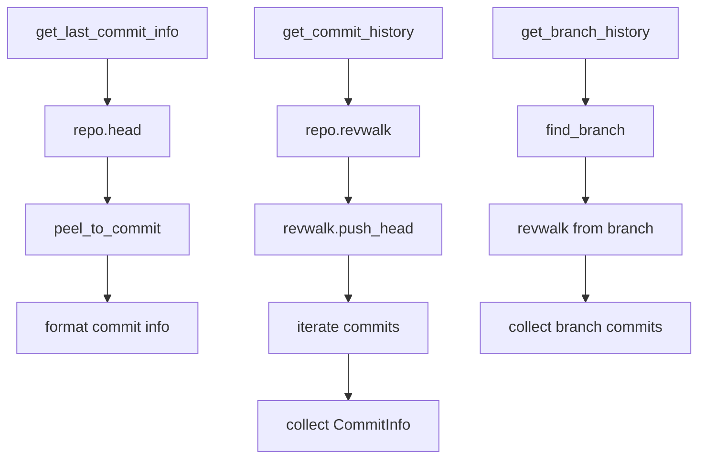

# Git2-rs Commit History Operations Migration

Refer to /Users/wballard/github/sah-skipped/ideas/git.md

## Objective

Migrate commit history and log operations from shell commands to git2-rs, including commit information retrieval, history traversal, and commit metadata access.

## Context

Commit history operations are used for diagnostics, reporting, and validation throughout the GitOperations system. These operations need to maintain exact output compatibility while providing better performance.

## Current Shell Commands to Migrate

```bash
# Get last commit information
git log -1 --pretty=format:%H|%s|%an|%ad --date=iso

# General commit history (used in various contexts)
git log --oneline
git log --pretty=format:...
```

## Tasks

### 1. Migrate Last Commit Information

Replace `get_last_commit_info()` method to use git2:

```rust
// Before (shell)
let output = Command::new("git")
    .args(["log", "-1", "--pretty=format:%H|%s|%an|%ad", "--date=iso"])
    .output()?;

// After (git2)
pub fn get_last_commit_info(&self) -> Result<String> {
    let repo = self.open_git2_repository()?;
    
    // Get HEAD commit
    let head_commit = repo.head()
        .map_err(|e| SwissArmyHammerError::git2_operation_failed("get HEAD", e))?
        .peel_to_commit()
        .map_err(|e| SwissArmyHammerError::git2_operation_failed("get HEAD commit", e))?;
    
    // Format commit info to match shell output exactly
    let hash = head_commit.id().to_string();
    let message = head_commit.message().unwrap_or("").trim();
    let author_name = head_commit.author().name().unwrap_or("unknown");
    
    // Format timestamp to ISO format matching --date=iso
    let timestamp = head_commit.author().when();
    let datetime = chrono::DateTime::<chrono::Utc>::from_timestamp(
        timestamp.seconds(), 
        0
    ).unwrap_or_default();
    let iso_date = datetime.format("%Y-%m-%d %H:%M:%S %z").to_string();
    
    Ok(format!("{}|{}|{}|{}", hash, message, author_name, iso_date))
}
```

### 2. Implement Commit History Traversal

Add comprehensive commit history operations:

```rust
pub fn get_commit_history(&self, limit: Option<usize>) -> Result<Vec<CommitInfo>> {
    let repo = self.open_git2_repository()?;
    let mut revwalk = repo.revwalk()
        .map_err(|e| SwissArmyHammerError::git2_operation_failed("create revwalk", e))?;
    
    // Start from HEAD
    revwalk.push_head()
        .map_err(|e| SwissArmyHammerError::git2_operation_failed("push HEAD to revwalk", e))?;
    
    let mut commits = Vec::new();
    let mut count = 0;
    
    for oid_result in revwalk {
        if let Some(limit) = limit {
            if count >= limit {
                break;
            }
        }
        
        let oid = oid_result
            .map_err(|e| SwissArmyHammerError::git2_operation_failed("iterate revwalk", e))?;
        
        let commit = repo.find_commit(oid)
            .map_err(|e| SwissArmyHammerError::git2_operation_failed("find commit", e))?;
        
        let commit_info = CommitInfo {
            hash: commit.id().to_string(),
            short_hash: commit.id().to_string()[..7].to_string(),
            message: commit.message().unwrap_or("").trim().to_string(),
            summary: commit.summary().unwrap_or("").to_string(),
            author_name: commit.author().name().unwrap_or("unknown").to_string(),
            author_email: commit.author().email().unwrap_or("").to_string(),
            committer_name: commit.committer().name().unwrap_or("unknown").to_string(),
            committer_email: commit.committer().email().unwrap_or("").to_string(),
            timestamp: commit.author().when().seconds(),
            parent_count: commit.parent_count(),
        };
        
        commits.push(commit_info);
        count += 1;
    }
    
    Ok(commits)
}

#[derive(Debug, Clone)]
pub struct CommitInfo {
    pub hash: String,
    pub short_hash: String,
    pub message: String,
    pub summary: String,
    pub author_name: String,
    pub author_email: String,
    pub committer_name: String,
    pub committer_email: String,
    pub timestamp: i64,
    pub parent_count: usize,
}
```

### 3. Add Commit Search and Filtering

Implement commit search operations:

```rust
pub fn find_commits_by_author(&self, author: &str, limit: Option<usize>) -> Result<Vec<CommitInfo>> {
    let all_commits = self.get_commit_history(None)?;
    
    let mut matching_commits = Vec::new();
    let mut count = 0;
    
    for commit in all_commits {
        if commit.author_name.contains(author) || commit.author_email.contains(author) {
            matching_commits.push(commit);
            count += 1;
            
            if let Some(limit) = limit {
                if count >= limit {
                    break;
                }
            }
        }
    }
    
    Ok(matching_commits)
}

pub fn find_commits_in_range(&self, since: &str, until: &str) -> Result<Vec<CommitInfo>> {
    let repo = self.open_git2_repository()?;
    let mut revwalk = repo.revwalk()
        .map_err(|e| SwissArmyHammerError::git2_operation_failed("create revwalk", e))?;
    
    // Parse range (simplified - could be enhanced)
    let since_oid = repo.revparse_single(since)
        .map_err(|e| SwissArmyHammerError::git2_operation_failed(
            &format!("parse since '{}'", since), e))?
        .id();
    
    let until_oid = repo.revparse_single(until)
        .map_err(|e| SwissArmyHammerError::git2_operation_failed(
            &format!("parse until '{}'", until), e))?
        .id();
    
    revwalk.push(until_oid)
        .map_err(|e| SwissArmyHammerError::git2_operation_failed("push until to revwalk", e))?;
    revwalk.hide(since_oid)
        .map_err(|e| SwissArmyHammerError::git2_operation_failed("hide since in revwalk", e))?;
    
    let mut commits = Vec::new();
    
    for oid_result in revwalk {
        let oid = oid_result
            .map_err(|e| SwissArmyHammerError::git2_operation_failed("iterate revwalk range", e))?;
        
        let commit = repo.find_commit(oid)
            .map_err(|e| SwissArmyHammerError::git2_operation_failed("find commit in range", e))?;
        
        let commit_info = self.commit_to_info(&commit);
        commits.push(commit_info);
    }
    
    Ok(commits)
}

fn commit_to_info(&self, commit: &git2::Commit) -> CommitInfo {
    CommitInfo {
        hash: commit.id().to_string(),
        short_hash: commit.id().to_string()[..7].to_string(),
        message: commit.message().unwrap_or("").trim().to_string(),
        summary: commit.summary().unwrap_or("").to_string(),
        author_name: commit.author().name().unwrap_or("unknown").to_string(),
        author_email: commit.author().email().unwrap_or("").to_string(),
        committer_name: commit.committer().name().unwrap_or("unknown").to_string(),
        committer_email: commit.committer().email().unwrap_or("").to_string(),
        timestamp: commit.author().when().seconds(),
        parent_count: commit.parent_count(),
    }
}
```

### 4. Add Branch-Specific History Operations

Implement operations for analyzing branch-specific history:

```rust
pub fn get_branch_history(&self, branch_name: &str, limit: Option<usize>) -> Result<Vec<CommitInfo>> {
    let repo = self.open_git2_repository()?;
    
    // Find the branch
    let branch = repo.find_branch(branch_name, git2::BranchType::Local)
        .map_err(|e| SwissArmyHammerError::git2_operation_failed(
            &format!("find branch '{}'", branch_name), e))?;
    
    // Get branch commit
    let branch_commit = branch.get().peel_to_commit()
        .map_err(|e| SwissArmyHammerError::git2_operation_failed(
            &format!("get commit for branch '{}'", branch_name), e))?;
    
    // Walk from branch commit
    let mut revwalk = repo.revwalk()
        .map_err(|e| SwissArmyHammerError::git2_operation_failed("create revwalk", e))?;
    
    revwalk.push(branch_commit.id())
        .map_err(|e| SwissArmyHammerError::git2_operation_failed("push branch to revwalk", e))?;
    
    let mut commits = Vec::new();
    let mut count = 0;
    
    for oid_result in revwalk {
        if let Some(limit) = limit {
            if count >= limit {
                break;
            }
        }
        
        let oid = oid_result
            .map_err(|e| SwissArmyHammerError::git2_operation_failed("iterate branch revwalk", e))?;
        
        let commit = repo.find_commit(oid)
            .map_err(|e| SwissArmyHammerError::git2_operation_failed("find branch commit", e))?;
        
        commits.push(self.commit_to_info(&commit));
        count += 1;
    }
    
    Ok(commits)
}

pub fn get_commits_unique_to_branch(&self, branch_name: &str, base_branch: &str) -> Result<Vec<CommitInfo>> {
    let repo = self.open_git2_repository()?;
    
    // Get branch commits
    let branch = repo.find_branch(branch_name, git2::BranchType::Local)
        .map_err(|e| SwissArmyHammerError::git2_operation_failed(
            &format!("find branch '{}'", branch_name), e))?;
    let branch_commit = branch.get().peel_to_commit()
        .map_err(|e| SwissArmyHammerError::git2_operation_failed(
            &format!("get commit for branch '{}'", branch_name), e))?;
    
    // Get base branch commit
    let base = repo.find_branch(base_branch, git2::BranchType::Local)
        .map_err(|e| SwissArmyHammerError::git2_operation_failed(
            &format!("find base branch '{}'", base_branch), e))?;
    let base_commit = base.get().peel_to_commit()
        .map_err(|e| SwissArmyHammerError::git2_operation_failed(
            &format!("get commit for base branch '{}'", base_branch), e))?;
    
    // Find merge base
    let merge_base = repo.merge_base(branch_commit.id(), base_commit.id())
        .map_err(|e| SwissArmyHammerError::git2_operation_failed("find merge base", e))?;
    
    // Walk from branch commit, hiding merge base
    let mut revwalk = repo.revwalk()
        .map_err(|e| SwissArmyHammerError::git2_operation_failed("create revwalk", e))?;
    
    revwalk.push(branch_commit.id())
        .map_err(|e| SwissArmyHammerError::git2_operation_failed("push branch to revwalk", e))?;
    revwalk.hide(merge_base)
        .map_err(|e| SwissArmyHammerError::git2_operation_failed("hide merge base", e))?;
    
    let mut unique_commits = Vec::new();
    
    for oid_result in revwalk {
        let oid = oid_result
            .map_err(|e| SwissArmyHammerError::git2_operation_failed("iterate unique commits", e))?;
        
        let commit = repo.find_commit(oid)
            .map_err(|e| SwissArmyHammerError::git2_operation_failed("find unique commit", e))?;
        
        unique_commits.push(self.commit_to_info(&commit));
    }
    
    Ok(unique_commits)
}
```

## Implementation Details



## Acceptance Criteria

- [ ] `get_last_commit_info()` uses git2 instead of shell commands
- [ ] Output format matches shell command exactly (pipe-separated format)
- [ ] Commit history traversal implemented with git2 revwalk
- [ ] Commit search and filtering operations available
- [ ] Branch-specific history operations implemented
- [ ] All timestamp formatting preserved exactly
- [ ] Performance significantly improved over shell commands
- [ ] Memory efficiency for large history operations

## Testing Requirements

- Test last commit info formatting matches shell output exactly
- Test commit history traversal with various limits
- Test commit search and filtering operations
- Test branch-specific history operations
- Test commit range operations
- Test performance with large repositories
- Test edge cases (empty repository, merge commits, orphaned commits)
- Compatibility tests ensuring identical output formats

## Error Handling

- Handle empty repositories gracefully
- Handle corrupted commits and history
- Handle detached HEAD states
- Handle missing branches or commits
- Maintain original error message formats

## Performance Expectations

- Eliminate subprocess overhead for commit history operations
- Faster commit traversal, especially for large histories
- Better memory efficiency for history operations
- Direct access to commit objects without text parsing

## Output Compatibility

Must preserve exact output formats:
- Last commit info: `"hash|subject|author|iso_date"`
- History formats matching shell equivalents
- Timestamp formatting exactly matching `--date=iso`

## Dependencies

- Branch deletion from step 9
- Merge operations from step 8
- Branch detection from step 3
- Repository operations from step 2

## Notes

Commit history operations must maintain exact output compatibility for downstream consumers while providing significant performance improvements. The enhanced search and filtering capabilities provide additional value beyond the original shell implementation.