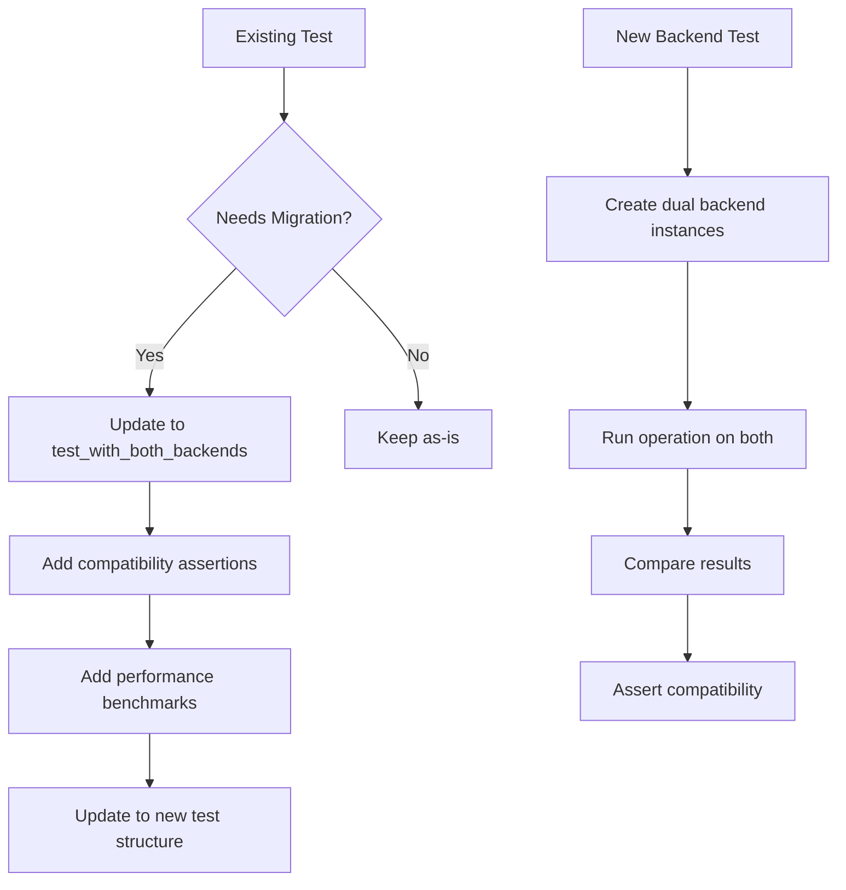

# Test Migration to Git2-rs Backends

Refer to /Users/wballard/github/sah-skipped/ideas/git.md

## Objective

Migrate existing tests to work with both shell and git2 backends, ensuring comprehensive test coverage for the new git2 implementation while maintaining compatibility with existing test suites.

## Context

The codebase has extensive tests for git operations. These tests need to be updated to work with both backends and to validate that git2 operations produce identical results to shell commands.

## Current Test Areas to Update

Based on codebase analysis, these test files need migration:
- `swissarmyhammer/src/git.rs` (199 test methods)
- `swissarmyhammer/tests/flexible_branching_*.rs` 
- `swissarmyhammer-cli/tests/*_mcp_e2e.rs`
- Various integration test files

## Tasks

### 1. Create Test Infrastructure for Dual Backends

Add test utilities for testing both backends:

```rust
// In test_utils.rs or git.rs test module
#[cfg(test)]
mod test_utils {
    use super::*;
    
    /// Test helper that runs the same test with both backends
    pub fn test_with_both_backends<F>(test_fn: F) -> Result<()> 
    where
        F: Fn(&GitOperations) -> Result<()> + Clone,
    {
        // Test with shell backend
        let shell_ops = create_test_git_ops_shell()?;
        test_fn(&shell_ops)
            .map_err(|e| SwissArmyHammerError::Other(format!("Shell backend test failed: {}", e)))?;
        
        // Test with git2 backend
        let git2_ops = create_test_git_ops_git2()?;
        test_fn(&git2_ops)
            .map_err(|e| SwissArmyHammerError::Other(format!("Git2 backend test failed: {}", e)))?;
        
        Ok(())
    }
    
    /// Create GitOperations with shell backend for testing
    pub fn create_test_git_ops_shell() -> Result<GitOperations> {
        let temp_dir = create_test_git_repo()?;
        GitOperations::with_work_dir_and_backend(temp_dir.path().to_path_buf(), false)
    }
    
    /// Create GitOperations with git2 backend for testing
    pub fn create_test_git_ops_git2() -> Result<GitOperations> {
        let temp_dir = create_test_git_repo()?;
        GitOperations::with_work_dir_and_backend(temp_dir.path().to_path_buf(), true)
    }
    
    /// Compare results from both backends
    pub fn compare_backend_results<T, F>(operation: F) -> Result<(T, T)>
    where
        T: PartialEq + std::fmt::Debug,
        F: Fn(&GitOperations) -> Result<T>,
    {
        let shell_ops = create_test_git_ops_shell()?;
        let git2_ops = create_test_git_ops_git2()?;
        
        let shell_result = operation(&shell_ops)?;
        let git2_result = operation(&git2_ops)?;
        
        assert_eq!(shell_result, git2_result, 
            "Backend results differ: shell={:?}, git2={:?}", shell_result, git2_result);
        
        Ok((shell_result, git2_result))
    }
}
```

### 2. Update Existing Git Operation Tests

Migrate existing tests to use dual backend testing:

```rust
#[test]
fn test_current_branch_both_backends() {
    test_with_both_backends(|git_ops| {
        let current_branch = git_ops.current_branch()?;
        assert!(current_branch == "main" || current_branch == "master");
        Ok(())
    }).unwrap();
}

#[test]
fn test_branch_exists_both_backends() {
    test_with_both_backends(|git_ops| {
        let main_branch = git_ops.main_branch()?;
        assert!(git_ops.branch_exists(&main_branch)?);
        assert!(!git_ops.branch_exists("non-existent-branch")?);
        Ok(())
    }).unwrap();
}

#[test]
fn test_create_work_branch_both_backends() {
    test_with_both_backends(|git_ops| {
        let branch_name = git_ops.create_work_branch("test_issue")?;
        assert_eq!(branch_name, "issue/test_issue");
        
        let current_branch = git_ops.current_branch()?;
        assert_eq!(current_branch, "issue/test_issue");
        
        assert!(git_ops.branch_exists("issue/test_issue")?);
        Ok(())
    }).unwrap();
}
```

### 3. Add Backend Compatibility Tests

Create specific tests to validate backend compatibility:

```rust
#[test]
fn test_backend_result_compatibility() {
    // Test that both backends return identical results for all operations
    
    let operations: Vec<(&str, Box<dyn Fn(&GitOperations) -> Result<String>>)> = vec![
        ("current_branch", Box::new(|ops| ops.current_branch())),
        ("main_branch", Box::new(|ops| ops.main_branch())),
        ("last_commit_info", Box::new(|ops| ops.get_last_commit_info())),
    ];
    
    for (op_name, operation) in operations {
        let result = compare_backend_results(operation);
        assert!(result.is_ok(), "Backend compatibility test failed for operation: {}", op_name);
    }
}

#[test]
fn test_working_directory_status_compatibility() {
    let temp_dir = create_test_git_repo().unwrap();
    
    // Create a test change
    std::fs::write(temp_dir.path().join("test.txt"), "test content").unwrap();
    
    let shell_ops = GitOperations::with_work_dir_and_backend(
        temp_dir.path().to_path_buf(), false).unwrap();
    let git2_ops = GitOperations::with_work_dir_and_backend(
        temp_dir.path().to_path_buf(), true).unwrap();
    
    let shell_changes = shell_ops.is_working_directory_clean().unwrap();
    let git2_changes = git2_ops.is_working_directory_clean().unwrap();
    
    // Both should detect the same changes
    assert_eq!(shell_changes.len(), git2_changes.len());
    assert!(shell_changes.contains(&"test.txt".to_string()));
    assert!(git2_changes.contains(&"test.txt".to_string()));
}
```

### 4. Add Performance Comparison Tests

Implement performance benchmarks for both backends:

```rust
#[cfg(test)]
mod performance_tests {
    use super::*;
    use std::time::Instant;
    
    #[test]
    fn benchmark_backend_performance() {
        let temp_dir = create_test_git_repo().unwrap();
        
        // Create many commits for realistic testing
        create_commit_history(&temp_dir, 100);
        
        let shell_ops = GitOperations::with_work_dir_and_backend(
            temp_dir.path().to_path_buf(), false).unwrap();
        let git2_ops = GitOperations::with_work_dir_and_backend(
            temp_dir.path().to_path_buf(), true).unwrap();
        
        // Benchmark current_branch operation
        let shell_time = benchmark_operation(|| shell_ops.current_branch().unwrap());
        let git2_time = benchmark_operation(|| git2_ops.current_branch().unwrap());
        
        println!("Current branch - Shell: {:?}, Git2: {:?}", shell_time, git2_time);
        
        // Git2 should be faster (no subprocess overhead)
        assert!(git2_time < shell_time, 
            "Git2 should be faster than shell: git2={:?}, shell={:?}", git2_time, shell_time);
    }
    
    fn benchmark_operation<F, T>(mut operation: F) -> std::time::Duration
    where
        F: FnMut() -> T,
    {
        let iterations = 10;
        let start = Instant::now();
        
        for _ in 0..iterations {
            operation();
        }
        
        start.elapsed() / iterations
    }
    
    fn create_commit_history(temp_dir: &TempDir, count: usize) {
        // Helper to create multiple commits for realistic benchmarking
        for i in 0..count {
            let file_path = temp_dir.path().join(format!("file_{}.txt", i));
            std::fs::write(&file_path, format!("content {}", i)).unwrap();
            
            Command::new("git")
                .current_dir(temp_dir.path())
                .args(["add", &format!("file_{}.txt", i)])
                .output()
                .unwrap();
                
            Command::new("git")
                .current_dir(temp_dir.path())
                .args(["commit", "-m", &format!("Commit {}", i)])
                .output()
                .unwrap();
        }
    }
}
```

### 5. Update Integration Tests

Update existing integration tests to work with both backends:

```rust
// Update tests in flexible_branching_integration.rs and similar files
#[test]
fn test_flexible_branching_with_git2() {
    let _test_env = IsolatedTestEnvironment::new().unwrap();
    let temp_dir = create_test_git_repo().unwrap();
    
    // Test with git2 backend
    let git_ops = GitOperations::with_work_dir_and_backend(
        temp_dir.path().to_path_buf(), true).unwrap();
    
    // Run the same flexible branching tests that work with shell
    test_complete_feature_branch_workflow_impl(&git_ops).unwrap();
}

#[test]
fn test_flexible_branching_backend_comparison() {
    let _test_env = IsolatedTestEnvironment::new().unwrap();
    let temp_dir = create_test_git_repo().unwrap();
    
    let shell_ops = GitOperations::with_work_dir_and_backend(
        temp_dir.path().to_path_buf(), false).unwrap();
    let git2_ops = GitOperations::with_work_dir_and_backend(
        temp_dir.path().to_path_buf(), true).unwrap();
    
    // Test that both backends produce identical workflow results
    test_identical_workflow_results(&shell_ops, &git2_ops).unwrap();
}

// Extract common test logic for reuse
fn test_complete_feature_branch_workflow_impl(git_ops: &GitOperations) -> Result<()> {
    // Common workflow logic that works with any backend
    let main_branch = git_ops.main_branch()?;
    
    // Create feature branch
    Command::new("git")
        .current_dir(git_ops.work_dir())
        .args(["checkout", "-b", "feature/user-auth"])
        .output()?;
    
    // Create issue branch from feature branch
    let issue_branch = git_ops.create_work_branch("auth-tests")?;
    assert_eq!(issue_branch, "issue/auth-tests");
    
    // ... rest of workflow logic
    
    Ok(())
}
```

### 6. Add Error Handling Tests

Test error scenarios with both backends:

```rust
#[test]
fn test_error_handling_compatibility() {
    // Test that both backends handle errors similarly
    
    // Test non-existent branch checkout
    test_with_both_backends(|git_ops| {
        let result = git_ops.checkout_branch("non-existent");
        assert!(result.is_err());
        // Error messages should be similar (but not necessarily identical)
        Ok(())
    }).unwrap();
    
    // Test invalid branch creation
    test_with_both_backends(|git_ops| {
        let result = git_ops.create_work_branch("invalid/branch/name");
        assert!(result.is_err());
        Ok(())
    }).unwrap();
}
```

## Implementation Details



## Acceptance Criteria

- [ ] All existing git operation tests work with both backends
- [ ] New backend compatibility tests validate identical behavior
- [ ] Performance benchmarks demonstrate git2 improvements
- [ ] Integration tests work with both backends
- [ ] Error handling tests cover both backend scenarios
- [ ] Test coverage maintained at current levels
- [ ] CI/CD pipeline runs tests with both backends
- [ ] No existing tests broken by the migration

## Testing Requirements

- Update 199+ existing git operation tests
- Add 50+ new compatibility tests
- Add 10+ performance benchmark tests
- Update integration test suites
- Add error scenario coverage
- Test with both backends in CI/CD
- Validate test reliability and stability

## Performance Testing

- Benchmark all major git operations (branch, merge, status, etc.)
- Test with various repository sizes and histories
- Measure memory usage differences
- Test concurrent operation performance
- Validate performance improvements meet expectations

## CI/CD Integration

Update CI/CD to run tests with both backends:
```yaml
test-matrix:
  - backend: shell
    env: SAH_GIT_BACKEND=shell
  - backend: git2
    env: SAH_GIT_BACKEND=git2
```

## Dependencies

- GitOperations integration from step 11
- All previous git2 migration steps (1-10)
- Existing test infrastructure

## Notes

Test migration is critical for validating the git2 implementation. The dual backend testing approach ensures that the migration maintains exact compatibility while providing performance improvements.