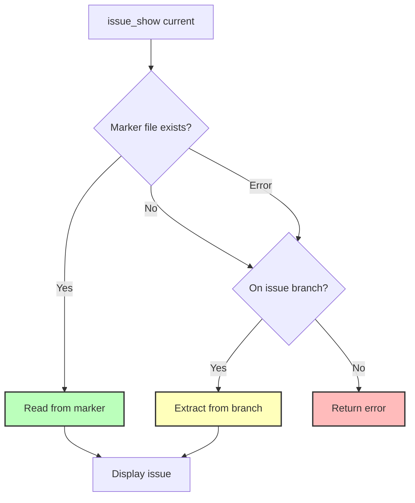

# Step 2: Update issue_show Tool for Marker Support

**Refer to ideas/issue_work_cleanup.md**

## Overview

Update the `issue_show` tool to support reading the current issue from the marker file (`.swissarmyhammer/.current_issue`) in addition to the existing git branch-based detection. This maintains backward compatibility while enabling the new workflow.

## Context

The `issue_show` tool currently supports `name: "current"` which reads the current branch name and extracts the issue name from `issue/<name>` pattern. We're adding marker file support as the primary method, with git branch as a fallback.

## Dependencies

**Requires**: Step 1 (Add Current Issue Marker System) must be completed first.

## Implementation Tasks

### 1. Update issue_show "current" Logic

**File**: `swissarmyhammer-tools/src/mcp/tools/issues/show/mod.rs`

Current behavior (lines ~119-155):
```rust
if request.name == "current" {
    // Get current issue name from git branch
    let git_ops = context.git_ops.lock().await;
    // ... extract from branch name ...
}
```

New behavior:
```rust
if request.name == "current" {
    // 1. Try marker file first
    let issue_name = match swissarmyhammer_issues::current_marker::get_current_issue() {
        Ok(Some(name)) => name,
        Ok(None) => {
            // 2. Fallback to git branch detection
            let git_ops = context.git_ops.lock().await;
            // ... existing branch extraction logic ...
        }
        Err(e) => {
            // 3. If marker read fails, also fallback to git
            tracing::warn!("Failed to read current issue marker: {}", e);
            // ... existing branch extraction logic ...
        }
    };
    // ... rest of logic ...
}
```

### 2. Add Dependency

**File**: `swissarmyhammer-tools/Cargo.toml`

Verify `swissarmyhammer-issues` is already a dependency (it should be). If not, add it.

### 3. Update Tests

**File**: `swissarmyhammer-tools/src/mcp/tools/issues/show/mod.rs` or separate test file

Add tests for:
- Reading current issue from marker file
- Fallback to branch when marker doesn't exist
- Fallback to branch when marker read fails
- Error handling when neither marker nor branch available

### 4. Keep Existing Behavior Intact

Important: The git branch fallback ensures that:
- Existing workflows continue to work
- No breaking changes for users currently on issue branches
- Smooth transition period where both methods work

## Implementation Details

### Precedence Order

1. **Marker file** (`.swissarmyhammer/.current_issue`) - Primary method
2. **Git branch** (`issue/<name>` pattern) - Fallback for compatibility
3. **Error/None** - If neither method works

### Error Messages

Update error messages to reflect both detection methods:
```rust
"Not on an issue branch and no current issue marker set. Use issue_show with a specific issue name or set a current issue marker."
```

## Testing Strategy

```rust
#[cfg(test)]
mod tests {
    #[tokio::test]
    async fn test_current_issue_from_marker() {
        // Set marker file, verify issue_show current reads it
    }
    
    #[tokio::test]
    async fn test_current_issue_fallback_to_branch() {
        // No marker, on issue branch, verify branch detection
    }
    
    #[tokio::test]
    async fn test_current_issue_no_marker_no_branch() {
        // No marker, not on issue branch, verify error message
    }
    
    #[tokio::test]
    async fn test_marker_takes_precedence() {
        // Both marker and branch set, verify marker wins
    }
}
```

## Architecture Diagram



## Success Criteria

- [ ] Marker file detection works (primary path)
- [ ] Git branch fallback works (compatibility path)
- [ ] All tests pass
- [ ] No breaking changes to existing functionality
- [ ] Error messages are clear and helpful
- [ ] Code compiles without warnings

## Estimated Lines of Code

~50 lines changed (mostly in the "current" handling logic)

## Files to Modify

- `swissarmyhammer-tools/src/mcp/tools/issues/show/mod.rs` (~40 line changes)
- `swissarmyhammer-tools/Cargo.toml` (verify dependency)

## Files to Create (Tests)

Optional: Could add dedicated test file if inline tests get too large

## Next Steps

After this step, Steps 3 and 4 will remove the `issue_work` and `issue_merge` tools, since we now have an alternative way to track the current issue.