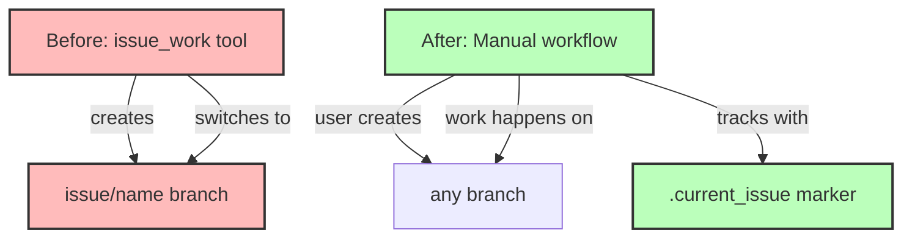

# Step 3: Remove issue_work Tool

**Refer to ideas/issue_work_cleanup.md**

## Overview

Delete the `issue_work` tool and remove all its registrations from the codebase. This tool is no longer needed since we're moving away from automatic git branch management for issues.

## Context

The `issue_work` tool currently:
- Creates `issue/<name>` branches automatically
- Switches to those branches for development
- Validates that users aren't on other issue branches

With the new marker-based system, users can work on issues from any branch without automatic branch creation.

## Dependencies

**Requires**: Steps 1 and 2 must be completed (marker system exists and issue_show supports it).

## Implementation Tasks

### 1. Delete Tool File

**Delete**: `swissarmyhammer-tools/src/mcp/tools/issues/work/mod.rs` (189 lines)

This file contains:
- `WorkIssueTool` struct and implementation
- Branch validation logic
- Branch creation/checkout logic
- Test for abort file creation

### 2. Remove from Tool Registration

**File**: `swissarmyhammer-tools/src/mcp/tools/issues/mod.rs`

Remove:
```rust
pub mod work;  // Delete this line
```

Remove from `register_issue_tools()` function:
```rust
registry.register(work::WorkIssueTool::new());  // Delete this line
```

Update module documentation to remove `work` from the list of available tools.

### 3. Remove Type Definition

**File**: `swissarmyhammer-tools/src/mcp/types.rs` (lines 80-83)

Delete:
```rust
pub struct WorkIssueRequest {
    /// Issue name to work on
    pub name: swissarmyhammer_issues::IssueName,
}
```

### 4. Verify Build

Run `cargo build` to ensure:
- No compilation errors
- No unused import warnings
- No dead code warnings related to removed tool

## What NOT to Touch (Yet)

- **Tests**: Will be removed in Step 5
- **Documentation**: Will be removed in Step 7  
- **Prompts**: Will be updated in Step 8

These are handled in separate steps to keep changes focused and testable.

## Architecture Impact



## Success Criteria

- [ ] `work/mod.rs` file deleted
- [ ] Tool registration removed from `issues/mod.rs`
- [ ] `WorkIssueRequest` type removed from `types.rs`
- [ ] `cargo build` succeeds with no errors
- [ ] No warnings about unused imports or dead code
- [ ] Module documentation updated

## Estimated Changes

- **Deletions**: ~189 lines (entire tool file)
- **Modifications**: ~15 lines (registration and types)

## Files to Delete

- `swissarmyhammer-tools/src/mcp/tools/issues/work/mod.rs`

## Files to Modify

- `swissarmyhammer-tools/src/mcp/tools/issues/mod.rs` (~10 lines)
- `swissarmyhammer-tools/src/mcp/types.rs` (~5 lines)

## Verification Commands

```bash
# Verify build
cargo build

# Verify no references remain in code (should find none in .rs files)
rg "issue_work" swissarmyhammer-tools/src/

# Verify WorkIssueRequest removed
rg "WorkIssueRequest" swissarmyhammer-tools/src/
```

## Migration Notes for Users

Users who currently use `issue_work`:
- Can manually create branches if desired (`git checkout -b issue/feature-name`)
- Can work on any branch without forced branching
- Use marker file or just specify issue names directly
- Issue tracking still works, just without automatic branching

## Next Steps

Step 4 will remove the `issue_merge` tool in the same manner.