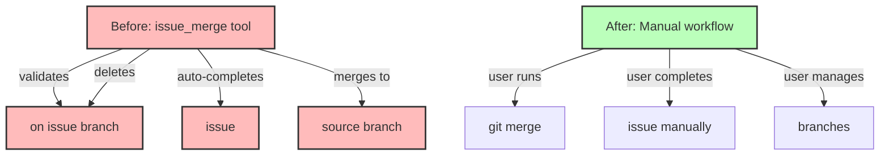

# Step 4: Remove issue_merge Tool

**Refer to ideas/issue_work_cleanup.md**

## Overview

Delete the `issue_merge` tool and remove all its registrations. This tool is no longer needed since we're eliminating the automatic issue branch workflow.

## Context

The `issue_merge` tool currently:
- Validates user is on an issue branch
- Auto-completes issues before merge
- Merges issue branches back to source branch
- Optionally deletes branches after merge

With the new approach, users manage their own git workflow and merges directly.

## Dependencies

**Requires**: Step 3 (Remove issue_work) should be completed for consistency.

## Implementation Tasks

### 1. Delete Tool File

**Delete**: `swissarmyhammer-tools/src/mcp/tools/issues/merge/mod.rs` (280 lines)

This file contains:
- `MergeIssueTool` struct and implementation
- Branch validation logic
- Auto-completion integration
- Merge logic with git operations
- Branch deletion logic

### 2. Remove from Tool Registration

**File**: `swissarmyhammer-tools/src/mcp/tools/issues/mod.rs`

Remove:
```rust
pub mod merge;  // Delete this line
```

Remove from `register_issue_tools()` function:
```rust
registry.register(merge::MergeIssueTool::new());  // Delete this line
```

Update module documentation to remove `merge` from the list of available tools.

### 3. Remove Type Definition

**File**: `swissarmyhammer-tools/src/mcp/types.rs` (lines 87-93)

Delete:
```rust
pub struct MergeIssueRequest {
    /// Issue name to merge
    pub name: swissarmyhammer_issues::IssueName,
    /// Whether to delete the branch after merging (default: false)
    #[serde(default)]
    pub delete_branch: bool,
}
```

### 4. Verify Build

Run `cargo build` to ensure:
- No compilation errors
- No unused import warnings
- No dead code warnings

## What NOT to Touch (Yet)

- **Tests**: Will be removed in Steps 5-6
- **Documentation**: Will be removed in Step 7
- **Prompts**: Will be updated in Step 8

## Architecture Impact



## Success Criteria

- [ ] `merge/mod.rs` file deleted
- [ ] Tool registration removed from `issues/mod.rs`
- [ ] `MergeIssueRequest` type removed from `types.rs`
- [ ] `cargo build` succeeds with no errors
- [ ] No warnings about unused imports or dead code
- [ ] Module documentation updated

## Estimated Changes

- **Deletions**: ~280 lines (entire tool file)
- **Modifications**: ~15 lines (registration and types)

## Files to Delete

- `swissarmyhammer-tools/src/mcp/tools/issues/merge/mod.rs`

## Files to Modify

- `swissarmyhammer-tools/src/mcp/tools/issues/mod.rs` (~10 lines)
- `swissarmyhammer-tools/src/mcp/types.rs` (~7 lines)

## Verification Commands

```bash
# Verify build
cargo build

# Verify no references remain in code
rg "issue_merge" swissarmyhammer-tools/src/

# Verify MergeIssueRequest removed
rg "MergeIssueRequest" swissarmyhammer-tools/src/

# Check for any lingering references to merge tool
rg "MergeIssueTool" swissarmyhammer-tools/src/
```

## Migration Notes for Users

Users who currently use `issue_merge`:
- Use standard git merge commands directly
- Manually complete issues with `issue_mark_complete`
- Manage branch lifecycle with git commands
- More control over merge strategy and timing

## Impact Assessment

### What Stays
- Issue completion (`issue_mark_complete`)
- Issue listing and display
- Issue creation and updates
- Git operations (still available, just not automated)

### What Goes
- Automatic merge-base detection
- Auto-completion before merge
- Forced branch validation
- Automatic branch deletion

## Next Steps

Step 5 will remove tests that specifically test the branching workflow and tool validations.