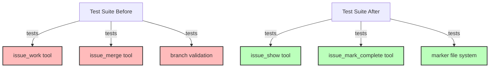

# Step 5: Remove Branching-Specific Tests

**Refer to ideas/issue_work_cleanup.md**

## Overview

Remove all tests that specifically validate the automatic issue branching workflow. These tests are no longer relevant since we're eliminating the `issue_work` and `issue_merge` tools.

## Context

Several test files contain tests specifically for:
- Creating issue branches automatically
- Switching to issue branches
- Validating branch-based restrictions
- Merging issue branches

These tests should be deleted since the functionality no longer exists.

## Dependencies

**Requires**: Steps 3 and 4 (both tools removed) must be completed.

## Implementation Tasks

### 1. Remove Tests from flexible_branching_mcp_e2e.rs

**File**: `swissarmyhammer-cli/tests/flexible_branching_mcp_e2e.rs`

Remove these complete test functions:

1. **Line 136**: `test_mcp_issue_work_from_feature_branch()`
   - Tests creating issue branch from feature branch
   - ~50 lines

2. **Line 189**: `test_mcp_issue_work_from_develop_branch()`
   - Tests creating issue branch from develop branch
   - ~25 lines

3. **Line 216**: `test_mcp_issue_merge_requires_issue_branch()`
   - Tests merge validation (must be on issue branch)
   - ~60 lines

4. **Line 280**: `test_mcp_issue_merge_to_source_branch()`
   - Tests merging issue branch back to source
   - ~65 lines

5. **Line 347**: `test_mcp_issue_work_prevents_issue_from_issue_branch()`
   - Tests prevention of nested issue branches
   - ~50 lines

**Total deletions**: ~250 lines from this file

### 2. Update Tool Existence Assertions

**File**: `swissarmyhammer-tools/tests/mcp_server_parity_tests.rs`

**Line 83-84**: Remove these entries from the expected tools list:
```rust
"issue_work",    // Delete this line
"issue_merge",   // Delete this line
```

This test validates that all expected MCP tools are registered. Since we removed two tools, update the expected list.

### 3. Check sah_serve_integration_test.rs

**File**: `swissarmyhammer-cli/tests/sah_serve_integration_test.rs`

**Line 64**: Check if `issue_work` appears in tool list assertions and remove if present.

Search for any references to:
- `issue_work`
- `issue_merge`
- `WorkIssueTool`
- `MergeIssueTool`

## What NOT to Remove (Yet)

Do NOT remove these tests yet (Step 6 will handle them):
- `swissarmyhammer-cli/tests/cli_mcp_integration_test.rs` - `test_issue_workflow_integration()` 
- `swissarmyhammer/tests/flexible_branching_integration.rs` - `test_release_branch_issue_workflow()`
- `swissarmyhammer/tests/mcp_issue_integration_tests.rs` - `test_complete_issue_workflow()`

These tests need to be **updated** not deleted, as they test the overall issue workflow.

## Verification Commands

```bash
# Build and run all tests
cargo nextest run --fail-fast

# Specifically check the modified test files
cargo nextest run flexible_branching_mcp_e2e
cargo nextest run mcp_server_parity
cargo nextest run sah_serve_integration

# Search for any remaining references to removed tools in test files
rg "issue_work|issue_merge" --type rust tests/
```

## Expected Test Results

After this step:
- All remaining tests should pass
- No tests reference `issue_work` or `issue_merge` tools
- Tool registration tests reflect correct count of tools

## Architecture Impact



## Success Criteria

- [ ] 5 test functions removed from flexible_branching_mcp_e2e.rs
- [ ] Tool list assertions updated in mcp_server_parity_tests.rs
- [ ] Tool list assertions updated in sah_serve_integration_test.rs (if needed)
- [ ] `cargo nextest run` passes all tests
- [ ] No references to removed tools in test files (except those handled in Step 6)

## Estimated Changes

- **Deletions**: ~300 lines (5 test functions + assertions)
- **Modifications**: ~5 lines (assertion updates)

## Files to Modify

- `swissarmyhammer-cli/tests/flexible_branching_mcp_e2e.rs` (~250 line deletions)
- `swissarmyhammer-tools/tests/mcp_server_parity_tests.rs` (~2 line deletions)
- `swissarmyhammer-cli/tests/sah_serve_integration_test.rs` (~2 line deletions if needed)

## Next Steps

Step 6 will update the remaining integration tests that test the overall issue workflow (not just branching).