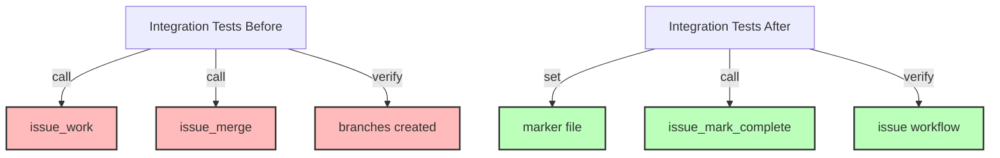

# Step 6: Fix Integration Tests for New Workflow

**Refer to ideas/issue_work_cleanup.md**

## Overview

Update integration tests that test the complete issue workflow to work with the new marker-based system instead of the branch-based workflow. These tests should be updated, not deleted, as they validate the core issue management functionality.

## Context

Several integration tests test the end-to-end issue workflow including work management and completion. With the removal of `issue_work` and `issue_merge`, these tests need to be updated to:
- Not use those tools
- Work with the marker file system
- Validate the simplified workflow

## Dependencies

**Requires**: Steps 1-5 completed (marker system exists, tools removed, branching tests removed)

## Implementation Tasks

### 1. Update cli_mcp_integration_test.rs

**File**: `swissarmyhammer-cli/tests/cli_mcp_integration_test.rs`

**Line 205**: `test_issue_workflow_integration()`

This test likely calls `issue_work` and `issue_merge`. Update to:
- Remove `issue_work` call
- Test `issue_show current` with marker file instead
- Remove `issue_merge` call
- Replace with `issue_mark_complete` call
- Test that issue can be worked on any branch

**Estimated changes**: ~30 lines modified

### 2. Update flexible_branching_integration.rs

**File**: `swissarmyhammer/tests/flexible_branching_integration.rs`

**Line 375**: `test_release_branch_issue_workflow()`

Update to:
- Remove branch creation expectations
- Test marker file instead of branch detection
- Update completion workflow
- Keep the release branch context but remove issue branching

**Estimated changes**: ~40 lines modified

### 3. Update mcp_issue_integration_tests.rs

**File**: `swissarmyhammer/tests/mcp_issue_integration_tests.rs`

**Line 90**: `test_complete_issue_workflow()`

Update to:
- Remove `issue_work` tool usage
- Manually set marker file for testing
- Remove `issue_merge` tool usage
- Test issue completion without merging

**Estimated changes**: ~30 lines modified

## Testing Strategy

For each updated test, ensure it validates:
1. **Issue creation** - Still works as before
2. **Issue listing** - Still works as before
3. **Current issue tracking** - Now uses marker file
4. **Issue completion** - Works without merge tool
5. **Issue show** - Can read from marker file

### Example Updated Test Pattern

```rust
#[tokio::test]
async fn test_issue_workflow_no_branching() {
    let context = setup_test_context().await;
    
    // Create issue (unchanged)
    let issue = create_issue(&context, "test-feature").await;
    
    // Set current issue marker (NEW - replaces issue_work)
    swissarmyhammer_issues::current_marker::set_current_issue(&issue.name).unwrap();
    
    // Verify current issue (updated to use marker)
    let current = show_issue(&context, "current").await;
    assert_eq!(current.name, issue.name);
    
    // Complete issue (unchanged, but no merge)
    mark_complete_issue(&context, &issue.name).await;
    
    // Verify completion (unchanged)
    assert!(is_issue_completed(&context, &issue.name).await);
}
```

## Files to Modify

Each file needs similar updates:
- Remove calls to `issue_work` and `issue_merge`
- Add marker file manipulation
- Update assertions for new workflow
- Keep core issue management tests intact

### Specific File Changes

1. **cli_mcp_integration_test.rs**
   - Update test_issue_workflow_integration()
   - ~30 lines changed

2. **flexible_branching_integration.rs**
   - Update test_release_branch_issue_workflow()
   - ~40 lines changed
   - Note: "flexible branching" now means user chooses branch, not automatic

3. **mcp_issue_integration_tests.rs**
   - Update test_complete_issue_workflow()
   - ~30 lines changed

## Success Criteria

- [ ] All three integration tests updated
- [ ] Tests no longer reference `issue_work` or `issue_merge`
- [ ] Tests validate marker file functionality
- [ ] All tests pass with `cargo nextest run`
- [ ] Test coverage maintained for issue workflow
- [ ] No test functionality lost, just adapted to new workflow

## Estimated Changes

- **Total modifications**: ~100 lines across 3 files
- **No deletions**: Tests are updated, not removed
- **Test count**: Same number of tests, just updated

## Verification Commands

```bash
# Run the specific updated tests
cargo nextest run test_issue_workflow_integration
cargo nextest run test_release_branch_issue_workflow
cargo nextest run test_complete_issue_workflow

# Run all tests to ensure nothing broke
cargo nextest run --fail-fast

# Verify no remaining references to removed tools
rg "issue_work|issue_merge" swissarmyhammer-cli/tests/ swissarmyhammer/tests/
```

## Architecture Impact



## Next Steps

Step 7 will update all documentation to remove references to the deleted tools.