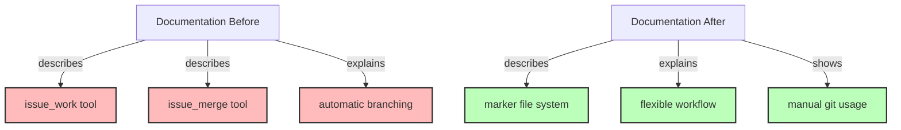

# Step 7: Update Documentation

**Refer to ideas/issue_work_cleanup.md**

## Overview

Remove all documentation for `issue_work` and `issue_merge` tools, and update references throughout the documentation to reflect the new marker-based workflow.

## Context

The specification identified 20+ documentation files that reference the removed tools. These need to be updated or deleted to reflect the simplified issue workflow.

## Dependencies

**Requires**: Steps 3-6 completed (tools removed, tests updated)

## Implementation Tasks

### 1. Delete Tool Documentation Pages

**Delete these 2 files**:
- `doc/src/05-tools/issue-management/work.md`
- `doc/src/05-tools/issue-management/merge.md`

### 2. Update SUMMARY.md (Table of Contents)

**File**: `doc/src/SUMMARY.md`

**Line 43**: Remove `issue_work` link:
```markdown
  - [work](05-tools/issue-management/work.md)  <!-- DELETE THIS LINE -->
```

**Line 45**: Remove `issue_merge` link:
```markdown
  - [merge](05-tools/issue-management/merge.md)  <!-- DELETE THIS LINE -->
```

### 3. Update Issue Management Introduction

**File**: `doc/src/05-tools/issue-management/introduction.md`

**Line 28**: Remove `issue_work` from tool list
**Line 30**: Remove `issue_merge` from tool list

Add new section explaining marker-based workflow:
```markdown
## Working with Issues

Issues can be worked on from any branch. The system tracks the "current issue" using a marker file (`.swissarmyhammer/.current_issue`) which allows you to:
- Work on issues from any git branch
- Switch between issues without branch management
- Use your preferred git workflow

Use `issue_show current` to see which issue you're currently working on.
```

### 4. Update Architecture Documentation

**File**: `doc/src/02-concepts/architecture.md`

**Line 214**: Remove `issue_work` from tool list

Update any architectural diagrams or descriptions that mention automatic branch creation.

### 5. Update Tools Overview

**File**: `doc/src/05-tools/overview.md`

**Line 18**: Remove `issue_work` entry from tools table

### 6. Update CLI Usage Documentation

**File**: `doc/src/06-integration/cli-usage.md`

**Line 105**: Remove `issue_work` row from MCP tools table

### 7. Update Claude Code Integration Documentation

**File**: `doc/src/06-integration/claude-code.md`

**Line 35**: Remove `issue_work` from available tools list
**Line 134**: Remove example showing `issue_work`
**Line 220**: Remove from workflow example
**Line 293**: Remove from step list

### 8. Update Workflow Documentation

**File**: `doc/src/04-workflows/custom-workflows.md`

**Line 142**: Remove `issue_work` step from example workflow
**Line 528**: Remove `issue_work` step from another example
**Line 671**: Remove `issue_work` step from third example
**Line 842**: Remove `issue_work` step from fourth example
**Line 754**: Remove `issue_merge` step from workflow
**Line 904**: Remove `issue_merge` step from another workflow

Replace these steps with simpler alternatives:
```yaml
# Old workflow step
- tool: issue_work
  arguments:
    name: "{{ issue_name }}"

# New approach - just work directly, optionally set marker
# (Usually no explicit step needed, user chooses their branch)
```

### 9. Update CLI Serve Description

**File**: `swissarmyhammer-cli/src/commands/serve/description.md`

**Line 125**: Remove mention of branch management tools

Update to explain that issue management works on any branch.

## Documentation Style Updates

When updating documentation, ensure:
1. Remove all "automatic branch creation" language
2. Replace with "work on any branch" messaging
3. Update workflow examples to show marker file usage
4. Maintain clarity about what issue management still provides
5. Add migration notes where helpful

## Success Criteria

- [ ] 2 tool documentation pages deleted
- [ ] SUMMARY.md updated (2 links removed)
- [ ] All tool lists updated (no issue_work or issue_merge)
- [ ] Workflow examples updated (no removed tool calls)
- [ ] Architecture docs updated
- [ ] Integration docs updated
- [ ] `mdbook build` succeeds without warnings
- [ ] No broken links in documentation
- [ ] Documentation accurately reflects new workflow

## Estimated Changes

- **Deletions**: ~200 lines (2 complete doc pages)
- **Modifications**: ~50 lines (removing references, updating examples)
- **Total files modified**: ~12 files

## Files to Delete

- `doc/src/05-tools/issue-management/work.md`
- `doc/src/05-tools/issue-management/merge.md`

## Files to Modify

1. `doc/src/SUMMARY.md` - Remove 2 links
2. `doc/src/05-tools/issue-management/introduction.md` - Update tool list, add new section
3. `doc/src/02-concepts/architecture.md` - Remove from tool list
4. `doc/src/05-tools/overview.md` - Remove from table
5. `doc/src/06-integration/cli-usage.md` - Remove from table
6. `doc/src/06-integration/claude-code.md` - Remove 4 references
7. `doc/src/04-workflows/custom-workflows.md` - Remove 6 workflow steps
8. `swissarmyhammer-cli/src/commands/serve/description.md` - Update description

## Verification Commands

```bash
# Build documentation
mdbook build doc/

# Check for broken links
mdbook test doc/

# Search for remaining references to removed tools
rg "issue_work|issue_merge" doc/

# Verify no references in CLI descriptions
rg "issue_work|issue_merge" swissarmyhammer-cli/src/commands/
```

## Architecture Impact



## Next Steps

Step 8 will update the prompt files to use the new workflow.