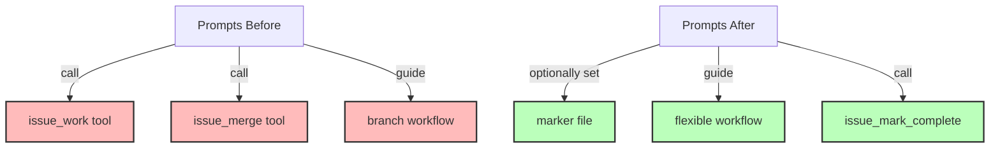

# Step 8: Update Prompts for New Workflow

**Refer to ideas/issue_work_cleanup.md**

## Overview

Update prompt files to use the marker-based workflow instead of the `issue_work` and `issue_merge` tools. This is the final step to complete the refactoring.

## Context

Prompts guide users and AI agents through common workflows. With the removal of branching tools, prompts need to be updated to:
- Set the current issue marker instead of using `issue_work`
- Not use `issue_merge` for completion workflows
- Explain the simpler workflow to users

## Dependencies

**Requires**: Steps 1-7 completed (entire refactoring except prompts)

## Implementation Tasks

### 1. Delete Merge Prompt

**Delete**: `builtin/prompts/issue/merge.md`

This prompt is no longer needed since there's no merge tool to guide users through.

### 2. Update Code Prompt

**File**: `builtin/prompts/issue/code.md`

**Line 25**: This likely contains logic that calls `issue_work` tool

**Current pattern** (approximately):
```markdown
1. Use issue_work to switch to the issue branch
2. Make code changes
3. Commit changes
```

**New pattern**:
```markdown
1. Set current issue marker (optional, for tracking)
2. Work on any branch you choose
3. Make code changes and commit
4. Complete issue when done with issue_mark_complete
```

Update to:
- Remove `issue_work` tool call
- Add instructions to set marker file if tracking current issue
- Explain users can work on any branch
- Remove branch-switching instructions
- Keep the coding workflow instructions

**Estimated changes**: ~30 lines modified

### 3. Search for Other Prompt References

Search all prompt files for references to:
- `issue_work`
- `issue_merge`
- "switch to issue branch"
- "merge issue branch"

Update any found references.

## Prompt Update Strategy

For each prompt that referenced removed tools:

1. **Identify the intent**: What was the prompt trying to accomplish?
2. **Update the approach**: How to accomplish it without the tool?
3. **Clarify the new workflow**: Make it clear and simple
4. **Test the prompt**: Ensure it still provides value

## Example Updated Prompt Content

**Before**:
```markdown
## Workflow

1. Use the `issue_work` tool to switch to the issue branch:
   ```json
   {
     "name": "ISSUE_NAME"
   }
   ```

2. Make your changes on the issue branch

3. When done, use `issue_merge` to merge back:
   ```json
   {
     "name": "ISSUE_NAME",
     "delete_branch": true
   }
   ```
```

**After**:
```markdown
## Workflow

1. (Optional) Set current issue for tracking:
   ```rust
   // In your code or via tools
   swissarmyhammer_issues::current_marker::set_current_issue("ISSUE_NAME")
   ```

2. Make your changes on your current branch (any branch)

3. When done, mark the issue complete:
   ```json
   {
     "name": "ISSUE_NAME"
   }
   ```
   
   Then merge your branch using your standard git workflow.
```

## Files to Delete

- `builtin/prompts/issue/merge.md`

## Files to Modify

- `builtin/prompts/issue/code.md` (~30 lines)
- Any other prompts that reference removed tools (search to identify)

## Success Criteria

- [ ] `merge.md` prompt deleted
- [ ] `code.md` prompt updated to not use removed tools
- [ ] All prompt files searched for references
- [ ] No references to `issue_work` or `issue_merge` in prompts
- [ ] Prompts still provide clear workflow guidance
- [ ] Prompt rendering tests pass
- [ ] `cargo build` succeeds

## Verification Commands

```bash
# Search for references in all prompt files
rg "issue_work|issue_merge" builtin/prompts/

# Search for branch-related instructions
rg "issue branch|switch to.*branch" builtin/prompts/

# Build and test
cargo build
cargo nextest run

# Run prompt-specific tests if they exist
cargo nextest run prompt
```

## Testing Strategy

If there are tests for prompt rendering:
1. Ensure they still pass
2. Update expected outputs if needed
3. Add tests for new prompt content if warranted

Look for tests in:
- `swissarmyhammer/tests/test_builtin_prompt_rendering.rs`
- `swissarmyhammer-cli/tests/prompt_*.rs`

## Architecture Impact



## Estimated Changes

- **Deletions**: ~50 lines (entire merge.md prompt)
- **Modifications**: ~30 lines (code.md updates)
- **Total files**: 2+ files

## User Impact

This completes the refactoring from a user perspective:
- Prompts now guide users through the new workflow
- No references to removed tools in user-facing content
- Clearer, simpler workflow for issue management

## Final Verification

After this step, run complete verification:

```bash
# Build everything
cargo build --all-features

# Run all tests
cargo nextest run

# Build documentation
mdbook build doc/

# Search entire codebase for any remaining references
rg "issue_work|issue_merge" --type rust
rg "issue_work|issue_merge" --type md

# Verify tool count is correct
cargo run -- serve --stdio | grep -c "tools"
```

## Completion

After this step, the entire refactoring is complete:
- ✅ Marker system added
- ✅ Tools removed
- ✅ Tests updated
- ✅ Documentation updated
- ✅ Prompts updated

The system now operates without automatic git branching for issues.