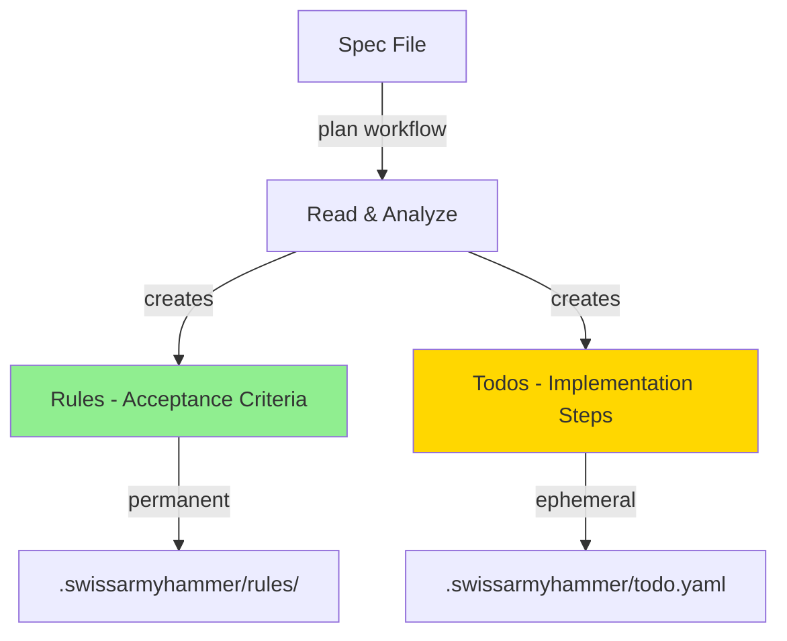

# Step 3: Update plan Workflow and Prompt

Refer to ideas/eliminate-issues-and-memos-migration.md

## Goal

Update the `plan` workflow and prompt to create rules + todos instead of issues. This changes the planning process to use the new architecture while maintaining rich markdown context.

## Context

The plan workflow currently creates multiple numbered issue files. In the new architecture, it will:
1. Create **rules** for acceptance criteria (permanent, executable specifications)
2. Create **todos** for implementation steps with rich markdown context

## Architecture Change



## Changes Required

### 1. Update `builtin/prompts/plan.md`

**Current behavior**: Creates multiple issues using `issue_create` tool

**New behavior**: 
- Create rules for acceptance criteria using `rule_create` tool
- Create todos for implementation steps using `todo_create` tool
- Include rich markdown context in todo `context` field (diagrams, examples, code snippets)

**Key Updates**:
- Remove references to `issue_create` tool
- Add guidance to use `rule_create` for acceptance criteria
- Add guidance to use `todo_create` for implementation steps
- Emphasize that todo context can contain rich markdown (Mermaid diagrams, code examples, multi-paragraph explanations)
- Remove instructions about creating numbered step files
- Update process to create rules first, then todos

### 2. Update Prompt Guidelines

**Rules Creation Guidance**:
```markdown
## Creating Rules

For each major requirement or acceptance criterion:
- Use `rule_create` tool
- Define what success looks like
- Make rules verifiable and executable
- Examples:
  - "API endpoint /users must exist and return 200"
  - "All functions must have JSDoc comments"
  - "No TODO comments in production code"
```

**Todos Creation Guidance**:
```markdown
## Creating Todos

For each implementation step:
- Use `todo_create` tool
- Include rich context with diagrams, examples, code snippets
- Break down into small, focused tasks (< 250 lines each)
- Context field supports full markdown:
  - Mermaid diagrams for architecture
  - Code examples for implementation patterns
  - Multi-paragraph explanations
  - References to spec file and rules
```

## Implementation Tasks

1. **Update `builtin/prompts/plan.md`**
   - Replace issue-focused language with rules + todos language
   - Remove `issue_create` tool references
   - Add `rule_create` tool guidance
   - Update `todo_create` tool guidance to emphasize rich context
   - Update process steps to reflect new workflow
   - Keep reference to spec file: `Refer to {{ plan_filename }}`

2. **Test the updated prompt**
   - Create a test spec file
   - Run plan workflow
   - Verify rules are created correctly
   - Verify todos have rich context
   - Verify no issues are created

## Example Output Structure

**Rules created** (in `.swissarmyhammer/rules/`):
```
project-name/api-endpoints-exist.md
project-name/documentation-complete.md
project-name/tests-passing.md
```

**Todos created** (in `.swissarmyhammer/todo.yaml`):
```yaml
- task: "Implement user authentication API endpoint"
  context: |
    ## Architecture
    
    ```mermaid
    sequenceDiagram
      Client->>API: POST /auth/login
      API->>Database: Verify credentials
      Database-->>API: User data
      API-->>Client: JWT token
    ```
    
    ## Implementation Steps
    1. Create route handler in src/auth.rs
    2. Add password hashing validation
    3. Generate JWT token
    
    Refer to spec.md section 2.1
  done: false
```

## Testing Checklist

- ✅ Prompt updated with rules + todos guidance
- ✅ `issue_create` references removed
- ✅ `rule_create` guidance added
- ✅ `todo_create` guidance emphasizes rich markdown context
- ✅ Test plan workflow creates rules
- ✅ Test plan workflow creates todos with rich context
- ✅ No issues created
- ✅ References to spec file maintained

## Acceptance Criteria

- `builtin/prompts/plan.md` updated to use rules + todos
- No references to `issue_create` tool remain
- Guidance for `rule_create` and `todo_create` is clear
- Test run creates rules in `.swissarmyhammer/rules/`
- Test run creates todos with rich markdown context
- All tests passing
- Build succeeds

## Estimated Changes

~50-100 lines (prompt rewrite, no code changes)
