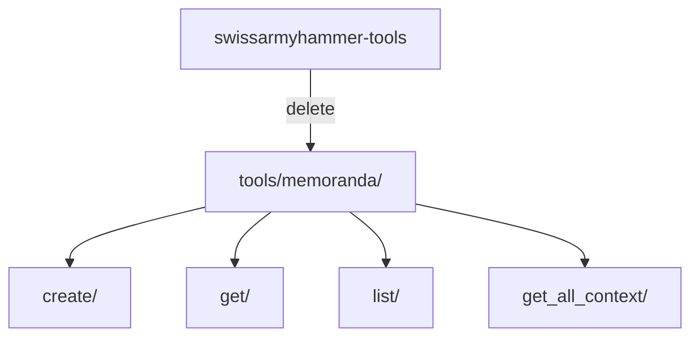

# Step 6: Remove Memo MCP Tools

Refer to ideas/eliminate-issues-and-memos-migration.md

## Goal

Remove all memo-related MCP tools from the codebase. This includes the tool implementations, registrations, and related infrastructure.

## Context

The memos system is being replaced by rules + todos. All memo-related MCP tools need to be removed:
- `memo_create` - Create new memos
- `memo_get` - Retrieve a memo by title
- `memo_list` - List all memos
- `memo_get_all_context` - Get all memo content for AI context

## Tools to Remove



## Implementation Tasks

### 1. Identify Memo Tool Files

Located in `swissarmyhammer-tools/src/mcp/tools/memoranda/`:
- `create/mod.rs`
- `get/mod.rs`
- `list/mod.rs`
- `get_all_context/mod.rs`
- `mod.rs` (module declaration)

### 2. Remove Tool Directory

```bash
rm -rf swissarmyhammer-tools/src/mcp/tools/memoranda/
```

### 3. Update Tool Registry

In `swissarmyhammer-tools/src/mcp/tool_registry.rs` or `tools/mod.rs`:
- Remove `pub mod memoranda;`
- Remove memo tool registrations
- Remove any memoranda-related imports

### 4. Update Main Tools Module

In `swissarmyhammer-tools/src/mcp/tools/mod.rs`:
- Remove `pub mod memoranda;`
- Remove any re-exports of memo tools

### 5. Remove Memo Types File

If it exists, remove `swissarmyhammer-tools/src/mcp/memo_types.rs` (based on file listing showing this exists)

### 6. Check for References

Search for uses of memo tools:
```bash
rg "memo_create|memo_get|memo_list|memo_get_all_context" --type rust
```

Remove any remaining references.

## Files to Modify

1. `swissarmyhammer-tools/src/mcp/tools/mod.rs`
2. `swissarmyhammer-tools/src/mcp/tool_registry.rs` (if tools registered there)
3. `swissarmyhammer-tools/src/mcp/memo_types.rs` (delete if exists)
4. `swissarmyhammer-tools/src/mcp/mod.rs` (remove memo_types re-export if exists)
5. Any test files that reference memo tools

## Testing Checklist

- ✅ Memo tools directory deleted
- ✅ Memo types file deleted (if exists)
- ✅ No references to memo tools in tool registry
- ✅ No imports of memoranda tools remain
- ✅ Build succeeds without errors
- ✅ MCP server starts without memo tools
- ✅ `sah` CLI no longer shows memo commands
- ✅ All remaining tests pass

## Verification Commands

```bash
# Verify directory is gone
ls swissarmyhammer-tools/src/mcp/tools/memoranda/ 2>&1 | grep "No such file"

# Check for remaining references
rg "tools/memoranda" --type rust
rg "memo_types" --type rust

# Build succeeds
cargo build

# MCP tools list doesn't include memo tools
sah serve # then query tools list via MCP
```

## Acceptance Criteria

- `swissarmyhammer-tools/src/mcp/tools/memoranda/` directory removed
- `swissarmyhammer-tools/src/mcp/memo_types.rs` removed (if it exists)
- No references to memo tools in tool registry
- No imports of memoranda module remain
- Build succeeds with no errors or warnings about missing modules
- MCP server starts successfully
- CLI no longer exposes memo commands
- All tests passing

## Estimated Changes

~200-250 lines removed (4 tool implementations + registrations + types)
