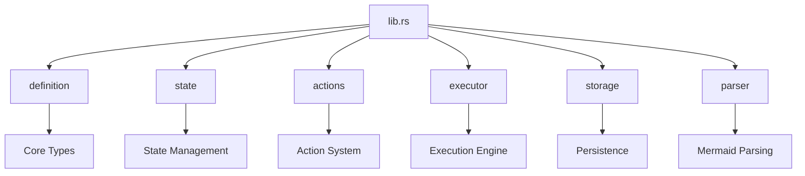

# Set up Basic Library Structure

Refer to /Users/wballard/github/swissarmyhammer/ideas/workflow_move.md

## Objective
Create the foundational module structure in the new workflow crate to prepare for systematic migration of components.

## Tasks
1. Create initial module structure in `src/lib.rs`
2. Set up placeholder modules for major components
3. Establish basic public API structure
4. Verify compilation

## Implementation Details

### Module Structure
Based on analysis of current `workflow/mod.rs`, create placeholders for:

```rust
//! SwissArmyHammer Workflow Engine

// Core modules (to be migrated)
pub mod definition;
pub mod state;
pub mod transition;
pub mod run;

// Parsing and template system
pub mod parser;
pub mod template_context;

// Action system
pub mod actions;
pub mod action_parser;
pub mod agents;

// Execution system  
pub mod executor;
pub mod mcp_integration;

// Storage and utilities
pub mod storage;
pub mod graph;
pub mod visualization;
pub mod metrics;
pub mod error_utils;

// Internal modules
mod transition_key;

#[cfg(test)]
mod test_helpers;

// Re-exports will be added as modules are migrated
```

### Placeholder Files
Create minimal placeholder files for each module:
- `src/definition.rs` - Empty with TODO comment
- `src/state.rs` - Empty with TODO comment
- `src/actions.rs` - Empty with TODO comment
- etc.

## Mermaid Diagram


## Acceptance Criteria
- [ ] Module structure created with placeholders
- [ ] `cargo check` passes for workflow crate
- [ ] Basic library compiles without errors
- [ ] Module visibility properly configured

## Next Step
Step 000003: Dependency analysis and migration