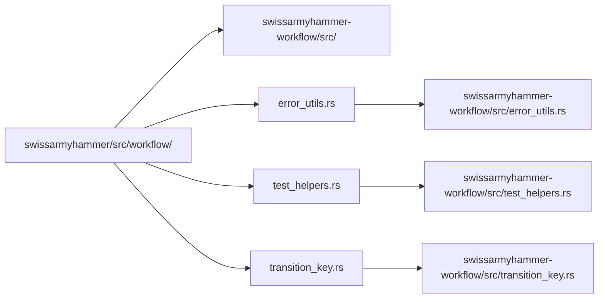

# Migrate Utility Modules

Refer to /Users/wballard/github/swissarmyhammer/ideas/workflow_move.md

## Objective
Migrate utility modules that have minimal dependencies - these are safe to move first as they're primarily used by other workflow components.

## Modules to Migrate
1. `error_utils.rs` - Error handling utilities
2. `test_helpers.rs` - Testing utilities (test-only)
3. `transition_key.rs` - Internal transition key type

## Tasks
1. Copy `error_utils.rs` to workflow crate
2. Copy `test_helpers.rs` to workflow crate  
3. Copy `transition_key.rs` to workflow crate
4. Update internal imports in these files
5. Add modules to workflow crate lib.rs
6. Run tests to verify migration

## Implementation Details

### Migration Process
For each file:
1. Copy from `swissarmyhammer/src/workflow/[file]` to `swissarmyhammer-workflow/src/[file]`
2. Update any internal imports (unlikely for utilities)
3. Update visibility modifiers if needed

### Update lib.rs
```rust
// Utility modules
pub mod error_utils;
mod transition_key;

#[cfg(test)]
mod test_helpers;

// Re-exports for error_utils
pub use error_utils::{
    command_succeeded, extract_stderr, extract_stdout, 
    handle_claude_command_error, handle_command_error, 
    handle_command_error_with_mapper,
};
pub use transition_key::TransitionKey;
```

### Import Updates
Check each migrated file for imports like:
- `use crate::workflow::*` → Update to local imports
- `use super::*` → Verify still correct
- External crate imports → Should be fine

## Mermaid Diagram


## Acceptance Criteria
- [ ] All three utility files copied to workflow crate
- [ ] Internal imports updated correctly
- [ ] Added to lib.rs with proper visibility
- [ ] `cargo check` passes for workflow crate
- [ ] `cargo test` passes for workflow crate (if any tests)
- [ ] Original files still in place (will remove in cleanup phase)

## Next Step
Step 000005: Migrate core data structures (state, transition, definition)