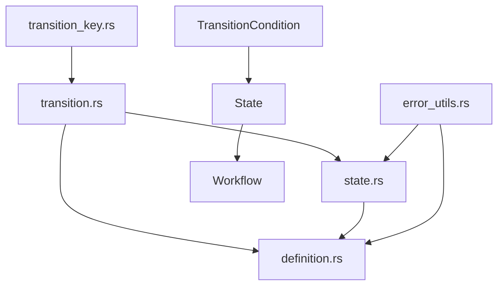

# Migrate Core Data Structures

Refer to /Users/wballard/github/swissarmyhammer/ideas/workflow_move.md

## Objective
Migrate the fundamental data structures that define workflows, states, and transitions. These are core types with minimal external dependencies.

## Modules to Migrate
1. `state.rs` - State definitions and management
2. `transition.rs` - Transition logic between states
3. `definition.rs` - Workflow definition types

## Tasks
1. Migrate `state.rs` with all its types and implementations
2. Migrate `transition.rs` with transition logic
3. Migrate `definition.rs` with workflow definitions
4. Update internal imports and cross-references
5. Add modules to lib.rs with proper exports
6. Verify compilation and basic functionality

## Implementation Details

### Migration Order (dependency-first)
1. **transition.rs first** - Defines TransitionCondition, ConditionType
2. **state.rs second** - Uses transition types  
3. **definition.rs third** - Uses both state and transition types

### Key Types to Export
From analysis of current mod.rs:
```rust
// From definition.rs
pub use definition::{Workflow, WorkflowError, WorkflowName, WorkflowResult};

// From state.rs  
pub use state::{
    CompensationKey, ErrorContext, State, StateError, StateId, 
    StateResult, StateType,
};

// From transition.rs
pub use transition::{ConditionType, Transition, TransitionCondition};
```

### Internal Dependencies to Check
- `transition_key.rs` (already migrated)
- `error_utils.rs` (already migrated)
- Imports from other workflow modules (update paths)

## Mermaid Diagram


## Acceptance Criteria
- [ ] All three core modules migrated successfully
- [ ] Internal imports updated to use local paths
- [ ] Cross-module dependencies working correctly
- [ ] Public API exports match original functionality
- [ ] `cargo check` passes for workflow crate
- [ ] No compilation errors or warnings
- [ ] Basic type instantiation works in tests

## Next Step
Step 000006: Migrate runtime structures (run.rs)